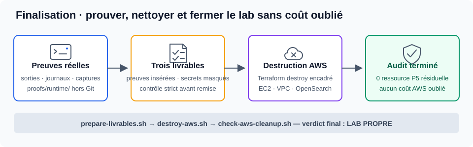

# P5 OpenClassrooms — Infrastructure as Code sur AWS

[](https://github.com/mathiasseguincadiche/p5_Openclassrooms/actions/workflows/ci.yml)

Ce dépôt contient l’**implémentation exécutable** et le **parcours technique** du
projet P5. Il conserve exactement les trois exercices officiels et les relie
dans une seule chaîne : préparer le lab, valider AWS, déployer, observer,
tester la disponibilité, produire les preuves puis supprimer les ressources.

> **Choix d’implémentation : 100 % AWS.** La VM Ubuntu Server 26.04 sert de
> poste DevOps. Terraform, Ansible, AWS CLI, Angular, Docker et les scripts de
> preuve s’exécutent depuis cette VM ; les infrastructures évaluées sont créées
> dans AWS.

## Le projet en une vue


| Étape | Transformation | Verdict attendu |
| --- | --- | --- |
| 0 — Fondations | VM Ubuntu + outils + compte AWS validé | `GO TERRAFORM` |
| 1 — Déploiement | Angular → Terraform → Ansible → NGINX sur EC2 | Application accessible |
| 2 — Observation | Logs NGINX → OpenSearch → trois visualisations | Dashboard exploitable |
| 3 — Disponibilité | Client → HAProxy → deux backends EC2 | Bascule et reprise validées |
| Finalisation | Preuves → livrables → destruction → audit | Lab propre, aucun coût oublié |

## Navigation rapide

- [Étape 0 — Préparer le lab et AWS](#étape-0--préparer-le-lab-et-aws)
- [Exercice 1 — Déployer Angular avec Terraform et Ansible](#exercice-1--déployer-angular-avec-terraform-et-ansible)
- [Exercice 2 — Exploiter les logs dans OpenSearch](#exercice-2--exploiter-les-logs-dans-opensearch)
- [Exercice 3 — Tester HAProxy et la reprise](#exercice-3--tester-haproxy-et-la-reprise)
- [Finalisation — Prouver, détruire et auditer](#finalisation--prouver-détruire-et-auditer)

---

## Étape 0 — Préparer le lab et AWS


### Ce que cette étape construit

| Entrée | Actions automatisées | Résultat |
| --- | --- | --- |
| VM Ubuntu Server 26.04 | Installation de Terraform, Ansible, AWS CLI, Docker, Node.js 22.22.0 et outils de contrôle | Poste DevOps reproductible |
| Compte AWS sécurisé | Vérification du profil, du compte, de la région, des quotas, du budget et des paramètres Terraform | Compte autorisé et dimensionné |
| Clé SSH et configuration locale | Contrôle des permissions, des fichiers `terraform.tfvars` et de l’adresse `/32` | Accès prêts pour les exercices |

### Commandes essentielles

```bash
./scripts/commands/bootstrap-ubuntu-server.sh
# Reconnexion nécessaire pour Docker et NVM.
./scripts/commands/setup.sh --check-only

cp environment/aws-readiness.env.example environment/aws-readiness.env
$EDITOR environment/aws-readiness.env

./scripts/commands/setup-aws-guardrails.sh --apply
./scripts/commands/pre-deployment-check.sh --stage initial
```

### Verdict obligatoire

```text
GO TERRAFORM
```

Aucun `terraform apply` n’est lancé par les contrôles de préparation. La seule
mutation volontaire de l’étape 0B est la création du budget avec `--apply`.

**Guides détaillés :**
[préparation de la VM](docs/00-preparation-environnement.md) ·
[préparation du compte AWS](docs/00b-preparation-compte-aws.md)

---

## Exercice 1 — Déployer Angular avec Terraform et Ansible


### Flux réel

```text
Sources Angular
      │ npm ci + npm run build
      ▼
Artefact navigateur versionné
      │ Terraform crée le réseau et EC2
      ▼
Ansible installe NGINX et copie le build
      │ contrôles HTTP et fallback SPA
      ▼
Application Angular accessible sur AWS
```

### 1. Construire l’application

```bash
./scripts/commands/prepare-angular-artifact.sh
```

La CI reconstruit l’application et compare exactement le résultat au contenu de
`ansible/files/angular-app/`. Une page HTML témoin ne peut donc pas remplacer le
véritable build Angular.

### 2. Créer l’infrastructure

```bash
terraform -chdir=terraform/exercice-1 init
terraform -chdir=terraform/exercice-1 plan -out=tfplan
terraform -chdir=terraform/exercice-1 show tfplan
terraform -chdir=terraform/exercice-1 apply tfplan
```

Le plan doit être relu avant application : compte, région, réseau, instance,
volume, clé SSH et coûts.

### 3. Déployer avec Ansible

```bash
ansible all \
  -i ansible/inventories/hosts_aws \
  -m ping

ansible-playbook \
  -i ansible/inventories/hosts_aws \
  ansible/playbooks/deploy.yml
```

### 4. Vérifier et produire des logs réels

```bash
./scripts/commands/verify-angular-deployment.sh
./scripts/commands/generate-nginx-traffic.sh
./scripts/commands/collect-nginx-access-log.sh
```

### Preuve attendue

- application Angular accessible en HTTP ;
- bundle JavaScript chargé ;
- fallback SPA assuré par NGINX ;
- seconde exécution Ansible idempotente ;
- logs NGINX réels récupérés pour l’exercice 2.

**Guide détaillé :**
[Terraform, Ansible, Angular et NGINX](docs/exercices/01-terraform-ansible.md)

---

## Exercice 2 — Exploiter les logs dans OpenSearch


### Flux réel

```text
Logs NGINX combined
      │ conversion Python
      ▼
Bulk NDJSON + mapping strict
      │ import contrôlé avec --apply
      ▼
Index nginx-access-*
      │ agrégations vérifiées
      ▼
Donut + octets/12 h + top 5/12 h
```

### 1. Valider et créer le domaine

```bash
./scripts/commands/pre-deployment-check.sh --stage exercice-2

terraform -chdir=terraform/exercice-2 init
terraform -chdir=terraform/exercice-2 plan -out=tfplan
terraform -chdir=terraform/exercice-2 apply tfplan
```

### 2. Préparer puis importer les données

```bash
# Aperçu local, sans écriture dans OpenSearch.
./scripts/commands/import-opensearch-data.sh

# Import réel après vérification.
./scripts/commands/import-opensearch-data.sh --apply

# Contrôle non destructif des mappings et agrégations.
./scripts/commands/verify-opensearch-data.sh
```

Le dépôt fournit un échantillon de **64 événements**, répartis sur quatre
tranches de douze heures. Les véritables logs de l’exercice 1 peuvent également
être fournis avec `--input`.

### Visualisations obligatoires

| Visualisation | Champ ou agrégation | Ce qu’elle démontre |
| --- | --- | --- |
| Donut | `http_method` | Répartition des verbes HTTP |
| Histogramme | somme de `bytes_sent` par 12 h | Volume de données envoyé |
| Top 5 temporel | `url_path` par 12 h | Requêtes les plus fréquentes |

La création des graphiques dans OpenSearch Dashboards reste volontairement
manuelle : elle constitue une partie de la compréhension évaluée.

### Preuve attendue

- index et champs visibles dans Discover ;
- trois visualisations conformes ;
- dashboard complet ;
- quatre captures lisibles ;
- aucune donnée sensible visible.

**Guide détaillé :**
[logs NGINX et Amazon OpenSearch](docs/exercices/02-elk-opensearch.md)

---

## Exercice 3 — Tester HAProxy et la reprise


### Flux réel

```text
Client HTTP
    │
    ▼
HAProxy en round-robin
    ├── p5-hello-1
    └── p5-hello-2

État normal → arrêt d’un backend → continuité → réintégration
```

### 1. Valider et déployer

```bash
./scripts/commands/pre-deployment-check.sh --stage exercice-3

terraform -chdir=terraform/exercice-3 init
terraform -chdir=terraform/exercice-3 plan -out=tfplan
terraform -chdir=terraform/exercice-3 apply tfplan
```

### 2. Vérifier la répartition

```bash
./scripts/commands/test-haproxy-roundrobin.sh
```

Le test doit observer les deux noms de serveur dans plusieurs réponses
successives.

### 3. Démontrer la panne et la reprise

```bash
# Simulation et vérification préalable, sans arrêt de backend.
./scripts/commands/test-haproxy-failover.sh

# Démonstration réelle.
./scripts/commands/test-haproxy-failover.sh --apply
```

Avec `--apply`, le script arrête un conteneur backend, contrôle la continuité du
service, redémarre le conteneur et vérifie sa réintégration. Un piège de sortie
tente toujours de restaurer le backend en cas d’interruption.

### Preuve attendue

- configuration HAProxy valide ;
- deux backends observés avant la panne ;
- un backend sain et service continu pendant la panne ;
- retour des deux backends après la reprise.

**Guide détaillé :**
[HAProxy, round-robin et failover](docs/exercices/03-haproxy.md)

---

## Finalisation — Prouver, détruire et auditer



### 1. Organiser les preuves

Les sorties, journaux et captures produits pendant l’exécution sont conservés
sous `proofs/runtime/`. Ce dossier est ignoré par Git afin d’éviter de publier
des adresses, identités ou données propres au compte AWS.

### 2. Contrôler les trois livrables

```bash
# Contrôle de structure utilisé par la CI.
./scripts/commands/prepare-livrables.sh --structure-only

# Contrôle strict avant remise.
./scripts/commands/prepare-livrables.sh
```

Le mode strict échoue tant qu’un marqueur tel que « preuve à insérer » subsiste.
Le dépôt organise les preuves, mais n’en invente aucune.

### 3. Détruire et vérifier

```bash
./scripts/commands/destroy-aws.sh
./scripts/commands/check-aws-cleanup.sh
```

### Verdict final

```text
LIVRABLES PRÊTS POUR RELECTURE FINALE
NETTOYAGE AWS COMPLET
```

Le budget AWS reste actif après la démonstration afin de signaler une ressource
oubliée.

**Guides détaillés :**
[livrables et preuves](docs/livrables/README.md) ·
[convention de collecte](proofs/README.md)

---

## Ce qui est automatisé et ce qui reste humain

| Automatisé par le dépôt | À réaliser et valider humainement |
| --- | --- |
| Installation du socle DevOps | MFA et récupération du compte root |
| Contrôles AWS Ready | Lecture et approbation des plans Terraform |
| Build Angular reproductible | Création des visualisations OpenSearch |
| Déploiement Ansible et configuration NGINX | Captures provenant du véritable environnement |
| Conversion et import des logs | Vérification qu’aucun secret n’apparaît dans les livrables |
| Tests HAProxy | Remise finale selon les consignes de la plateforme |
| Destruction et audit des ressources P5 | Confirmation de la réception des alertes budgétaires |

## Arborescence utile

```text
p5_Openclassrooms/
├── application/angular/       # sources Angular et verrouillage npm
├── ansible/                   # build, NGINX, inventaire et playbook
├── aws/                       # politique IAM et budget du lab
├── environment/               # versions et configuration AWS d’exemple
├── docs/
│   ├── exercices/             # trois guides d’exécution
│   ├── livrables/             # gabarits et contrôle de complétude
│   └── schemas/               # six schémas pédagogiques
├── proofs/                    # convention ; runtime ignoré par Git
├── scripts/
│   ├── commands/              # préparation, vérifications, tests et nettoyage
│   └── tools/                 # conversion NGINX et génération HAProxy
└── terraform/                 # trois modules AWS
```

## Validation continue

```bash
./scripts/commands/validate.sh
```

La CI vérifie notamment :

- les permissions exécutables des scripts ;
- Bash et ShellCheck ;
- Angular avec `npm ci` et l’égalité exacte du build Ansible ;
- le mapping et les données OpenSearch ;
- la configuration HAProxy ;
- JSON, YAML, Terraform, Ansible et NGINX ;
- Markdown, liens et schémas SVG ;
- la structure des trois livrables ;
- l’absence de composants hors périmètre.

## Documentation complète

1. [Cadre officiel](docs/00-cadre-officiel.md)
2. [Préparer la VM](docs/00-preparation-environnement.md)
3. [Préparer le compte AWS](docs/00b-preparation-compte-aws.md)
4. [Parcours guidé](docs/01-parcours-debutant.md)
5. [Correspondance consignes, fichiers et preuves](docs/02-correspondance-consignes-depot.md)
6. [Exercice 1 — Terraform et Ansible](docs/exercices/01-terraform-ansible.md)
7. [Exercice 2 — OpenSearch](docs/exercices/02-elk-opensearch.md)
8. [Exercice 3 — HAProxy](docs/exercices/03-haproxy.md)
9. [Livrables et preuves](docs/livrables/README.md)
10. [Audit de non-régression](docs/04-audit-non-regression.md)

Licence : [MIT](LICENSE).
