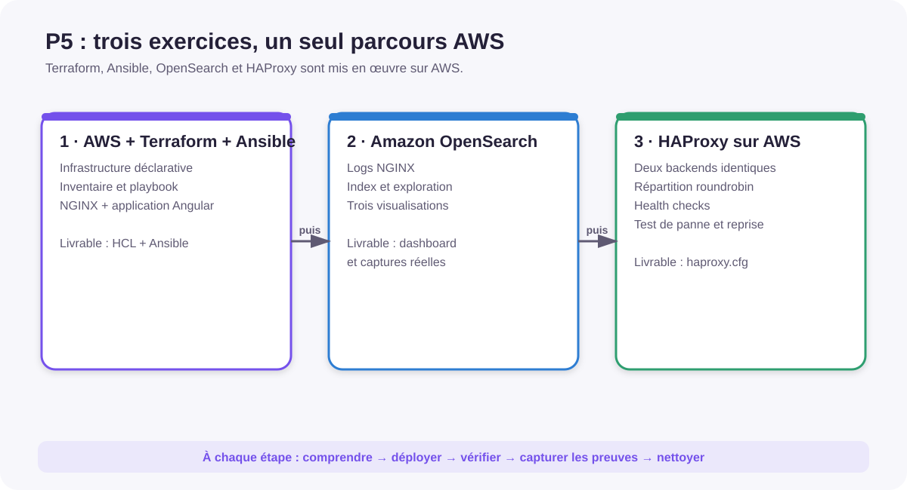

# P5 OpenClassrooms — Infrastructure as Code sur AWS

[](https://github.com/mathiasseguincadiche/p5_Openclassrooms/actions/workflows/ci.yml)

Ce dépôt contient le **wiki technique et l’implémentation exécutable du projet
P5**. Il conserve exactement les trois exercices officiels, précédés de la
préparation de la VM de lab et du compte AWS.

> **Parcours retenu : 100 % AWS.** La VM Ubuntu Server 26.04 sans interface
> graphique sert de poste DevOps. Elle exécute Terraform, Ansible, AWS CLI,
> Angular, Docker et les scripts de preuve ; les infrastructures évaluées sont
> créées sur AWS.



## Parcours complet

| Étape | Objectif | Verdict attendu |
| --- | --- | --- |
| 0A — Lab | Installer Ubuntu Server 26.04 et le socle DevOps | VM et dépôt validés |
| 0B — AWS Ready | Contrôler identité, région, quotas, budget et sécurité | `GO AWS` |
| 1 — Terraform et Ansible | Déployer la vraie application Angular avec NGINX | Application vérifiée par HTTP |
| 2 — OpenSearch | Collecter ou générer des logs, les importer et les agréger | Données prêtes pour le dashboard |
| 3 — HAProxy | Tester round-robin, panne et réintégration | Bascule validée |
| Finalisation | Compléter les preuves, détruire et auditer AWS | Aucun marqueur ni coût oublié |

## Démarrage

```bash
./scripts/commands/bootstrap-ubuntu-server.sh
# Reconnexion nécessaire pour le groupe docker et le chargement de NVM.
./scripts/commands/setup.sh --check-only

cp environment/aws-readiness.env.example environment/aws-readiness.env
$EDITOR environment/aws-readiness.env
./scripts/commands/setup-aws-guardrails.sh --apply
./scripts/commands/pre-deployment-check.sh --stage initial
```

Le bootstrap installe notamment **Node.js 22.22.0 avec NVM**, version utilisée
par la CI pour Angular. Les contrôles de préparation ne lancent aucun
`terraform apply`.

## Une seule application réelle

Le dépôt contient une SPA Angular complète et son verrouillage npm :

```text
application/angular/
        │ npm ci + npm run build
        ▼
application/angular/dist/
        │ copie et comparaison contrôlées
        ▼
ansible/files/angular-app/
        │ ansible-playbook
        ▼
EC2 /var/www/p5 ── NGINX :80 ── application web
```

La CI reconstruit Angular et compare exactement le résultat à l’artefact
versionné pour Ansible. Après le déploiement :

```bash
./scripts/commands/verify-angular-deployment.sh
./scripts/commands/generate-nginx-traffic.sh
./scripts/commands/collect-nginx-access-log.sh
```

## OpenSearch reproductible

Le dépôt fournit un échantillon de 64 événements répartis sur quatre tranches
de douze heures, un mapping strict et un convertisseur NGINX vers Bulk NDJSON.

```bash
./scripts/commands/pre-deployment-check.sh --stage exercice-2
./scripts/commands/import-opensearch-data.sh
./scripts/commands/import-opensearch-data.sh --apply
./scripts/commands/verify-opensearch-data.sh
```

La première commande d’import est un aperçu local. `--apply` est obligatoire
pour envoyer les documents au domaine OpenSearch. Les visualisations restent à
créer dans OpenSearch Dashboards afin de démontrer la compréhension des champs
et des agrégations.

## HAProxy et reprise

Après le déploiement de l’exercice 3 :

```bash
./scripts/commands/pre-deployment-check.sh --stage exercice-3
./scripts/commands/test-haproxy-roundrobin.sh
./scripts/commands/test-haproxy-failover.sh
./scripts/commands/test-haproxy-failover.sh --apply
```

Sans `--apply`, le test de failover ne coupe rien. Avec `--apply`, il arrête un
conteneur backend, vérifie la continuité, le redémarre et contrôle sa
réintégration. Un piège de sortie tente toujours de restaurer le backend.

## Arborescence utile

```text
p5_Openclassrooms/
├── application/angular/       # sources, verrouillage npm et configuration Angular
├── ansible/                   # build Angular, NGINX, inventaire et playbook
├── aws/                       # politique IAM et budget du lab
├── environment/               # versions et configuration AWS locale d’exemple
├── docs/
│   ├── exercices/             # les trois guides d’exécution
│   ├── livrables/             # gabarits et contrôle de complétude
│   └── schemas/               # cinq schémas compacts
├── proofs/                    # convention des preuves ; runtime ignoré par Git
├── scripts/
│   ├── commands/              # préparation, import, tests et nettoyage
│   └── tools/                 # conversion des logs et génération HAProxy
└── terraform/                 # trois modules AWS
```

## Validation et preuves

```bash
./scripts/commands/validate.sh
./scripts/commands/prepare-livrables.sh --structure-only
./scripts/commands/prepare-livrables.sh
```

Le dernier contrôle échoue volontairement tant que les gabarits contiennent des
mentions telles que « preuve à insérer ». Le dépôt fournit les scripts et les
emplacements de collecte, mais n’invente jamais une preuve d’exécution AWS.
Les fichiers générés pendant les démonstrations sont enregistrés dans
`proofs/runtime/`, dossier ignoré par Git.

La CI vérifie notamment : Angular avec `npm ci`, égalité du build Ansible,
conversion OpenSearch, richesse temporelle des données, configuration HAProxy,
Bash, ShellCheck, JSON, YAML, Terraform, Ansible, NGINX, Markdown, liens et SVG.

## Sécurité, coûts et nettoyage

Ne versionnez jamais de clé privée, `terraform.tfvars`, état Terraform,
inventaire réel, fichier `environment/aws-readiness.env` ou identifiant secret.
Relisez chaque plan avant application.

```bash
./scripts/commands/destroy-aws.sh
./scripts/commands/check-aws-cleanup.sh
```

Le budget reste actif pour signaler une ressource oubliée.

## Documentation

1. [Préparer la VM](docs/00-preparation-environnement.md)
2. [Préparer le compte AWS](docs/00b-preparation-compte-aws.md)
3. [Exercice 1 — Terraform et Ansible](docs/exercices/01-terraform-ansible.md)
4. [Exercice 2 — OpenSearch](docs/exercices/02-elk-opensearch.md)
5. [Exercice 3 — HAProxy](docs/exercices/03-haproxy.md)
6. [Livrables et preuves](docs/livrables/README.md)
7. [Audit de non-régression](docs/04-audit-non-regression.md)

Licence : [MIT](LICENSE).
