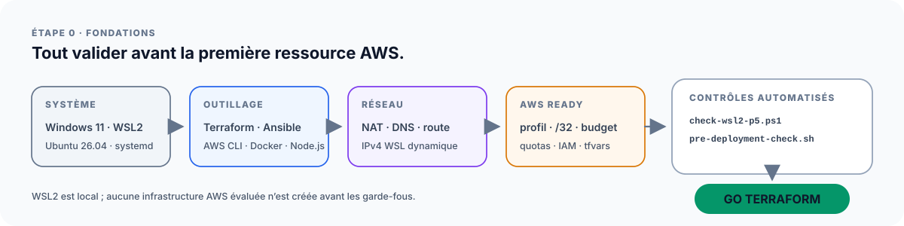

# Étape 0A — Préparer l'environnement de contrôle P5

Cette étape **ne construit plus WSL2**.

Le poste Windows/WSL2 est préparé en amont par le dépôt :

- `mathiasseguincadiche/Windows_11_Pro_Custom`
- <https://github.com/mathiasseguincadiche/Windows_11_Pro_Custom>

Le P5 commence lorsque cette workstation est déjà installée et qualifiée.

La préparation du compte AWS est traitée ensuite dans
[l'étape 0B — AWS Ready](00b-preparation-compte-aws.md).



## 1. Architecture de responsabilité

```text
Windows_11_Pro_Custom
└── Windows 11 Pro
    └── WSL2
        └── Ubuntu
            ├── systemd
            ├── Docker
            ├── Terraform
            ├── Ansible
            ├── AWS CLI
            ├── kubectl / Helm
            ├── Minikube / kind
            └── outils qualité

p5_Openclassrooms
└── réutilise cet environnement
    ├── contrôle le contrat P5
    ├── converge uniquement les écarts propres au projet
    ├── prépare AWS
    └── exécute les trois exercices
```

Le P5 ne doit pas modifier les profils WSL, le VHDX ou la stratégie de backup de
la workstation.

## 2. Plateforme attendue

La distribution fournie par le dépôt Windows est nommée :

```text
Ubuntu
```

Elle est stockée sous :

```text
D:\WSL\Ubuntu-DevOps
```

Les profils versionnés dans le dépôt amont sont :

| Profil | Threads | RAM | Swap | Réseau |
| --- | ---: | ---: | ---: | --- |
| `standard` | 8 | 20 Go | 8 Go | `mirrored` |
| `lab-heavy` | 12 | 28 Go | 12 Go | `mirrored` |
| `nat-fallback` | 8 | 20 Go | 8 Go | `nat` |

Pour P5, `standard` est recommandé. `lab-heavy` peut être utilisé pour les tests
locaux plus lourds. `nat-fallback` reste accepté si le mode mirrored rencontre
une incompatibilité réseau.

## 3. Qualifier d'abord la workstation

Depuis le dépôt `Windows_11_Pro_Custom`, PowerShell administrateur :

```powershell
.\install.ps1 -Mode Apply
```

Après le premier lancement Ubuntu et la création de l'utilisateur Linux :

```powershell
.\install.ps1 -Mode Apply -InstallDevOps
wsl --shutdown
.\install.ps1 -Mode Verify -ValidateWsl -ValidateDevOps
```

Verdicts attendus :

```text
VERDICT: V3 DEVOPS READY
VERDICT: V6 WSL2 PLATFORM READY
```

Cette qualification appartient au dépôt Windows. En cas d'échec WSL2, il faut
corriger la workstation **dans ce dépôt amont**, pas ajouter une seconde
configuration dans P5.

## 4. Ouvrir Ubuntu

Depuis Windows :

```powershell
wsl -d Ubuntu
```

Vérifications rapides :

```bash
ps -p 1 -o comm=
findmnt -T "$HOME" -n -o FSTYPE
nproc
free -h
```

Résultats attendus :

- PID 1 : `systemd` ;
- HOME sur filesystem Linux ;
- ressources cohérentes avec le profil WSL actif.

## 5. Cloner P5 dans le filesystem Linux

```bash
mkdir -p ~/labs
cd ~/labs
git clone https://github.com/mathiasseguincadiche/p5_Openclassrooms.git
cd p5_Openclassrooms
```

Ne pas utiliser `/mnt/c` ou `/mnt/d` comme emplacement principal du dépôt P5.

## 6. Vérifier le contrat spécifique P5

La workstation amont fournit déjà la stack générale. Le P5 commence donc par un
contrôle non destructif :

```bash
bash scripts/commands/bootstrap-ubuntu-server.sh --check-only
```

Le bootstrap vérifie les versions et outils nécessaires au projet. S'ils sont
déjà conformes, il ne fait rien.

Si un delta existe :

```bash
bash scripts/commands/bootstrap-ubuntu-server.sh
```

Ce mode peut corriger uniquement ce qui manque au contrat P5, par exemple une
version Node.js de référence. Il ne réinstalle pas WSL2 et ne touche pas au VHDX.

Après un éventuel ajout au groupe Docker, fermer la session WSL puis appliquer :

```powershell
wsl --shutdown
wsl -d Ubuntu
```

Puis vérifier :

```bash
cd ~/labs/p5_Openclassrooms
bash scripts/commands/bootstrap-ubuntu-server.sh --check-only
```

## 7. Inspection P5

Avant toute configuration AWS :

```bash
bash scripts/commands/p5.sh inspect
```

`inspect` ne doit ni installer un paquet, ni ouvrir une session AWS interactive,
ni créer une ressource.

## 8. Réseau WSL2 et AWS

Le P5 ne dépend pas d'une adresse privée WSL fixe.

Le profil amont quotidien utilise `networkingMode=mirrored`; un profil NAT de
secours existe également. Ces choix concernent uniquement le poste local.

La variable :

```text
P5_PUBLIC_IP_CIDR
```

représente l'IPv4 publique `/32` d'administration autorisée dans AWS. Elle ne
doit jamais être remplacée par une adresse d'interface WSL2.

## 9. Sauvegarde et reprise de la workstation

Le P5 ne fournit plus de scripts `backup-p5.ps1` ou `restore-p5.ps1`.

La V7 de `Windows_11_Pro_Custom` est la seule source de vérité pour la sauvegarde
Windows et WSL2 :

```powershell
.\install.ps1 -BackupAction Create -BackupTargetDrive E:
.\install.ps1 -BackupAction Verify -BackupTargetDrive E:
.\install.ps1 -BackupAction RestorePlan -BackupTargetDrive E:
```

Cette procédure couvre notamment l'image Windows et l'export Ubuntu VHDX avec
SHA-256.

## 10. Passage à l'étape AWS

Une fois la workstation qualifiée et le contrôle P5 conforme :

```bash
cp environment/aws-readiness.env.example environment/aws-readiness.env
$EDITOR environment/aws-readiness.env
```

Puis suivre :

[Étape 0B — Préparer le compte AWS](00b-preparation-compte-aws.md).

Les portes finales de préparation restent :

```text
GO AWS
GO TERRAFORM
```

## Références

- [Contrat WSL2 du P5](../environment/wsl2/README.md)
- [Environnement](../environment/README.md)
- [Architecture et flux](architecture-et-flux.md)
- [Runbook A → Z](RUNBOOK_EXECUTION_GUIDEE.md)
- [Troubleshooting](troubleshooting.md)
