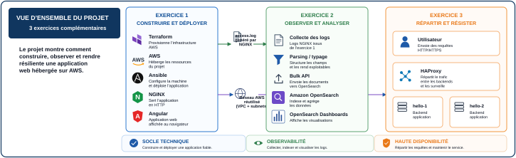

# Documentation officielle du P5

Ce dossier est le **portail documentaire de référence** du projet P5 OpenClassrooms.

La documentation est organisée par intention : **comprendre**, **démontrer**, **exécuter**, **diagnostiquer**, **prouver** et **maintenir**. Chaque document garde une fonction claire afin d'éviter un manuel monolithique impossible à utiliser sous pression.



## Le projet en une lecture

```text
Exercice 1
Terraform → AWS → Ansible → NGINX → Angular
        │
        ├── access.log ─────► Exercice 2 : OpenSearch
        │
        └── VPC/subnets ────► Exercice 3 : HAProxy
```

Le projet se résume en trois verbes :

```text
CONSTRUIRE ET DÉPLOYER
        ↓
OBSERVER
        ↓
RÉPARTIR ET RÉSISTER
```

## Choisir le bon document

| Je veux… | Document | Fonction |
| --- | --- | --- |
| préparer et dérouler la soutenance | [`RUNBOOK_SOUTENANCE.md`](RUNBOOK_SOUTENANCE.md) | **conducteur LIVE (<20 min)** : schémas officiels, commandes, résultats et navigateur |
| préparer la soutenance en profondeur | [`soutenance/RUNBOOK_MENTOR_COMPLET_DETAILLE.md`](soutenance/RUNBOOK_MENTOR_COMPLET_DETAILLE.md) | **runbook mentor détaillé** : explications, preuves, questions probables et limites |
| ouvrir les runbooks détaillés par exercice | [`soutenance/README.md`](soutenance/README.md) | portail Ex. 1, Ex. 2 et Ex. 3 |
| comprendre l'architecture en profondeur | [`architecture-et-flux.md`](architecture-et-flux.md) | référence technique des ressources, flux et dépendances |
| découvrir le P5 progressivement | [`01-parcours-debutant.md`](01-parcours-debutant.md) | guide pédagogique |
| exécuter le projet de A à Z | [`RUNBOOK_EXECUTION_GUIDEE.md`](RUNBOOK_EXECUTION_GUIDEE.md) | procédure opératoire complète |
| reprendre après une interruption | [`convergence-et-reexecution.md`](convergence-et-reexecution.md) | state, delta, convergence et idempotence |
| comprendre une commande `p5.sh` | [`CENTRE_DE_COMMANDE.md`](CENTRE_DE_COMMANDE.md) | référence CLI |
| résoudre un incident | [`troubleshooting.md`](troubleshooting.md) | diagnostic par couche |
| comprendre les schémas | [`schemas/README.md`](schemas/README.md) | schémas officiels de soutenance et références techniques |
| préparer les preuves | [`livrables/README.md`](livrables/README.md) | preuves techniques et livrables |
| vérifier la cohérence doc/code | [`MATRICE_TRACABILITE.md`](MATRICE_TRACABILITE.md) | source de vérité et maintenance |

## Parcours recommandé pour la soutenance

```text
1. soutenance/RUNBOOK_MENTOR_COMPLET_DETAILLE.md  → préparer et comprendre
        ↓
2. RUNBOOK_SOUTENANCE.md                         → conducteur LIVE <20 min
        ↓
3. schemas/officiels/                            → supports visuels officiels
        ↓
4. GLOSSAIRE.md                                  → réviser une notion si nécessaire
```

Le runbook détaillé sert à **apprendre et préparer**. `RUNBOOK_SOUTENANCE.md` reste le **conducteur LIVE** à utiliser sous contrainte de temps.

## Parcours recommandé pour comprendre le projet

```text
README racine
    ↓
01-parcours-debutant.md
    ↓
architecture-et-flux.md
    ↓
exercices/01-terraform-ansible.md
    ↓
exercices/02-opensearch.md
    ↓
exercices/03-haproxy.md
```

## Parcours recommandé pour exécuter

```text
00-preparation-environnement.md
    ↓
00b-preparation-compte-aws.md
    ↓
RUNBOOK_EXECUTION_GUIDEE.md
    ↓
validation-preuves-nettoyage.md
```

## Les trois niveaux de documentation

### 1. Handbook — expliquer et démontrer

[`RUNBOOK_SOUTENANCE.md`](RUNBOOK_SOUTENANCE.md) répond à :

```text
qu'est-ce que je montre ?
comment je l'explique ?
quelle commande prouve le point ?
quel résultat le jury doit voir ?
comment j'enchaîne ?
```

Pour réviser chaque point avec davantage de contexte avant la session, utiliser [`soutenance/RUNBOOK_MENTOR_COMPLET_DETAILLE.md`](soutenance/RUNBOOK_MENTOR_COMPLET_DETAILLE.md) ou les trois runbooks spécialisés du dossier [`soutenance/`](soutenance/README.md).

### 2. Architecture — comprendre le système

[`architecture-et-flux.md`](architecture-et-flux.md) répond à :

```text
quelles ressources existent ?
qui possède quoi ?
comment communiquent-elles ?
quelles données circulent ?
quelles dépendances relient les exercices ?
```

### 3. Runbooks — agir

[`RUNBOOK_EXECUTION_GUIDEE.md`](RUNBOOK_EXECUTION_GUIDEE.md) et les runbooks spécialisés répondent à :

```text
que dois-je faire maintenant ?
quelles sont les préconditions ?
que dois-je observer ?
quand dois-je m'arrêter ?
comment reprendre si cela échoue ?
```

## Parcours visuel officiel

Les quatre schémas ci-dessous sont les **supports officiels de soutenance en SVG vectoriel haute qualité**. Ils restent nets à l'écran, au zoom et lors d'une exportation PDF :

| Vue | Schéma | À comprendre |
| --- | --- | --- |
| projet | [`vue-ensemble.svg`](schemas/officiels/vue-ensemble.svg) | Ex. 1 construit le socle ; Ex. 2 exploite les logs ; Ex. 3 réutilise le réseau pour la haute disponibilité |
| Ex. 1 | [`exercice-1.svg`](schemas/officiels/exercice-1.svg) | VPC, subnets, EC2 et rôle de Terraform, Ansible, NGINX et Angular |
| Ex. 2 | [`exercice-2.svg`](schemas/officiels/exercice-2.svg) | `access.log → parsing → Bulk API → OpenSearch → Dashboards` |
| Ex. 3 | [`exercice-3.svg`](schemas/officiels/exercice-3.svg) | HAProxy, deux backends, round-robin et failover `2 → 1 → 2` |

Les anciens WebP restent disponibles comme compatibilité raster. Les schémas [`etape-0.svg`](schemas/etape-0.svg), [`finalisation.svg`](schemas/finalisation/finalisation.svg) et les anciens SVG d'architecture restent des **références techniques complémentaires**. Les conventions sont documentées dans [`schemas/README.md`](schemas/README.md).

## Guides techniques par exercice

| Exercice | Guide | Résultat attendu |
| --- | --- | --- |
| 1 — Terraform / Ansible | [`exercices/01-terraform-ansible.md`](exercices/01-terraform-ansible.md) | infrastructure convergée, Ansible idempotent, Angular visible |
| 2 — OpenSearch | [`exercices/02-opensearch.md`](exercices/02-opensearch.md) | données validées + trois visualisations |
| 3 — HAProxy | [`exercices/03-haproxy.md`](exercices/03-haproxy.md) | round-robin + failover `2 → 1 → 2` |

## Sources de vérité

La prose explique ; le code configure.

| Domaine | Source de vérité |
| --- | --- |
| orchestration | `scripts/commands/p5.sh` |
| infrastructure AWS | `terraform/exercice-{1,2,3}/` |
| configuration Ex. 1 | `ansible/playbooks/deploy.yml` |
| application | `application/angular/` |
| mapping OpenSearch | `terraform/exercice-2/opensearch/index-template.json` |
| Dashboard as Code | `terraform/exercice-2/opensearch/dashboards/p5-dashboard.json` |
| comportement HAProxy | `terraform/exercice-3/haproxy.cfg.tpl` |
| logs et preuves | `scripts/lib/p5-runtime.sh` |
| cohérence doc/code | `MATRICE_TRACABILITE.md` |

## Trois preuves différentes

```text
CODE
= ce qui doit être construit

CI
= le dépôt respecte ses contrats et tests

PREUVE RUNTIME
= ce qui a réellement été observé dans le lab
```

Une CI verte ne remplace pas une démonstration AWS réelle.

## Maintenir la qualité documentaire

Avant de fusionner une évolution documentaire importante :

```bash
python3 scripts/tools/audit_non_regression.py --schemas-only
python3 scripts/tools/audit_non_regression.py
bash scripts/commands/validate.sh
```

Les règles de rédaction sont dans [`CONVENTIONS_DOCUMENTAIRES.md`](CONVENTIONS_DOCUMENTAIRES.md).

## Préparer, diagnostiquer et fermer

- [`00-preparation-environnement.md`](00-preparation-environnement.md) — environnement local ;
- [`00b-preparation-compte-aws.md`](00b-preparation-compte-aws.md) — AWS, budget, réseau et identité ;
- [`convergence-et-reexecution.md`](convergence-et-reexecution.md) — reprise ;
- [`troubleshooting.md`](troubleshooting.md) — diagnostic ;
- [`validation-preuves-nettoyage.md`](validation-preuves-nettoyage.md) — finalisation ;
- [`livrables/README.md`](livrables/README.md) — livrables.

## Gouvernance

- [`02-correspondance-consignes-depot.md`](02-correspondance-consignes-depot.md) — consignes → implémentation → preuves ;
- [`03-audit-structurel.md`](03-audit-structurel.md) — invariants structurels ;
- [`04-audit-non-regression.md`](04-audit-non-regression.md) — contrat exécutable ;
- [`MATRICE_TRACABILITE.md`](MATRICE_TRACABILITE.md) — documentation ↔ code ;
- [`CONVENTIONS_DOCUMENTAIRES.md`](CONVENTIONS_DOCUMENTAIRES.md) — règles documentaires ;
- [`suivi/decisions-techniques.md`](suivi/decisions-techniques.md) — décisions techniques.
