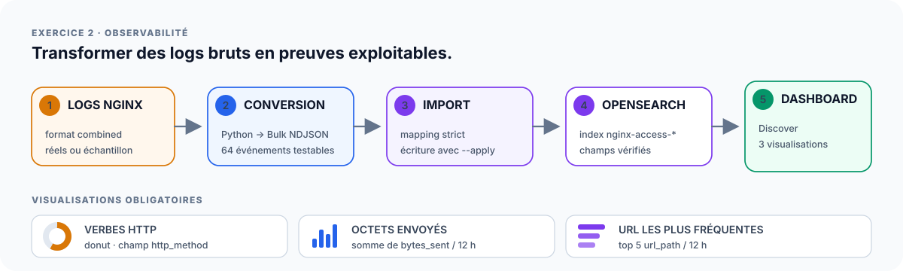

# Handbook de soutenance — P5 OpenClassrooms

> **Fonction du document :** conduire une démonstration claire, pédagogique et vérifiable du P5.
> L'ordre de lecture est volontaire : **comprendre → expliquer → montrer le code utile → prouver dans le terminal → montrer le résultat dans le navigateur → conclure**.
>
> Le récit principal porte sur **l'architecture du projet AWS et les trois exercices**. L'environnement local utilisé pour lancer les commandes n'est qu'un poste de contrôle et ne constitue pas l'architecture présentée au jury.

## Comment utiliser ce handbook

Ce document est conçu pour trois usages simultanés :

| Besoin pendant l'oral | Où regarder |
| --- | --- |
| je veux suivre la démonstration sans réfléchir à l'étape suivante | blocs **Déroulé de démonstration** |
| j'ai oublié comment expliquer un choix | blocs **À dire au jury** et **Pourquoi** |
| le jury pose une question technique | blocs **Sous le capot** et section **Questions probables** |

Chaque exercice suit la même mécanique :

```text
COMPRENDRE L'ARCHITECTURE
          ↓
EXPLIQUER LE CHOIX
          ↓
MONTRER LE CODE UTILE
          ↓
PROUVER DANS LE TERMINAL
          ↓
MONTRER DANS LE NAVIGATEUR
          ↓
DIRE CE QUE CELA PROUVE
          ↓
ENCHAÎNER
```

> **Règle de soutenance :** le terminal prouve le fonctionnement technique ; le navigateur matérialise le résultat ; l'explication démontre la compréhension.

## Navigation rapide

- [0 — Préparer le lab avant l'oral](#0--préparer-le-lab-avant-loral)
- [1 — Comprendre l'architecture globale](#1--comprendre-larchitecture-globale)
- [2 — Exercice 1 : construire et déployer](#2--exercice-1--construire-et-déployer)
- [3 — Exercice 2 : observer les logs](#3--exercice-2--observer-les-logs)
- [4 — Exercice 3 : répartir et résister](#4--exercice-3--répartir-et-résister)
- [5 — Relier les trois exercices](#5--relier-les-trois-exercices)
- [6 — Conclusion](#6--conclusion)
- [7 — Mémo express](#7--mémo-express)
- [8 — Questions probables](#8--questions-probables)
- [9 — Repli en cas d'incident](#9--repli-en-cas-dincident)
- [10 — Après la soutenance](#10--après-la-soutenance)
- [11 — À ne pas faire](#11--à-ne-pas-faire)
- [12 — Annexe environnement local](#12--annexe-environnement-local)

---

## 0 — Préparer le lab avant l'oral

Cette partie se fait **avant** l'arrivée du jury. L'objectif est d'éviter d'utiliser le temps de soutenance pour reconstruire des ressources AWS ou chercher des URLs.

### Reconstruire et valider le lab

```bash
cd ~/labs/p5_Openclassrooms

git switch main
git pull --ff-only
git status --short

bash scripts/commands/p5.sh inspect
bash scripts/commands/p5.sh prepare
bash scripts/commands/p5.sh status

bash scripts/commands/p5.sh ex1
bash scripts/commands/p5.sh ex2
bash scripts/commands/p5.sh ex3

bash scripts/commands/p5.sh diagnostics
bash scripts/commands/p5.sh finalize
```

### État minimum avant de présenter

| Couche | État attendu |
| --- | --- |
| Terraform Ex. 1 | infrastructure présente, post-plan sans delta |
| Ansible Ex. 1 | deuxième passage `changed=0`, `unreachable=0`, `failed=0` |
| Angular / NGINX | application visible dans le navigateur |
| NGINX | vrai `access.log` collecté |
| OpenSearch | documents, mappings et agrégations validés |
| Dashboard as Code | 5 Saved Objects importés et relus par API |
| OpenSearch Dashboards | 3 visualisations + dashboard lisibles |
| HAProxy | 2 backends observables |
| Failover | scénario `2 → 1 → 2` validé |

> **Stop :** ne pas commencer la soutenance avec un exercice dégradé. Ne pas lancer `cleanup` avant la fin de l'oral.

### Préparer les URLs une seule fois

```bash
cd ~/labs/p5_Openclassrooms

export WEB_URL="$(terraform -chdir=terraform/exercice-1 output -raw web_url)"
export WEB_IP="$(terraform -chdir=terraform/exercice-1 output -raw web_public_ip)"

export OPENSEARCH_ENDPOINT="$(terraform -chdir=terraform/exercice-2 output -raw opensearch_endpoint)"
export DASHBOARDS_URL="$(terraform -chdir=terraform/exercice-2 output -raw opensearch_dashboards_endpoint)"
export DASHBOARD_URL="${DASHBOARDS_URL%/}/app/dashboards#/view/p5-nginx-observability"

export HAPROXY_URL="$(terraform -chdir=terraform/exercice-3 output -raw haproxy_url)"
export BACKEND_1_IP="$(terraform -chdir=terraform/exercice-3 output -raw hello_1_public_ip)"

printf 'Angular   : %s\n' "$WEB_URL"
printf 'Dashboard : %s\n' "$DASHBOARD_URL"
printf 'HAProxy   : %s\n' "$HAPROXY_URL"
```

Préparer trois onglets avant le début :

```text
1. Application Angular    → WEB_URL
2. OpenSearch Dashboards  → DASHBOARD_URL
3. HAProxy                → HAPROXY_URL
```

---

## 1 — Comprendre l'architecture globale

### La vue à montrer en premier


### Comment lire ce schéma

1. **Exercice 1 construit le socle AWS et livre l'application.**
   Terraform crée le réseau, la sécurité et l'EC2 ; Ansible configure la machine ; NGINX sert Angular.
2. **Exercice 2 part d'un résultat réel de l'exercice 1.**
   NGINX produit `access.log`, qui est transformé puis indexé dans Amazon OpenSearch.
3. **Exercice 3 réutilise le réseau de l'exercice 1.**
   HAProxy distribue le trafic entre deux backends et démontre la continuité de service pendant une panne.
4. Les trois exercices forment donc **une histoire cohérente**, pas trois TP indépendants.

### À retenir en une phrase

```text
Exercice 1 = construire et déployer
Exercice 2 = observer
Exercice 3 = répartir et résister
```

### Valeurs d'architecture à connaître

| Élément | Valeur du projet | Pourquoi c'est important |
| --- | --- | --- |
| Région AWS | `us-east-1` | région de référence du lab |
| VPC | `10.0.0.0/16` | réseau principal créé par l'Ex. 1 |
| Subnets | 2 publics | réseau réparti sur deux zones disponibles |
| EC2 Ex. 1 | `t3.micro` | serveur NGINX / Angular |
| OS EC2 | Ubuntu 24.04 LTS | AMI des EC2 du lab |
| OpenSearch | `OpenSearch_2.19` | moteur managé de l'Ex. 2 |
| Nœud OpenSearch | `t3.small.search` | dimensionnement pédagogique |
| Stockage OpenSearch | EBS `gp3`, 10 Gio | stockage du domaine |
| EC2 Ex. 3 | 3 × `t3.micro` | 1 HAProxy + 2 backends |
| HTTP public | TCP/80 | application Angular et point d'entrée HAProxy |
| SSH administration | TCP/22 depuis `/32` | accès d'administration restreint |

### À dire au jury

> « Le projet est organisé en trois exercices complémentaires. Le premier construit l'infrastructure AWS et déploie une application Angular derrière NGINX. Le deuxième exploite les logs réels de ce serveur avec Amazon OpenSearch et un dashboard d'observabilité. Le troisième réutilise le réseau du premier exercice pour placer HAProxy devant deux backends et démontrer la répartition de charge ainsi que la continuité de service pendant une panne contrôlée. »

### Transition

> « Je commence par le socle : comment l'infrastructure est créée et comment l'application est réellement livrée dessus. »

---

## 2 — Exercice 1 : construire et déployer

### Objectif de l'exercice

Prouver que l'infrastructure et la configuration applicative sont **séparées, reproductibles et convergentes**.

### Architecture à montrer


### Comment lire ce schéma

| Étape | Ce qui se passe | Responsable |
| --- | --- | --- |
| 1 | création du VPC, des subnets, du routage, du SG et de l'EC2 | Terraform |
| 2 | préparation minimale de l'EC2 avec Python 3 | Terraform `user_data` |
| 3 | connexion à la cible par SSH | Ansible |
| 4 | installation de NGINX et déploiement de l'artefact Angular | Ansible |
| 5 | exposition de l'application sur HTTP/80 | NGINX |
| 6 | génération de `access.log` par les requêtes HTTP | NGINX |

### Pourquoi séparer Terraform et Ansible ?

```text
Terraform = créer l'infrastructure
Ansible   = configurer la machine
NGINX     = servir l'application
Angular   = application livrée
```

> **À dire au jury :**
> « Terraform possède l'infrastructure AWS. Ansible possède la configuration du serveur. Cette séparation évite de transformer le `user_data` en gros script monolithique et rend chaque couche plus lisible, rejouable et testable. »

### Sous le capot : ce que Terraform crée

Source de vérité :

```text
terraform/exercice-1/main.tf
```

Terraform crée notamment :

- un VPC `10.0.0.0/16` avec DNS ;
- deux subnets publics ;
- une Internet Gateway ;
- une route `0.0.0.0/0` vers Internet ;
- un Security Group avec HTTP/80 public ;
- SSH/22 limité à l'IP d'administration `/32` ;
- une paire de clés EC2 à partir de la clé publique ;
- une EC2 `t3.micro` par défaut ;
- Ubuntu 24.04 LTS ;
- une IP publique ;
- un volume racine EBS `gp3` chiffré ;
- IMDSv2 obligatoire ;
- un `user_data` minimal qui installe Python 3.

> **Question fréquente — t2.micro ou t3.micro ?**
> La valeur Terraform actuelle est **`t3.micro`**. Le type reste paramétrable pour s'adapter aux quotas et aux coûts du compte.

### Code utile à montrer

Ne pas faire défiler tout `main.tf`. Afficher uniquement les blocs qui servent l'explication :

```bash
grep -nE 'resource "aws_(vpc|subnet|internet_gateway|route_table|security_group|key_pair|instance)"' \
  terraform/exercice-1/main.tf
```

Pour le type d'instance :

```bash
grep -nA5 'variable "instance_type"' terraform/exercice-1/variables.tf
```

### Déroulé de démonstration 1A — Terraform

**Intention :** montrer que les ressources AWS existent et qu'elles correspondent au code.

```bash
terraform -chdir=terraform/exercice-1 output
```

À repérer :

```text
vpc_id
public_subnet_ids
web_security_group_id
web_public_ip
web_public_dns
web_url
```

> **À dire au jury :**
> « Ces valeurs proviennent de l'état Terraform. Les étapes suivantes consomment les outputs réels plutôt qu'une IP ou une URL recopiée à la main. »

Prouver ensuite la convergence :

```bash
terraform -chdir=terraform/exercice-1 plan -input=false -detailed-exitcode
```

Résultat idéal : aucun changement.

> **Ce que cela prouve :** l'infrastructure déclarée et l'infrastructure gérée sont alignées ; aucun delta n'est nécessaire avant la démonstration.

### Déroulé de démonstration 1B — Ansible

#### Ce qu'Ansible configure

Source de vérité :

```text
ansible/playbooks/deploy.yml
```

Le playbook :

```text
installe NGINX + curl
        ↓
crée appuser / appgroup
        ↓
crée /var/www/p5
        ↓
copie l'artefact Angular
        ↓
installe la configuration NGINX
        ↓
exécute nginx -t
        ↓
démarre et active NGINX
```

> **À dire au jury :**
> « Le `user_data` Terraform ne déploie pas l'application. Il prépare seulement le minimum pour qu'Ansible puisse prendre la main. La configuration applicative reste donc dans un playbook idempotent. »

Prouver la connectivité :

```bash
ansible all \
  -i ansible/inventories/hosts_aws \
  -m ping
```

Attendu :

```text
SUCCESS
ping: pong
```

Prouver l'idempotence :

```bash
ansible-playbook \
  -i ansible/inventories/hosts_aws \
  ansible/playbooks/deploy.yml
```

Attendu sur une cible déjà convergée :

```text
changed=0
unreachable=0
failed=0
```

> **À dire au jury :**
> « Je rejoue le même playbook sur une machine déjà conforme. `changed=0` montre qu'Ansible reconnaît l'état souhaité et n'applique pas de modification inutile. »

### Déroulé de démonstration 1C — montrer l'application

Un HTTP 200 seul ne suffit pas : l'application doit être **visible**.

Prouver d'abord techniquement :

```bash
bash scripts/commands/verify-angular-deployment.sh --url "$WEB_URL"
```

Verdict attendu :

```text
APPLICATION ANGULAR DÉPLOYÉE ET SERVIE PAR NGINX
```

Le script contrôle notamment HTTP 200, le document Angular, le bundle JavaScript, le fallback SPA et l'en-tête `nosniff`.

#### Dans le navigateur

Ouvrir :

```text
WEB_URL
```

Montrer :

1. la page Angular réellement rendue ;
2. le contenu de l'application ;
3. un rafraîchissement ;
4. si utile, `WEB_URL/parcours-p5` pour matérialiser le fallback SPA.

> **À dire au jury :**
> « Le terminal valide techniquement le déploiement. Ici je montre le résultat concret : Angular est réellement servi par NGINX sur l'EC2 AWS. »

### Ce que l'exercice 1 démontre

| Compétence | Preuve |
| --- | --- |
| Infrastructure as Code | ressources AWS décrites par Terraform |
| convergence | `terraform plan` sans delta |
| automatisation de configuration | playbook Ansible |
| idempotence | `changed=0` au deuxième passage |
| livraison applicative | Angular visible dans le navigateur |
| lien vers l'observabilité | NGINX produit `access.log` |

### Transition vers l'exercice 2

> « L'application fonctionne. Je vais maintenant suivre son activité réelle : chaque requête reçue par NGINX produit une ligne de log que je vais transformer en donnée exploitable. »

---

## 3 — Exercice 2 : observer les logs

### Objectif de l'exercice

Montrer comment un **événement HTTP réel** devient une donnée structurée, une agrégation puis une visualisation.

### Architecture à montrer



### Comment lire ce schéma

1. le vrai `access.log` vient du NGINX de l'exercice 1 ;
2. un sample versionné conserve une source reproductible pour les tests ;
3. le parser transforme les lignes en documents NDJSON typés ;
4. la Bulk API importe les documents dans OpenSearch ;
5. les mappings rendent les champs correctement agrégeables ;
6. OpenSearch Dashboards matérialise les trois vues demandées.

### Pourquoi deux sources de logs ?

| Source | Rôle |
| --- | --- |
| `access.log` réel | prouver le lien avec l'application réellement déployée |
| sample versionné | permettre des tests reproductibles sans dépendre d'une EC2 active |

> **À dire au jury :**
> « Je sépare la reproductibilité de la preuve réelle. Le sample stabilise mes tests ; le log runtime montre que la chaîne fonctionne avec le NGINX AWS réellement déployé. »

### Sous le capot : le domaine OpenSearch

Source de vérité :

```text
terraform/exercice-2/main.tf
```

| Paramètre | Valeur |
| --- | --- |
| Service | Amazon OpenSearch Service |
| Moteur | `OpenSearch_2.19` |
| Nombre de nœuds | 1 |
| Instance | `t3.small.search` |
| Stockage | EBS `gp3` |
| Taille | 10 Gio |
| HTTPS | obligatoire |
| TLS | minimum 1.2 |
| Chiffrement au repos | activé |
| Chiffrement inter-nœuds | activé |
| Accès | IP d'administration `/32` |

> **À dire au jury :**
> « Le domaine est volontairement dimensionné comme un lab avec un seul nœud. Je conserve néanmoins les protections essentielles : HTTPS, TLS 1.2 minimum, chiffrement au repos, chiffrement inter-nœuds et restriction d'accès par IP. »

### Déroulé de démonstration 2A — produire un vrai log

Générer du trafic :

```bash
bash scripts/commands/generate-nginx-traffic.sh \
  --url "$WEB_URL" \
  --requests 12
```

Collecter le log :

```bash
bash scripts/commands/collect-nginx-access-log.sh \
  --host "$WEB_IP" \
  --output proofs/runtime/exercice-2/nginx-access-presentation.log
```

Montrer quelques lignes :

```bash
tail -n 10 proofs/runtime/exercice-2/nginx-access-presentation.log
```

> **À dire au jury :**
> « Ces lignes ont été produites par le NGINX que je viens de démontrer. Je pars donc d'une donnée runtime réelle avant de l'envoyer vers la couche d'observabilité. »

### Déroulé de démonstration 2B — expliquer les champs

Avant de montrer un graphique, expliquer **ce qu'il agrège**.

| Champ | Sens | Visualisation |
| --- | --- | --- |
| `@timestamp` | date et heure de la requête | axe temporel |
| `http_method` | GET, POST, HEAD… | donut |
| `bytes_sent` | volume envoyé par NGINX | somme par 12 h |
| `url_path` | ressource demandée | top 5 par 12 h |

> **À dire au jury :**
> « La visualisation n'a de sens que si le mapping est correct. `bytes_sent`, par exemple, doit être numérique pour que sa somme soit calculable. »

### Déroulé de démonstration 2C — prouver la couche données

```bash
bash scripts/commands/verify-opensearch-data.sh \
  --endpoint "$OPENSEARCH_ENDPOINT"
```

À observer :

- documents présents ;
- mappings valides ;
- champs exploitables ;
- agrégations sans erreur.

> **À dire au jury :**
> « Je valide d'abord la donnée. Cela permet de distinguer un problème d'indexation d'un simple problème d'affichage dans Dashboards. »

### Déroulé de démonstration 2D — expliquer le Dashboard as Code

Source de vérité :

```text
terraform/exercice-2/opensearch/dashboards/p5-dashboard.json
```

Afficher une vue courte :

```bash
jq '{index_pattern, visualizations, dashboard: {id: .dashboard.id, title: .dashboard.title}}' \
  terraform/exercice-2/opensearch/dashboards/p5-dashboard.json
```

Chaîne d'automatisation :

```text
p5-dashboard.json
        ↓
génération des Saved Objects
        ↓
contrôle _field_caps
        ↓
import API avec overwrite contrôlé
        ↓
relecture des 5 objets par API
        ↓
validation du rendu dans le navigateur
```

Les cinq objets sont :

```text
1 index pattern
3 visualisations
1 dashboard
```

> **À dire au jury :**
> « La définition du dashboard est versionnée. Après une reconstruction du lab, l'automatisation recrée les Saved Objects au lieu de me demander de reconstruire les graphiques à la souris. Je garde ensuite un contrôle humain du rendu. »

### Déroulé de démonstration 2E — montrer le dashboard

Ouvrir dans le navigateur :

```text
DASHBOARD_URL
```

Titre attendu :

```text
P5 — Observabilité NGINX
```

Montrer dans cet ordre :

1. **Donut — méthodes HTTP** ;
2. **Somme de `bytes_sent` par tranche de 12 h** ;
3. **Top 5 des `url_path` par tranche de 12 h** ;
4. **dashboard complet** avec les trois vues.

> **À dire au jury :**
> « Le donut montre la répartition des méthodes HTTP. Le second graphique mesure le volume cumulé envoyé par le serveur sur des fenêtres de 12 heures. Le troisième suit les cinq chemins les plus sollicités dans le temps. »

Si une visualisation paraît vide, vérifier d'abord :

```text
plage temporelle
filtres actifs
présence réelle des données
```

Ne pas recréer le graphique manuellement pendant l'oral.

Captures de secours à préparer :

```text
01-dashboard-complet
02-donut-methodes-http
03-histogramme-bytes-12h
04-top5-url-12h
```

### Ce que l'exercice 2 démontre

| Compétence | Preuve |
| --- | --- |
| collecte | vrai `access.log` NGINX |
| transformation | parser → NDJSON |
| ingestion | Bulk API |
| qualité des données | mappings et agrégations validés |
| observabilité | trois visualisations |
| reproductibilité | Dashboard as Code |
| contrôle humain | rendu vérifié dans le navigateur |

### Transition vers l'exercice 3

> « J'ai démontré comment déployer puis observer. Je termine par la disponibilité : comment répartir les requêtes sur plusieurs serveurs et maintenir le service si l'un d'eux tombe. »

---

## 4 — Exercice 3 : répartir et résister

### Objectif de l'exercice

Démontrer le **load balancing**, les **health checks**, la **continuité de service** et la **réintégration automatique**.

### Architecture à montrer


### Comment lire ce schéma

Le dessin contient volontairement deux niveaux :

- **en haut : la topologie statique** — qui communique avec qui ;
- **en bas : le scénario dynamique** — ce qui change pendant une panne.

### Topologie

```text
Internet
   ↓ HTTP :80
HAProxy
   ↓ round-robin + health checks
Backend 1 + Backend 2
```

L'exercice 3 ne crée pas un second réseau : Terraform retrouve le **VPC et les subnets de l'exercice 1** grâce aux tags.

> **À dire au jury :**
> « Je réutilise le réseau du premier exercice. Cela donne une architecture cohérente et évite de créer un VPC indépendant uniquement pour la démonstration HAProxy. »

### Sécurité réseau

Le client parle à HAProxy. Les backends n'acceptent HTTP/80 que depuis le **Security Group HAProxy**.

```text
Internet
   ↓ HTTP :80 public
HAProxy
   ↓ HTTP :80 autorisé par relation de Security Groups
Backends
```

> **Nuance du lab :** les EC2 backends disposent d'une IP publique pour les besoins d'administration et de démonstration, mais leur port HTTP reste filtré par le Security Group.

### Instances

```text
1 × EC2 t3.micro : HAProxy
2 × EC2 t3.micro : backends applicatifs
```

Les backends exécutent :

```text
Docker
  └── nginxdemos/hello:0.4-plain-text
      ├── p5-hello-1
      └── p5-hello-2
```

### Sous le capot : configuration HAProxy

Source de vérité :

```text
terraform/exercice-3/haproxy.cfg.tpl
```

Afficher seulement les directives utiles :

```bash
grep -E 'bind|default_backend|balance|httpchk|http-check|server hello' \
  terraform/exercice-3/haproxy.cfg.tpl
```

À savoir expliquer :

| Directive | Sens |
| --- | --- |
| `bind *:80` | écoute HTTP sur le port 80 |
| `balance roundrobin` | distribue les requêtes entre les backends disponibles |
| `option httpchk GET /` | teste la racine HTTP |
| `http-check expect status 200` | considère un HTTP 200 comme sain |
| `inter 3s` | exécute un check toutes les 3 secondes |
| `fall 3` | retire un backend après 3 échecs consécutifs |
| `rise 2` | réintègre un backend après 2 succès consécutifs |

> **À dire au jury :**
> « Le load balancer ne se contente pas de distribuer les requêtes. Il surveille aussi la santé des backends et adapte dynamiquement le pool disponible. »

### Déroulé de démonstration 3A — round-robin dans le navigateur

Ouvrir :

```text
HAPROXY_URL
```

Dans `nginxdemos/hello`, repérer :

```text
Server address
Server name
```

Rafraîchir plusieurs fois. Les deux backends doivent apparaître.

```text
p5-hello-1
p5-hello-2
```

> **À dire au jury :**
> « Ici la répartition est visible sans interprétation : les réponses proviennent de deux serveurs différents derrière le même point d'entrée HAProxy. »

Confirmer sur une série de requêtes :

```bash
bash scripts/commands/test-haproxy-roundrobin.sh \
  --url "$HAPROXY_URL" \
  --requests 12
```

### Déroulé de démonstration 3B — failover réel

Avant de lancer la commande, annoncer ce qui doit se produire :

```text
2 backends UP
      ↓
arrêt du conteneur backend 1
      ↓
3 checks en échec
      ↓
backend 1 = DOWN
      ↓
backend 2 continue à répondre
      ↓
backend 1 redémarre
      ↓
2 checks réussis
      ↓
backend 1 = UP
      ↓
retour à 2 backends
```

Lancer :

```bash
bash scripts/commands/test-haproxy-failover.sh \
  --url "$HAPROXY_URL" \
  --backend-host "$BACKEND_1_IP" \
  --apply
```

Le scénario doit montrer :

```text
AVANT   : 2 backends
PENDANT : 1 backend, HTTP reste disponible
APRÈS   : 2 backends
```

Verdict attendu :

```text
BASCULE ET RÉINTÉGRATION HAPROXY VALIDÉES
```

> **À dire pendant le test :**
> « J'arrête uniquement le conteneur du backend ciblé. HAProxy doit détecter la panne et maintenir le service grâce au backend sain. Après restauration, les health checks doivent provoquer sa réintégration. »

#### Retour navigateur

Revenir sur `HAPROXY_URL`, rafraîchir plusieurs fois et montrer que les deux `Server name` sont de nouveau visibles.

### Ce que l'exercice 3 démontre

| Compétence | Preuve |
| --- | --- |
| load balancing | deux backends visibles |
| contrôle de santé | checks HTTP |
| retrait automatique | `fall 3` |
| continuité de service | HTTP disponible avec un seul backend |
| réintégration | `rise 2` |
| compréhension réseau | flux client → HAProxy → backends |

---

## 5 — Relier les trois exercices

La valeur pédagogique du P5 vient aussi des **dépendances entre exercices**.


### Dépendance 1 — Exercice 1 vers Exercice 2

```text
NGINX de l'Exercice 1
        ↓
access.log réel
        ↓
OpenSearch de l'Exercice 2
```

### Dépendance 2 — Exercice 1 vers Exercice 3

```text
VPC + subnets de l'Exercice 1
        ↓
réutilisés par Terraform
        ↓
HAProxy + backends de l'Exercice 3
```

> **À dire au jury :**
> « Les trois exercices ne sont pas isolés. Le premier fournit à la fois la donnée réelle utilisée dans le deuxième et le réseau réutilisé dans le troisième. »

---

## 6 — Conclusion

### Résumer les preuves sans tout rejouer

```bash
bash scripts/commands/p5.sh logs
```

Si nécessaire :

```bash
ls -1 proofs/runtime/exercice-2/*dashboards* 2>/dev/null
ls -1t proofs/runtime/exercice-3/*failover* 2>/dev/null | head
```

### Tableau de synthèse

| Propriété | Ce qui a été démontré |
| --- | --- |
| Infrastructure as Code | Terraform décrit et crée l'infrastructure AWS |
| convergence | plan Terraform sans delta |
| configuration automatisée | Ansible configure NGINX et Angular |
| idempotence | second passage Ansible `changed=0` |
| application fonctionnelle | Angular visible dans le navigateur |
| observabilité | vrai `access.log` → OpenSearch → dashboard |
| reproductibilité visuelle | Saved Objects versionnés et synchronisés |
| load balancing | deux backends derrière HAProxy |
| résilience | failover réel `2 → 1 → 2` |
| traçabilité | logs et preuves runtime |

### Phrase de conclusion

> « Ce P5 met en œuvre une chaîne DevOps complète autour de l'infrastructure et de l'exploitation : Terraform rend l'infrastructure AWS reproductible, Ansible automatise la configuration et le déploiement, NGINX sert l'application et produit des logs exploitables, OpenSearch transforme ces logs en observabilité, et HAProxy démontre la répartition de charge ainsi que la continuité de service pendant une panne contrôlée. »

---

## 7 — Mémo express

Si le temps devient court, suivre uniquement cette colonne vertébrale :

```text
1  VUE GLOBALE
   Ex1 construire → Ex2 observer → Ex3 résister

2  EX1 TERRAFORM
   outputs → plan sans delta

3  EX1 ANSIBLE
   ping → playbook → changed=0

4  EX1 ANGULAR
   verify → navigateur → application visible

5  EX2 LOG RÉEL
   trafic → collecte → tail

6  EX2 OPENSEARCH
   verify-opensearch-data

7  EX2 DASHBOARD
   Dashboard as Code → navigateur → 3 visualisations

8  EX3 HAPROXY
   navigateur → deux Server name

9  EX3 FAILOVER
   terminal → 2 → 1 → 2 → retour navigateur

10 CONCLUSION
   IaC + idempotence + application + observabilité + résilience
```

---

## 8 — Questions probables

### Pourquoi Terraform et Ansible ensemble ?

Terraform gère les **ressources d'infrastructure** ; Ansible gère la **configuration du système et le déploiement**. Cette séparation évite un `user_data` monolithique et rend chaque couche rejouable indépendamment.

### Quel type d'instance EC2 utilisez-vous ?

Les EC2 des exercices 1 et 3 utilisent `t3.micro` par défaut. Le type reste une variable Terraform.

### Pourquoi deux subnets publics ?

Le VPC est conçu avec deux subnets sur deux zones disponibles. L'exercice 3 les réutilise et répartit ses deux backends sur ce réseau.

### Pourquoi Python 3 dans le `user_data` ?

Python 3 prépare la cible Ubuntu à l'exécution des modules Ansible. Le déploiement applicatif reste dans le playbook.

### Pourquoi le deuxième passage Ansible est-il important ?

Il prouve l'idempotence : une cible déjà conforme ne doit pas être modifiée inutilement.

### Sample NGINX ou log réel : quelle différence ?

Le sample rend les tests reproductibles. Le log réel prouve le lien entre l'application effectivement déployée et l'observabilité.

### Pourquoi Amazon OpenSearch ?

Le projet utilise le mode Cloud avec un service managé AWS pour démontrer indexation, mapping, agrégations et visualisation sans administrer un cluster de recherche complet.

### Pourquoi un seul nœud OpenSearch ?

C'est un dimensionnement de lab. L'objectif est la démonstration fonctionnelle, pas une architecture OpenSearch de production hautement disponible.

### Pourquoi Dashboard as Code ?

Pour reconstruire les visualisations de manière reproductible après destruction/recréation du lab et réduire les manipulations manuelles non versionnées.

### Comment HAProxy détecte-t-il une panne ?

Il exécute `GET /` et attend HTTP 200. `fall 3` retire le backend après trois échecs ; `rise 2` le réintègre après deux succès.

### Les backends sont-ils exposés directement en HTTP ?

Leurs EC2 disposent d'une IP publique dans ce lab, mais leur Security Group n'autorise HTTP/80 que depuis le Security Group HAProxy. Le chemin applicatif utilisateur passe donc par HAProxy.

---

## 9 — Repli en cas d'incident

### Angular ne s'affiche plus

```bash
bash scripts/commands/verify-angular-deployment.sh --url "$WEB_URL"
bash scripts/commands/p5.sh logs
```

Si la preuve technique est saine mais que le navigateur pose problème, utiliser une capture en indiquant clairement qu'elle a été enregistrée avant l'oral.

### Dashboard vide ou inaccessible

```bash
bash scripts/commands/verify-opensearch-data.sh \
  --endpoint "$OPENSEARCH_ENDPOINT"

ls -1 proofs/runtime/exercice-2/*dashboards* 2>/dev/null
```

Vérifier d'abord la plage temporelle, les filtres et les données. Ne pas reconstruire les visualisations manuellement devant le jury.

### HAProxy n'affiche qu'un backend avant le failover

Ne pas lancer le scénario de panne.

```bash
bash scripts/commands/test-haproxy-roundrobin.sh \
  --url "$HAPROXY_URL" \
  --requests 12
```

Le failover n'est pertinent que si les deux backends sont sains au départ.

### Session AWS expirée

```bash
bash scripts/commands/check-aws-session.sh
```

Réparer l'authentification avant de poursuivre. Ne jamais remplacer un output Terraform par une valeur inventée.

---

## 10 — Après la soutenance

Une fois les preuves conservées :

```bash
bash scripts/commands/p5.sh diagnostics
bash scripts/commands/p5.sh finalize
bash scripts/commands/p5.sh cleanup
```

Ordre de destruction :

```text
Exercice 3
    ↓
Exercice 2
    ↓
Exercice 1
    ↓
audit AWS
```

Verdict attendu :

```text
NETTOYAGE AWS COMPLET
```

---

## 11 — À ne pas faire

- commencer la présentation par Windows, WSL2 ou le poste local ;
- reconstruire les trois exercices depuis zéro devant le jury ;
- lancer un `terraform apply` sans comprendre le plan ;
- faire défiler de longs fichiers sans objectif précis ;
- chercher les ressources au hasard dans la console AWS ;
- se contenter d'un HTTP 200 sans montrer Angular ;
- présenter le sample comme le vrai `access.log` ;
- recréer les visualisations OpenSearch à la souris ;
- présenter seulement `haproxy.cfg` sans démontrer le comportement ;
- lancer le failover si un seul backend est déjà disponible ;
- afficher une clé privée, un secret, un mot de passe ou un vrai `terraform.tfvars` ;
- lancer `cleanup` avant la fin.

---

## 12 — Annexe environnement local

Cette information ne fait pas partie du récit d'architecture principal.

Si le jury demande depuis quel environnement les commandes sont lancées :

> « J'utilise un environnement Linux local comme poste de contrôle pour exécuter Terraform, Ansible et les scripts. L'architecture que je démontre reste celle des ressources AWS des trois exercices. »

Puis revenir immédiatement au projet :

```text
Terraform → AWS → Ansible → NGINX/Angular → OpenSearch → HAProxy
```

## Documents complémentaires

- [Architecture et flux](architecture-et-flux.md) — référence technique complète ;
- [Glossaire](GLOSSAIRE.md) — définitions des termes du P5 ;
- [Runbook d'exécution guidée](RUNBOOK_EXECUTION_GUIDEE.md) — reconstruction pas à pas ;
- [Schémas de référence](schemas/README.md) — conventions visuelles et lecture ;
- [Troubleshooting](troubleshooting.md) — diagnostic et récupération.
