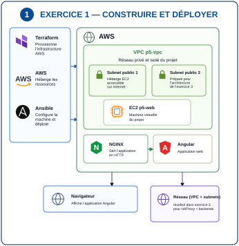
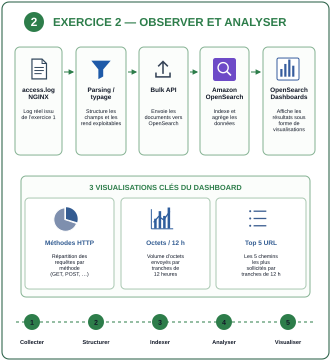
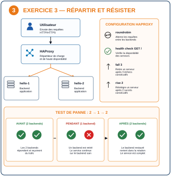

# Runbook LIVE P5 — moins de 20 minutes

> **But :** présenter clairement les trois exercices, montrer uniquement les preuves utiles et terminer avec une marge de sécurité.
>
> **Règle :** schéma → explication courte → preuve → navigateur.

## Avant l'oral — hors chrono

### 1. Vérifier le dépôt et le lab

```bash
cd ~/labs/p5_Openclassrooms
git switch main
git pull --ff-only
bash scripts/commands/p5.sh status
```

### 2. Préparer les variables

```bash
export WEB_URL="$(terraform -chdir=terraform/exercice-1 output -raw web_url)"
export OPENSEARCH_ENDPOINT="$(terraform -chdir=terraform/exercice-2 output -raw opensearch_endpoint)"
export DASHBOARDS_URL="$(terraform -chdir=terraform/exercice-2 output -raw opensearch_dashboards_endpoint)"
export DASHBOARD_URL="${DASHBOARDS_URL%/}/app/dashboards#/view/p5-nginx-observability"
export HAPROXY_URL="$(terraform -chdir=terraform/exercice-3 output -raw haproxy_url)"
export BACKEND_1_IP="$(terraform -chdir=terraform/exercice-3 output -raw hello_1_public_ip)"
```

### 3. Ouvrir les trois onglets navigateur

```text
1. $WEB_URL       → application Angular
2. $DASHBOARD_URL → OpenSearch Dashboards
3. $HAPROXY_URL   → service derrière HAProxy
```

Les commandes sont lancées dans WSL2 Ubuntu. Les preuves visuelles sont montrées dans le navigateur Windows.

### 4. Prévalider les trois preuves principales

```bash
bash scripts/commands/verify-angular-deployment.sh --url "$WEB_URL"
bash scripts/commands/verify-opensearch-data.sh --endpoint "$OPENSEARCH_ENDPOINT"
bash scripts/commands/test-haproxy-roundrobin.sh --url "$HAPROXY_URL" --requests 12
```

Ne pas lancer `cleanup` avant la fin de la soutenance.

---

# 0:00 → 0:45 — Vue d'ensemble du projet

## Afficher


## Dire

> « Le projet est composé de trois exercices complémentaires. Le premier construit et déploie le socle technique. Le deuxième exploite les logs produits par NGINX. Le troisième réutilise le réseau AWS pour répartir la charge et tester la continuité de service. »

### À retenir

```text
Exercice 1 → construire et déployer
Exercice 2 → observer et analyser
Exercice 3 → répartir et résister
```

---

# 0:45 → 6:00 — Exercice 1 — Construire et déployer

## Architecture



**À comprendre :** Terraform provisionne l'infrastructure AWS. Ansible configure la machine. NGINX sert l'application Angular. Le VPC et ses deux subnets constituent le socle réseau réutilisé ensuite par l'exercice 3.

## 1. Prouver la convergence Terraform

```bash
terraform -chdir=terraform/exercice-1 plan \
  -input=false \
  -detailed-exitcode
```

### À voir

```text
No changes
```

### Dire

> « L'infrastructure AWS réelle correspond à la configuration Terraform : aucun changement n'est nécessaire. »

## 2. Prouver l'idempotence Ansible

```bash
ansible-playbook \
  -i ansible/inventories/hosts_aws \
  ansible/playbooks/deploy.yml
```

### À voir

```text
changed=0
unreachable=0
failed=0
```

### Dire

> « Ansible peut être rejoué sans modifier une machine déjà conforme. »

## 3. Prouver puis montrer Angular

```bash
bash scripts/commands/verify-angular-deployment.sh \
  --url "$WEB_URL"
```

### À voir

```text
HTTP 200
APPLICATION ANGULAR DÉPLOYÉE ET SERVIE PAR NGINX
```

### Navigateur

```text
$WEB_URL
```

Montrer l'application Angular puis effectuer un rafraîchissement.

### Dire

> « Ici on voit le résultat réel : l'application Angular est bien servie par NGINX sur l'EC2 AWS. »

### Transition

> « L'application fonctionne. J'utilise maintenant les logs produits par NGINX. »

---

# 6:00 → 10:30 — Exercice 2 — Observer et analyser

## Choix de mise en œuvre à annoncer

> « Pour cet exercice, j'ai choisi le **mode Cloud prévu par le projet**. Au lieu du mode local Elasticsearch/Kibana, j'utilise **Amazon OpenSearch et OpenSearch Dashboards sur AWS**. La chaîne fonctionnelle reste la même : structurer, indexer, analyser et visualiser les logs. »

Cette phrase doit être donnée avant d'entrer dans le détail afin d'éviter toute ambiguïté entre l'intitulé historique « stack ELK » et l'option Cloud retenue.

## Architecture



**À comprendre :** le log brut est structuré, envoyé à Amazon OpenSearch, indexé et agrégé. OpenSearch Dashboards transforme ensuite ces données en visualisations lisibles.

## 1. Vérifier les données

```bash
bash scripts/commands/verify-opensearch-data.sh \
  --endpoint "$OPENSEARCH_ENDPOINT"
```

### À voir

```text
documents présents
méthodes HTTP exploitables
tranches de 12 h exploitables
chemins exploitables
DONNÉES OPENSEARCH PRÊTES POUR LE DASHBOARD
```

### Dire

> « Les données nécessaires aux trois visualisations sont bien structurées et agrégables. »

## 2. Montrer le dashboard dans le navigateur

```text
$DASHBOARD_URL
```

Montrer dans cet ordre :

```text
1. méthodes HTTP       → répartition des requêtes
2. octets / 12 h       → volume servi dans le temps
3. top 5 URL / 12 h    → chemins les plus demandés
4. dashboard complet
```

### Dire

> « Le dashboard rassemble les trois visualisations demandées à partir des logs NGINX. »

### Transition

> « Je termine avec la répartition de charge et la réaction à la panne d'un backend. »

---

# 10:30 → 17:00 — Exercice 3 — Répartir et résister

## Architecture



**À comprendre :** HAProxy reçoit les requêtes et choisit un backend sain. `roundrobin` alterne les requêtes ; le health check vérifie la disponibilité ; `fall 3` retire un backend après trois échecs ; `rise 2` le réintègre après deux succès.

## 0. Relier la configuration au comportement observé

Afficher uniquement les quatre paramètres utiles :

```bash
grep -nE \
  'balance roundrobin|option httpchk|fall 3|rise 2' \
  terraform/exercice-3/haproxy.cfg.tpl
```

### À voir

```text
balance roundrobin
option httpchk GET /
... fall 3 rise 2
... fall 3 rise 2
```

### Dire

> « Avant de tester le comportement, je montre les paramètres qui l'expliquent : répartition `roundrobin`, health check HTTP, retrait après trois échecs et réintégration après deux succès. »

Ne pas commenter toute la configuration : cette preuve doit rester très courte.

## 1. Montrer le round-robin dans le navigateur

```text
$HAPROXY_URL
```

Rafraîchir quatre à six fois et montrer :

```text
Server name
Server address
```

### Dire

> « Les requêtes successives sont réparties entre les deux backends. »

## 2. Confirmer le round-robin dans le terminal

```bash
bash scripts/commands/test-haproxy-roundrobin.sh \
  --url "$HAPROXY_URL" \
  --requests 12
```

### À voir

```text
2 backends distincts observés
ROUND-ROBIN OPÉRATIONNEL
```

## 3. Prouver la panne et la reprise

### Dire avant de lancer

> « J'arrête un backend. HAProxy doit le retirer, continuer avec l'autre puis le réintégrer automatiquement après son retour. »

```bash
bash scripts/commands/test-haproxy-failover.sh \
  --url "$HAPROXY_URL" \
  --backend-host "$BACKEND_1_IP" \
  --apply
```

### À voir

```text
AVANT   : 2 backends
PENDANT : 1 backend
APRÈS   : 2 backends

BASCULE ET RÉINTÉGRATION HAPROXY VALIDÉES
```

### À comprendre

```text
2 → 1 = la panne est détectée
1     = le service reste disponible
1 → 2 = le backend restauré est réintégré
```

## 4. Vérifier le retour à l'état normal dans le navigateur

```text
$HAPROXY_URL
```

Rafraîchir plusieurs fois et vérifier que les deux backends sont de nouveau servis.

### Dire

> « Le backend restauré a été réintégré automatiquement dans la rotation. »

### Limite à connaître

Le lab démontre la tolérance à la panne d'un **backend**. L'instance HAProxy elle-même reste un point unique de défaillance dans cette architecture pédagogique.

---

# 17:00 → 18:00 — Conclusion

> « Terraform et Ansible rendent le déploiement reproductible, OpenSearch rend les logs observables, et HAProxy répartit la charge tout en maintenant le service lors de la perte d'un backend. »

---

# 18:00 → 20:00 — Marge de sécurité

Utiliser ce temps pour une question, une latence ou un imprévu.

## Repli rapide

### Angular

```bash
bash scripts/commands/verify-angular-deployment.sh --url "$WEB_URL"
```

### OpenSearch

```bash
bash scripts/commands/verify-opensearch-data.sh --endpoint "$OPENSEARCH_ENDPOINT"
```

### HAProxy

```bash
bash scripts/commands/test-haproxy-roundrobin.sh --url "$HAPROXY_URL" --requests 12
```

---

# Après la démo — bilan mentor (hors chrono)

La démonstration technique reste limitée à 20 minutes. Si cette session sert aussi de bilan de fin de projet, enchaîner ensuite avec les quatre points demandés par OpenClassrooms.

## 1. Autoévaluation

Ouvrir la fiche d'autoévaluation et commenter brièvement les éléments importants ou les notes laissées.

### Formulation

> « Je vous propose maintenant de faire le bilan du projet à partir de mon autoévaluation. »

## 2. Difficulté rencontrée

Préparer **une difficulté réelle** rencontrée pendant le projet et expliquer :

```text
contexte → problème → diagnostic → correction → ce que j'en retiens
```

Ne pas inventer une difficulté pour l'oral. Choisir un cas que tu peux expliquer techniquement.

## 3. Point fort

Présenter **un point que tu maîtrises bien** et expliquer pourquoi. L'objectif n'est pas de répéter la démo, mais de montrer ce que tu as appris et ce que tu sais désormais reproduire.

## 4. Suite à donner

Identifier un ou deux éléments à approfondir après le projet : cours à revoir, pratique supplémentaire ou point technique sur lequel rester vigilant.

### Phrase de fermeture

> « La démonstration montre que les trois exercices fonctionnent. Ce bilan me permet maintenant d'identifier ce que je maîtrise et ce que je dois encore approfondir pour la suite. »

---

## Après la soutenance

```bash
bash scripts/commands/p5.sh cleanup
```
