# 🏗️ Schéma d'Infrastructure - P5 OpenClassrooms

**Ce document présente l'architecture globale du projet P5**, avec des **schémas détaillés** pour chaque composant. Les schémas sont générés en **Mermaid** pour une visualisation claire et intégrée directement dans la documentation.

---

## 📌 Table des Matières

1. [Schéma Global du Projet](#-schéma-global-du-projet)
2. [Schéma de l'Environnement Local](#-schéma-de-lenvironnement-local)
3. [Schéma de l'Environnement GitHub](#-schéma-de-lenvironnement-github)
4. [Schéma de l'Environnement de Production](#-schéma-de-lenvironnement-de-production)
5. [Schéma par Exercice](#-schéma-par-exercice)
6. [Légende](#-légende)

---

## 🌍 Schéma Global du Projet

Ce schéma montre **l'architecture complète** du projet, de l'environnement local au déploiement en production.

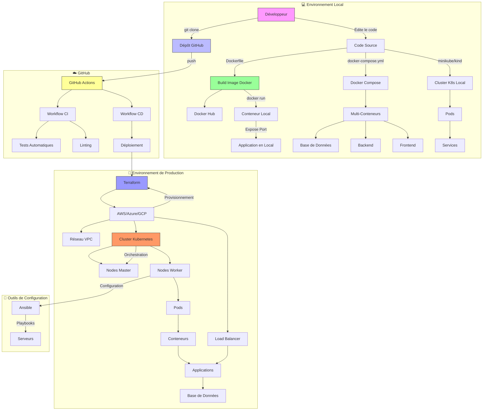

---

## 💻 Schéma de l'Environnement Local

Ce schéma détaille **l'environnement de développement local**, avec Docker, Docker Compose, et Kubernetes.

### Avec Docker
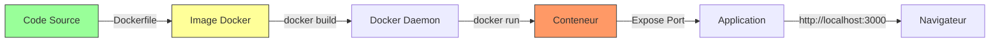

### Avec Docker Compose
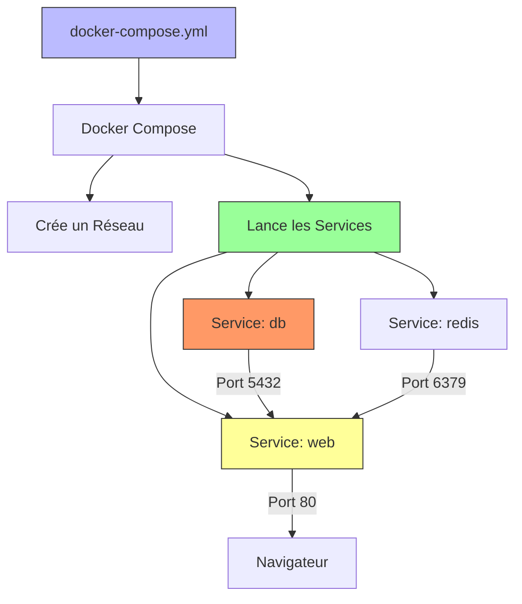

### Avec Kubernetes (Minikube/Kind)
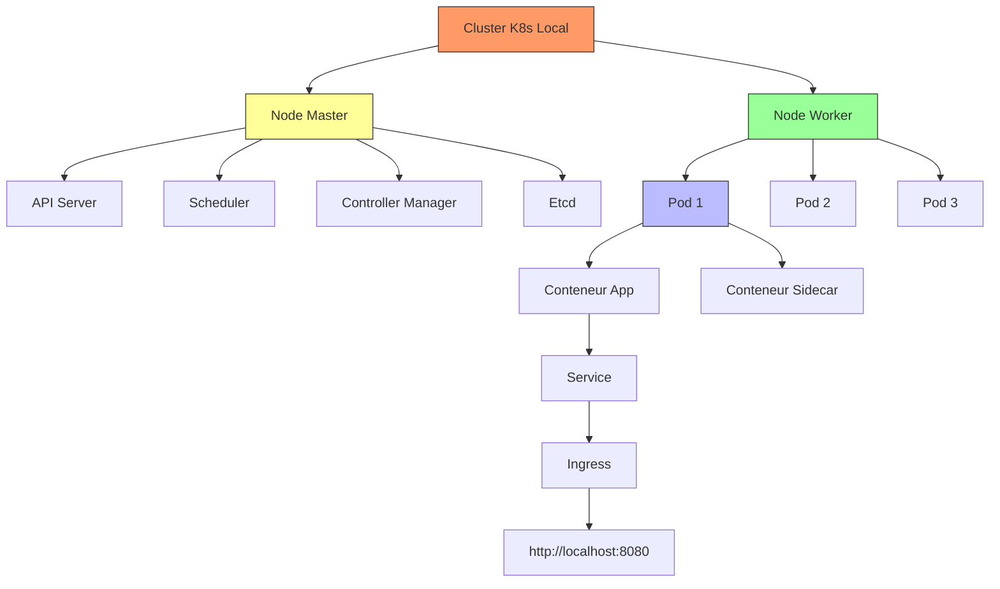

---

## ☁️ Schéma de l'Environnement GitHub

Ce schéma montre comment **GitHub Actions** automatise les tests et les déploiements.

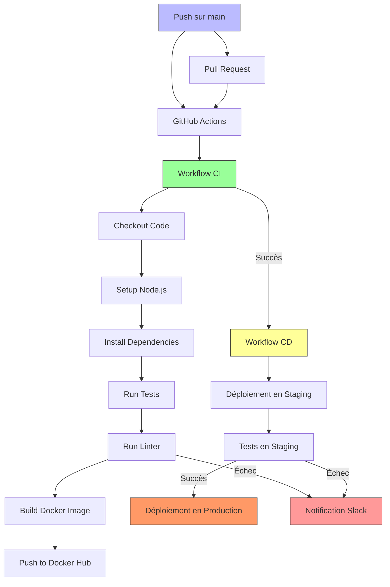

---

## 🚀 Schéma de l'Environnement de Production

Ce schéma détaille **l'infrastructure en production**, avec Terraform, Kubernetes, et Ansible.

### Infrastructure as Code avec Terraform
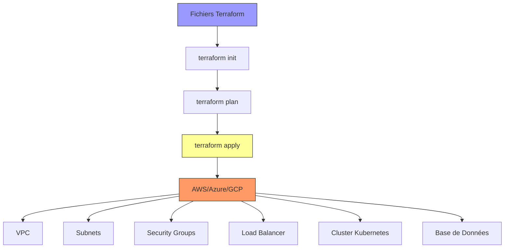

### Cluster Kubernetes en Production
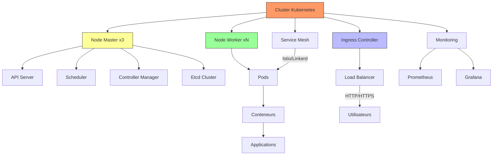

### Configuration avec Ansible
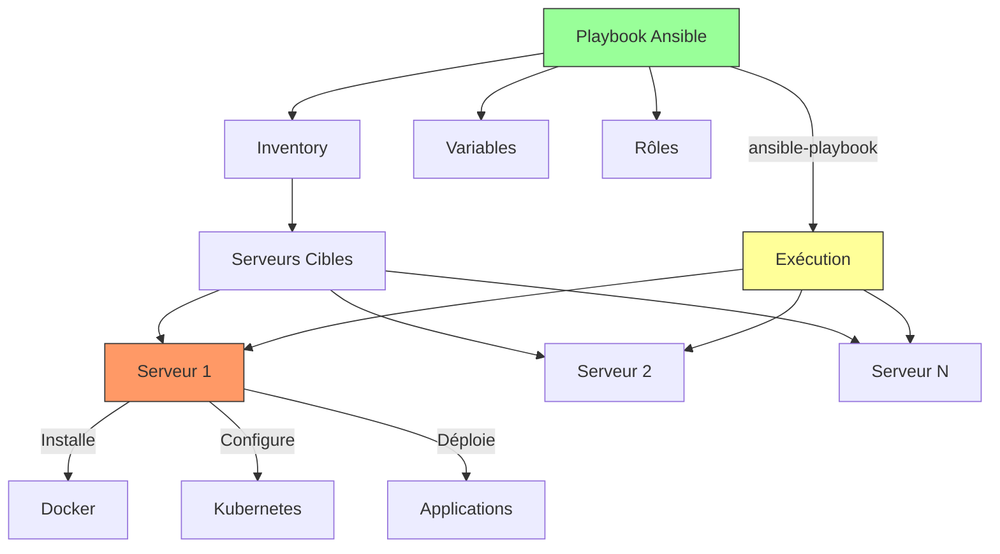

---

## 🎯 Schéma par Exercice

### Exercice 1 : Déploiement avec Docker
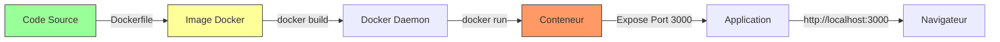

### Exercice 2 : CI/CD avec GitHub Actions
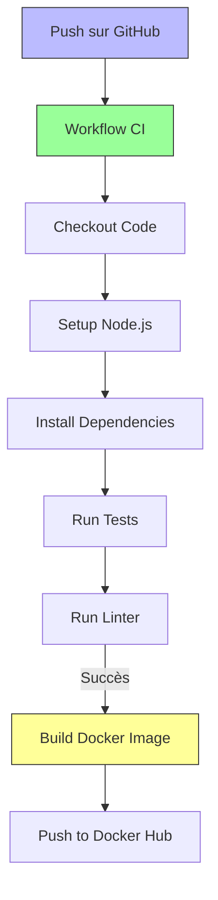

### Exercice 3 : Configuration avec Ansible
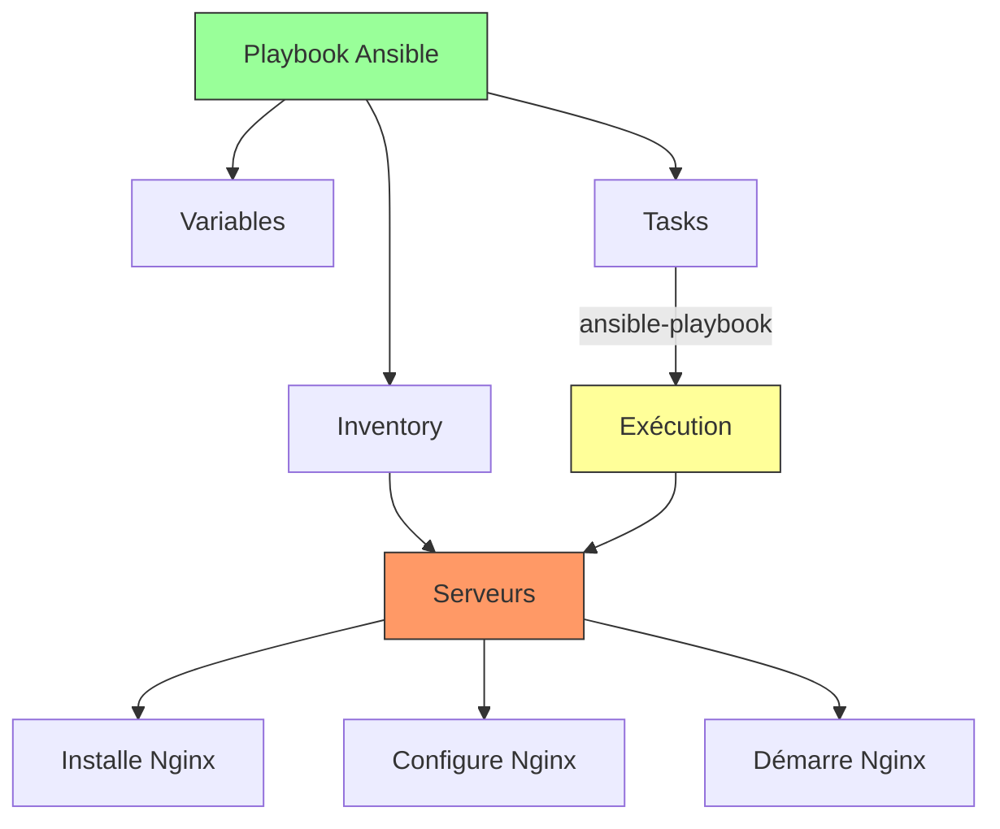

### Exercice 4 : Infrastructure as Code avec Terraform
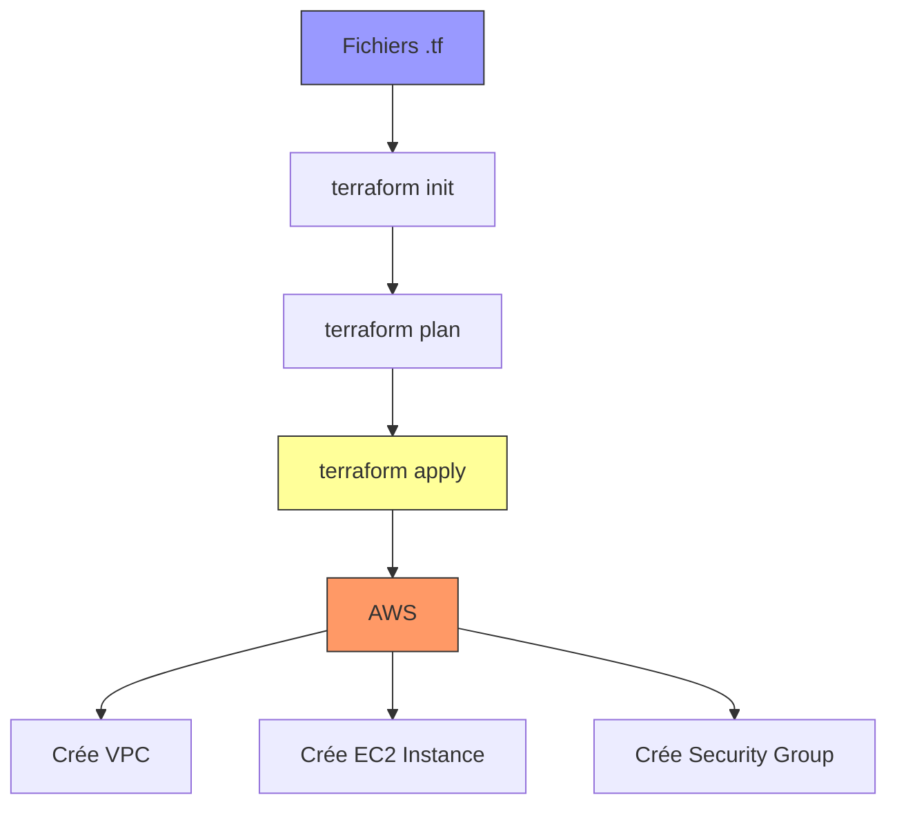

### Exercice 5 : Orchestration avec Kubernetes
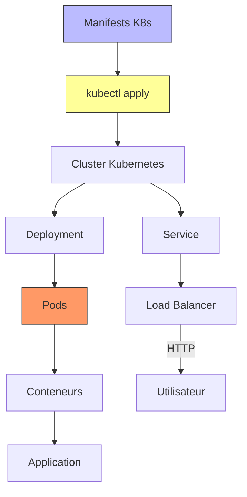

---

## 📌 Légende

| Couleur | Signification | Exemple |
|---------|---------------|---------|
| 🟢 Vert (`#9f9`) | **Code Source / Fichiers de Configuration** | Dockerfile, playbook.yml |
| 🟡 Jaune (`#ff9`) | **Outils / Processus** | Docker, Ansible, Terraform |
| 🔴 Rouge (`#f96`) | **Environnements / Conteneurs** | Conteneur Docker, Pod Kubernetes |
| 🔵 Bleu (`#bbf`) | **Dépôts / Stockage** | GitHub, Docker Hub |
| 🟣 Violet (`#99f`) | **Infrastructure Cloud** | AWS, Azure, GCP |
| 🟠 Orange (`#f99`) | **Erreurs / Notifications** | Notification Slack |

---

## 💡 Conseils pour Comprendre les Schémas

1. **Lisez de haut en bas** : Les schémas sont conçus pour être lus dans l'ordre du flux de travail.
2. **Suivez les flèches** : Elles indiquent le sens des interactions.
3. **Consultez les légendes** : Chaque couleur a une signification.
4. **Testez en pratique** : Reproduisez les schémas dans votre environnement pour mieux les comprendre.

---

## 📚 Pour Aller Plus Loin

- **[Mermaid Live Editor](https://mermaid.live/)** : Pour créer et tester vos propres schémas.
- **[Diagrams as Code](https://diagrams.mingrammer.com/)** : Alternative à Mermaid pour des schémas plus complexes.
- **[Draw.io](https://app.diagrams.net/)** : Outil graphique pour créer des schémas.

---

**Prochaine étape** : [Découvrir les outils DevOps en détail](../guides/devops-tools.md) 🚀
