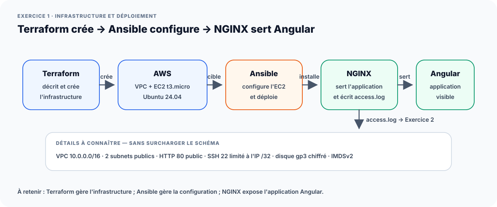

# Exercice 1 — Terraform, Ansible et application Angular



## Objectif officiel

Créer l’infrastructure avec Terraform, vérifier `init`, `plan` et `apply`, puis
utiliser Ansible pour installer NGINX et déployer l’application Angular.

## Choix retenu : AWS

Terraform crée le réseau et une instance EC2 accessible en SSH. Ansible
configure cette instance. Le mode Docker local proposé comme alternative par
OpenClassrooms n’est pas une seconde implémentation du dépôt.

## Arborescence nécessaire

```text
application/angular/             # sources du starter Angular
terraform/exercice-1/            # VPC, sous-réseaux, sécurité et EC2
ansible/inventories/             # adresse et paramètres SSH de la cible
ansible/playbooks/deploy.yml     # installation et déploiement
ansible/files/angular-app/       # résultat navigateur de ng build
ansible/files/nginx-angular.conf # virtual host NGINX
```

## Construire l’application unique

```bash
./scripts/commands/prepare-angular-artifact.sh
```

La commande exécute `npm ci`, puis le script `build` du starter. Elle détecte
l’artefact contenant `index.html` et le copie dans
`ansible/files/angular-app/`. La page de démonstration versionnée n’est pas une
preuve de build Angular.

## Déployer l’infrastructure

```bash
cp terraform/exercice-1/terraform.tfvars.example \
  terraform/exercice-1/terraform.tfvars
terraform -chdir=terraform/exercice-1 init
terraform -chdir=terraform/exercice-1 fmt -check
terraform -chdir=terraform/exercice-1 validate
terraform -chdir=terraform/exercice-1 plan -out=tfplan
terraform -chdir=terraform/exercice-1 show tfplan
terraform -chdir=terraform/exercice-1 apply tfplan
```

Le plan doit être relu avant application : région, type d’instance, règles
réseau, volume et clés.

## Déployer avec Ansible

```bash
cp ansible/inventories/hosts_aws.example ansible/inventories/hosts_aws
terraform -chdir=terraform/exercice-1 output -raw web_public_ip
# Reporter l'adresse dans hosts_aws.
ansible all -i ansible/inventories/hosts_aws -m ping
ansible-playbook \
  -i ansible/inventories/hosts_aws \
  ansible/playbooks/deploy.yml --check --diff
ansible-playbook \
  -i ansible/inventories/hosts_aws \
  ansible/playbooks/deploy.yml
```

## Vérifier

```bash
curl -I "http://$(terraform -chdir=terraform/exercice-1 output -raw web_public_ip)"
```

Contrôler ensuite dans le navigateur : chargement de l’application, ressources
CSS/JavaScript et navigation Angular.

## Preuves attendues

- versions de Terraform et Ansible sur la VM de lab ;
- `terraform validate` et plan relu ;
- infrastructure créée ;
- ping Ansible réussi ;
- playbook sans erreur et seconde exécution idempotente ;
- véritable application Angular accessible ;
- configuration NGINX et handler de rechargement ;
- aucune clé, identité ou variable sensible visible.

Gabarit :
[`SEGUIN-CADICHE_Mathias_1_terraform_ansible_nginx_02082026.md`](../livrables/SEGUIN-CADICHE_Mathias_1_terraform_ansible_nginx_02082026.md).
