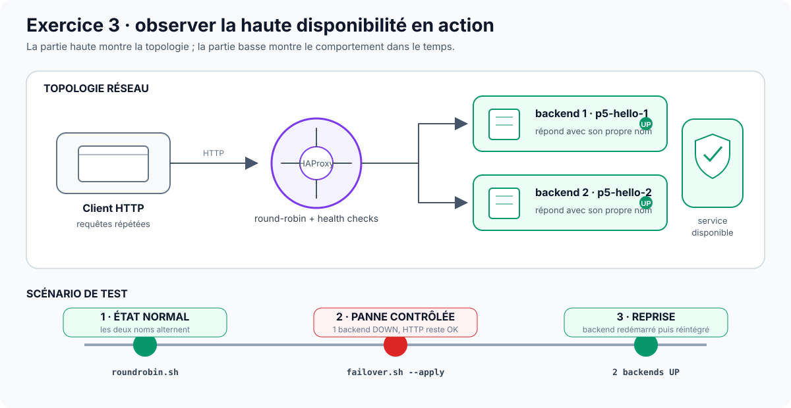

# Exercice 3 — HAProxy, disponibilité et reprise

Cette fiche décrit l'exercice 3 dans le parcours AWS retenu. L'objectif est de
démontrer une répartition réelle entre deux backends, la continuité du service
pendant une panne et la réintégration automatique du backend restauré.



## Mode recommandé

```bash
bash scripts/commands/p5.sh ex3
```

Le centre de commande contrôle la dépendance avec l'exercice 1, déploie
l'infrastructure, attend HAProxy, valide le round-robin puis exécute la panne et
la reprise après confirmation explicite.

Les commandes détaillées restent disponibles ci-dessous pour la compréhension ou
le dépannage.

## Objectif

Déployer HAProxy devant deux instances `nginxdemos/hello`, utiliser
`roundrobin`, superviser la santé des backends et vérifier la bascule lors d'une
panne contrôlée.

## Résultat final attendu

```text
2 backends actifs
      ↓
ROUND-ROBIN OPÉRATIONNEL
      ↓
1 backend arrêté
      ↓
service toujours disponible
      ↓
backend redémarré
      ↓
BASCULE ET RÉINTÉGRATION HAPROXY VALIDÉES
```

## Dépendance critique

L'exercice 3 réutilise :

- le VPC de l'exercice 1 ;
- les deux sous-réseaux publics de l'exercice 1 ;
- la paire de clés EC2 de l'exercice 1.

L'exercice 1 doit donc être encore déployé.

`p5.sh` vérifie cette dépendance avant de poursuivre.

## Prérequis

- étape 0A validée ;
- AWS Ready validé ;
- exercice 1 encore présent ;
- clé privée SSH disponible ;
- tfvars synchronisés ;
- adresse publique `/32` actuelle ;
- quota EC2 suffisant.

Contrôles manuels :

```bash
./scripts/commands/check-aws-readiness.sh --stage exercice-3
./scripts/commands/pre-deployment-check.sh --stage exercice-3
```

## Ce que Terraform crée

Le module `terraform/exercice-3/` crée :

- groupe de sécurité HAProxy ;
- groupe de sécurité des backends ;
- deux EC2 backends ;
- une EC2 HAProxy.

### HAProxy

Le groupe de sécurité autorise :

- HTTP 80 publiquement ;
- SSH 22 uniquement depuis le `/32` d'administration.

### Backends

Chaque backend :

- utilise Ubuntu 24.04 LTS par défaut ;
- installe Docker dans `user_data` ;
- démarre `nginxdemos/hello:plain-text` ;
- expose le conteneur sur le port 80 ;
- n'autorise HTTP que depuis HAProxy ;
- autorise SSH uniquement depuis le `/32` ;
- impose IMDSv2 ;
- utilise un volume racine `gp3` chiffré.

Les hostnames sont déterministes : `p5-hello-1` et `p5-hello-2`.

## Configuration HAProxy

```text
backend hello-servers
    balance roundrobin
    option httpchk GET /
    http-check expect status 200
    server hello-1 ADRESSE_PRIVEE_1:80 check inter 3s fall 3 rise 2
    server hello-2 ADRESSE_PRIVEE_2:80 check inter 3s fall 3 rise 2
```

Interprétation :

- `inter 3s` : contrôle toutes les 3 secondes ;
- `fall 3` : retrait après trois échecs ;
- `rise 2` : réintégration après deux succès.

## Fichiers concernés

```text
terraform/exercice-3/
├── main.tf
├── variables.tf
├── outputs.tf
└── terraform.tfvars.example

scripts/
├── commands/p5.sh
├── commands/test-haproxy-roundrobin.sh
├── commands/test-haproxy-failover.sh
├── tests/test-haproxy-containers.sh
└── tools/generer-haproxy-config.sh
```

## Procédure manuelle détaillée

### 1. Contrôler l'étape

```bash
./scripts/commands/check-aws-readiness.sh --stage exercice-3
./scripts/commands/pre-deployment-check.sh --stage exercice-3
```

### 2. Initialiser et valider Terraform

```bash
terraform -chdir=terraform/exercice-3 init
terraform -chdir=terraform/exercice-3 fmt -check
terraform -chdir=terraform/exercice-3 validate
```

### 3. Produire et relire le plan

```bash
terraform -chdir=terraform/exercice-3 plan -out=tfplan
terraform -chdir=terraform/exercice-3 show tfplan
```

Vérifier :

- bon VPC ;
- deux backends ;
- une instance HAProxy ;
- règles réseau ;
- types d'instance ;
- clé EC2 ;
- chiffrement ;
- absence de VPC dupliqué inutilement.

### 4. Appliquer

```bash
terraform -chdir=terraform/exercice-3 apply tfplan
terraform -chdir=terraform/exercice-3 output
```

Outputs utiles :

```text
hello_1_public_ip
hello_2_public_ip
hello_1_private_ip
hello_2_private_ip
haproxy_public_ip
haproxy_private_ip
haproxy_public_dns
haproxy_security_group_id
haproxy_url
```

`p5.sh ex3` attend automatiquement que `haproxy_url` réponde en HTTP au lieu
d'utiliser un délai fixe arbitraire.

### 5. Vérifier le round-robin

```bash
./scripts/commands/test-haproxy-roundrobin.sh --requests 12
```

Le script exige au moins deux noms de backend distincts.

Verdict :

```text
ROUND-ROBIN OPÉRATIONNEL
```

### 6. Prévisualiser la panne

```bash
./scripts/commands/test-haproxy-failover.sh
```

Sans `--apply`, aucune panne réelle n'est provoquée.

### 7. Exécuter la panne réelle

```bash
./scripts/commands/test-haproxy-failover.sh --apply
```

Le script :

1. confirme les deux backends ;
2. sélectionne le backend ;
3. se connecte en SSH ;
4. arrête `nginx-hello` ;
5. attend la détection de panne ;
6. vérifie la continuité du service avec un seul backend ;
7. redémarre le conteneur ;
8. attend la réintégration ;
9. exige de nouveau deux backends.

`p5.sh ex3` prévisualise d'abord ce scénario puis demande une confirmation avant
d'appeler le mode `--apply`.

## Restauration de sécurité

Après un arrêt réel, `test-haproxy-failover.sh` conserve un `trap` sur `EXIT`,
`INT` et `TERM`. Si l'exécution est interrompue alors que le backend est arrêté,
le script tente de redémarrer :

```text
sudo docker start nginx-hello
```

Cette restauration réduit le risque d'une panne permanente mais ne dispense pas
de vérifier l'état après une interruption.

## Preuves à conserver

### Infrastructure

- plan Terraform ;
- trois EC2 actives ;
- outputs anonymisés.

### Configuration

- `haproxy.cfg` lisible ;
- validation HAProxy ;
- service actif.

### Round-robin

- deux serveurs distincts observés.

### Panne

- deux backends avant ;
- un seul pendant ;
- continuité HTTP.

### Reprise

- backend redémarré ;
- retour des deux backends ;
- verdict final.

Gabarit :
[Livrable 3](../livrables/SEGUIN-CADICHE_Mathias_3_haproxy_nginxdemos_02082026.md).

## Ce qu'il ne faut pas publier

- clé privée SSH ;
- tfvars ;
- état Terraform ;
- adresse complète non nécessaire ;
- contenu brut non relu de `proofs/runtime/` ou `logs/`.

## Nettoyage

Après la collecte des preuves, utiliser de préférence le nettoyage global :

```bash
bash scripts/commands/p5.sh cleanup
```

Ordre :

```text
Exercice 3 → Exercice 2 → Exercice 1 → audit AWS global
```

Référence :
[Validation, preuves et nettoyage](../validation-preuves-nettoyage.md).
