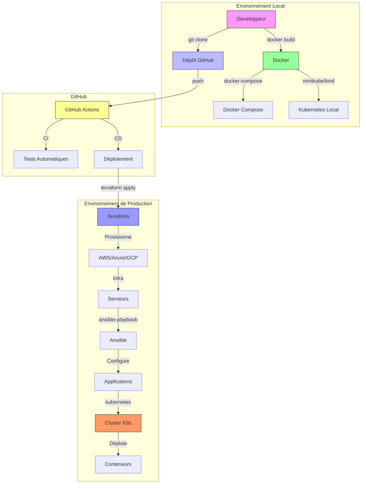
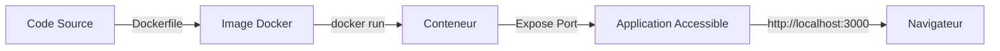
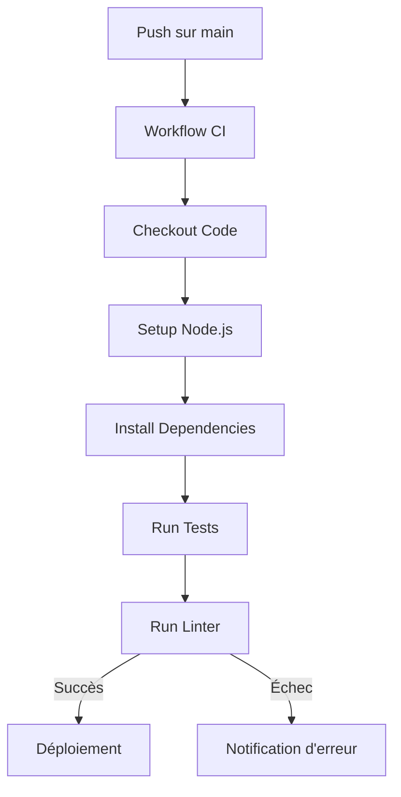
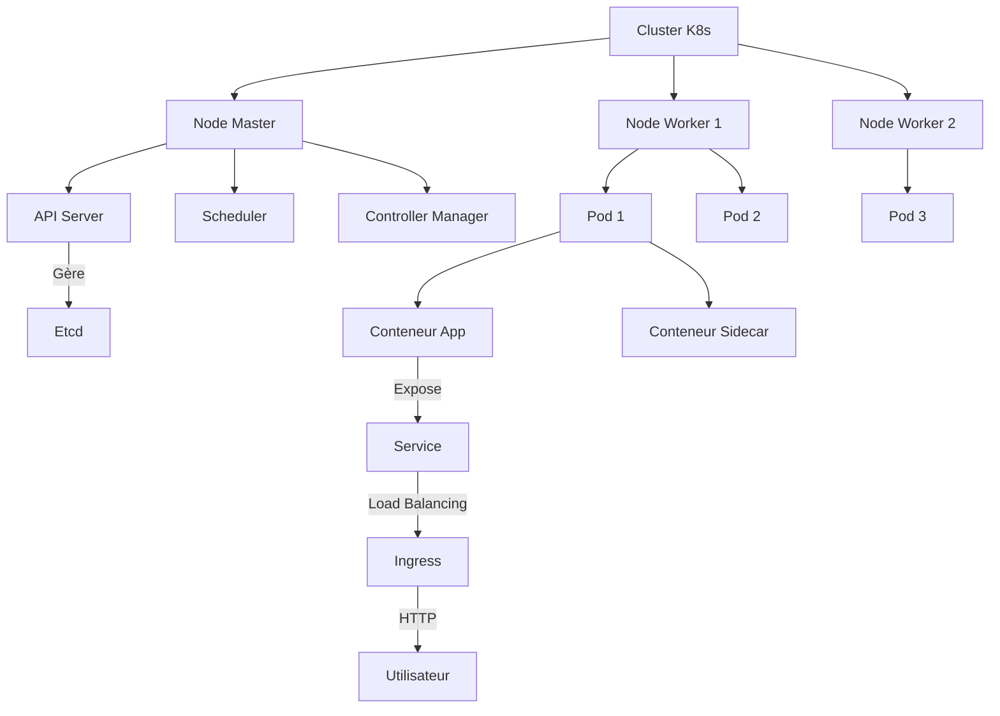

# 🚀 Présentation Complète du Projet P5 - OpenClassrooms

**Bienvenue dans la présentation détaillée du projet P5 !**
Ce guide vous explique **tout ce qu'il faut savoir** sur le projet : ses objectifs, son infrastructure, les outils utilisés, et les exercices proposés.

---

## 📌 Table des Matières

1. [Contexte et Objectifs](#-contexte-et-objectifs)
2. [Infrastructure Globale](#infrastructure-globale)
3. [Outils DevOps Utilisés](#outils-devops)
4. [Exercices Proposés](#-exercices-proposés)
5. [Schéma d'Architecture](#schema-architecture)
6. [Comment Utiliser Ce Dépôt](#-comment-utiliser-ce-dépôt)

---

## 🎯 Contexte et Objectifs

### Pourquoi ce projet ?

Le projet **P5 OpenClassrooms** est conçu pour vous aider à **maîtriser les outils DevOps** et les **bonnes pratiques** en infrastructure et automatisation. Il s'adresse aux :

- **Débutants** en DevOps qui veulent comprendre les bases.
- **Développeurs** qui souhaitent automatiser leurs déploiements.
- **Administrateurs système** qui veulent adopter des outils modernes.

### Compétences Visées

À la fin de ce projet, vous serez capable de :
✅ **Conteneuriser** une application avec Docker.
✅ **Automatiser** des tests et déploiements avec GitHub Actions.
✅ **Configurer** des serveurs avec Ansible.
✅ **Déployer** une infrastructure avec Terraform.
✅ **Orchestrer** des conteneurs avec Kubernetes.

---

<a id="infrastructure-globale"></a>

## 🏗️ Infrastructure Globale

L'infrastructure du projet est conçue pour être **modulaire** et **scalable**. Elle repose sur les composants suivants :

### 1. Environnement Local

- **Docker** : Pour conteneuriser les applications et les tester localement.
- **Docker Compose** : Pour gérer des applications multi-conteneurs.
- **Minikube/Kind** : Pour tester Kubernetes en local.

### 2. Environnement de Développement

- **GitHub** : Pour versionner le code et gérer les collaborations.
- **GitHub Actions** : Pour automatiser les tests et les déploiements.

### 3. Environnement de Production (Optionnel)

- **Cloud Provider** : AWS, Azure, ou GCP pour héberger l'infrastructure.
- **Kubernetes** : Pour orchestrer les conteneurs en production.
- **Terraform** : Pour provisionner l'infrastructure as code.

---

<a id="outils-devops"></a>

## 🛠️ Outils DevOps Utilisés

Voici la liste complète des outils utilisés dans ce projet, avec leurs rôles et leurs liens vers la documentation officielle.

### 📦 Conteneurisation

| Outil | Version | Rôle | Lien | Niveau |
|-------|---------|------|------|--------|
| **Docker** | 24.x | Conteneurisation d'applications | [Documentation](https://docs.docker.com) | Débutant |
| **Docker Compose** | 2.x | Gestion de multi-conteneurs | [Documentation](https://docs.docker.com/compose/) | Débutant |

### 🚀 CI/CD

| Outil | Version | Rôle | Lien | Niveau |
|-------|---------|------|------|--------|
| **GitHub Actions** | - | Automatisation des tests et déploiements | [Documentation](https://docs.github.com/en/actions) | Débutant/Intermédiaire |
| **Git** | 2.x | Versionnement du code | [Documentation](https://git-scm.com/doc) | Débutant |

### 🔧 Configuration Management

| Outil | Version | Rôle | Lien | Niveau |
|-------|---------|------|------|--------|
| **Ansible** | 8.x | Configuration de serveurs | [Documentation](https://docs.ansible.com) | Intermédiaire |

### ☁️ Infrastructure as Code (IaC)

| Outil | Version | Rôle | Lien | Niveau |
|-------|---------|------|------|--------|
| **Terraform** | 1.5.x | Provisionnement d'infrastructure cloud | [Documentation](https://developer.hashicorp.com/terraform) | Intermédiaire |

### 🐳 Orchestration de Conteneurs

| Outil | Version | Rôle | Lien | Niveau |
|-------|---------|------|------|--------|
| **Kubernetes** | 1.28.x | Orchestration de conteneurs | [Documentation](https://kubernetes.io/docs/home/) | Avancé |
| **Minikube** | - | Kubernetes local | [Documentation](https://minikube.sigs.k8s.io/docs/) | Débutant |
| **Kind** | - | Kubernetes in Docker | [Documentation](https://kind.sigs.k8s.io/) | Débutant |

### 📊 Monitoring (Optionnel)

| Outil | Version | Rôle | Lien | Niveau |
|-------|---------|------|------|--------|
| **Prometheus** | - | Surveillance des métriques | [Documentation](https://prometheus.io/docs/introduction/overview/) | Avancé |
| **Grafana** | - | Visualisation des métriques | [Documentation](https://grafana.com/docs/) | Avancé |

---

## 🎯 Exercices Proposés

Chaque exercice est conçu pour vous faire pratiquer un outil ou un concept spécifique. Voici la liste complète :

### 1️⃣ [Exercice 1 : Déploiement avec Docker](../exercises/exercise-1/README.md)

**Objectif** : Conteneuriser une application simple et la déployer localement.
**Outils** : Docker, Docker Compose
**Niveau** : Débutant
**Durée estimée** : 1h30

**Ce que vous allez apprendre** :

- Créer un `Dockerfile` pour conteneuriser une application.
- Construire et lancer une image Docker.
- Utiliser Docker Compose pour gérer des applications multi-conteneurs.
- Comprendre les volumes et les réseaux Docker.

---

### 2️⃣ [Exercice 2 : CI/CD avec GitHub Actions](../exercises/exercise-2/README.md)

**Objectif** : Automatiser les tests et le déploiement d'une application avec GitHub Actions.
**Outils** : GitHub Actions, Docker
**Niveau** : Débutant/Intermédiaire
**Durée estimée** : 2h

**Ce que vous allez apprendre** :

- Créer un workflow CI pour exécuter des tests automatiquement.
- Configurer un workflow CD pour déployer une application.
- Utiliser des secrets et des variables d'environnement.
- Comprendre les déclencheurs (push, pull request, etc.).

---

### 3️⃣ [Exercice 3 : Configuration avec Ansible](../exercises/exercise-3/README.md)

**Objectif** : Automatiser la configuration de serveurs avec Ansible.
**Outils** : Ansible, SSH
**Niveau** : Intermédiaire
**Durée estimée** : 2h30

**Ce que vous allez apprendre** :

- Créer un inventaire Ansible pour cibler des serveurs.
- Écrire un playbook pour installer et configurer des logiciels.
- Utiliser des variables et des templates (Jinja2).
- Comprendre les modules Ansible (apt, yum, file, service, etc.).

---

### 4️⃣ [Exercice 4 : Infrastructure as Code avec Terraform](../exercises/exercise-4/README.md)

**Objectif** : Provisionner une infrastructure cloud avec Terraform.
**Outils** : Terraform, AWS/Azure/GCP
**Niveau** : Intermédiaire
**Durée estimée** : 3h

**Ce que vous allez apprendre** :

- Initialiser un projet Terraform.
- Définir des ressources (instances, buckets, réseaux, etc.).
- Utiliser des variables et des outputs.
- Comprendre l'état Terraform (`terraform.tfstate`).

---

### 5️⃣ [Exercice 5 : Orchestration avec Kubernetes](../exercises/exercise-5/README.md)

**Objectif** : Déployer une application sur un cluster Kubernetes.
**Outils** : Kubernetes, Docker, Minikube/Kind
**Niveau** : Avancé
**Durée estimée** : 4h

**Ce que vous allez apprendre** :

- Créer un cluster Kubernetes local avec Minikube ou Kind.
- Définir un `Deployment` et un `Service` Kubernetes.
- Utiliser `kubectl` pour gérer le cluster.
- Comprendre les concepts de pods, services, et ingress.

---

<a id="schema-architecture"></a>

## 🏗️ Schéma d'Architecture

Voici un schéma global de l'infrastructure du projet, utilisant **Mermaid** pour une visualisation claire.

### Schéma Global



### Schéma Détaillé pour l'Exercice 1 (Docker)



### Schéma Détaillé pour l'Exercice 2 (GitHub Actions)



### Schéma Détaillé pour l'Exercice 5 (Kubernetes)



---

## 📥 Comment Utiliser Ce Dépôt

### 1. Cloner le Dépôt

```bash
# Cloner le dépôt en local
git clone https://github.com/mathiasseguincadiche/p5_Openclassrooms.git
cd p5_Openclassrooms
```

### 2. Explorer la Documentation

- Commencez par lire **[ce guide](project-overview.md)** pour comprendre le projet.
- Consultez les **[exercices](../exercises/)** pour pratiquer.
- Utilisez les **[templates](../../TEMPLATES/)** pour démarrer rapidement.

### 3. Faire un Exercice

1. Choisissez un exercice dans [`docs/exercises/`](../exercises/).
2. Lisez attentivement la fiche (objectifs, étapes, commandes).
3. Suivez les étapes **pas à pas**.
4. Vérifiez vos résultats avec les **résultats attendus**.

### 4. Utiliser les Templates

- Copiez les fichiers depuis [`TEMPLATES/`](../../TEMPLATES/) dans votre projet.
- Adaptez-les selon vos besoins.
- Consultez les `README.md` dans chaque dossier pour des explications.

### 5. Contribuer

- **Signaler un problème** : Ouvrez une **issue** dans le dépôt.
- **Proposer une amélioration** : Ouvrez une **pull request**.

---

## 📌 Résumé

| Élément | Description | Lien |
|---------|-------------|------|
| **Objectif** | Maîtriser les outils DevOps | - |
| **Public** | Débutants à avancés | - |
| **Outils** | Docker, GitHub Actions, Ansible, Terraform, Kubernetes | [Voir ci-dessus](#outils-devops) |
| **Exercices** | 5 exercices pratiques | [Voir ci-dessus](#-exercices-proposés) |
| **Documentation** | Guides, schémas, aides-mémoire | [docs/](./) |
| **Templates** | Fichiers de configuration prêts à l'emploi | [TEMPLATES](../../TEMPLATES/) |

---

## 🎉 Prochaines Étapes

1. **Lisez la présentation des outils** : [Outils DevOps](./devops-tools.md).
2. **Commencez par l'Exercice 1** : [Déploiement avec Docker](../exercises/exercise-1/README.md).
3. **Explorez les templates** : [TEMPLATES](../../TEMPLATES/).

---

**Bon courage et bon apprentissage !** 🚀
