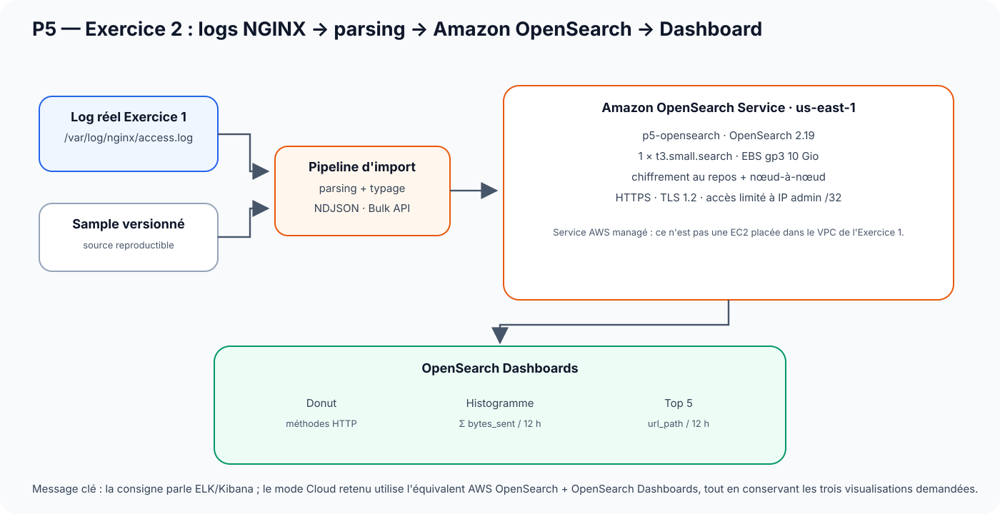

# P5 OpenClassrooms — Runbook mentor détaillé — Exercice 2

## Objectif de la séquence

**Exercice 2 : mettre en place le monitoring et le logging demandés, en mode Cloud AWS avec Amazon OpenSearch.**

La consigne OpenClassrooms prévoit deux possibilités :

- **mode local** : stack ELK avec Docker Compose ;
- **mode Cloud** : Amazon OpenSearch sur AWS.

Dans ce projet, le mode retenu est **Cloud AWS**.

La démonstration doit prouver, dans cet ordre :

1. que le domaine Amazon OpenSearch est réellement provisionné par Terraform ;
2. que les logs NGINX sont transformés en données structurées ;
3. que les champs nécessaires aux visualisations sont correctement typés et agrégables ;
4. que les données sont réellement présentes dans OpenSearch ;
5. que les **trois visualisations exigées** existent et sont lisibles dans OpenSearch Dashboards ;
6. que le dashboard final regroupe correctement ces trois visualisations.

> **Phrase d'ouverture**
>
> « Pour l'exercice 2, j'ai choisi le mode Cloud proposé par la consigne. J'utilise Amazon OpenSearch à la place d'un ELK local. Je vais vous montrer d'où viennent les logs, comment ils sont transformés et indexés, puis les trois visualisations demandées dans OpenSearch Dashboards. »

---

## 1 — Ce que demande précisément l'exercice

OpenClassrooms demande de :

1. démarrer l'environnement ELK/OpenSearch ;
2. charger un échantillon de logs NGINX ;
3. créer un index permettant d'exploiter ces logs ;
4. créer trois visualisations :
   - un **donut** de répartition des verbes HTTP ;
   - un **histogramme** de quantité cumulée de données envoyées par tranche de 12 heures ;
   - un **histogramme/top 5** des requêtes les plus fréquentes par tranche de 12 heures ;
5. regrouper les trois visualisations dans un dashboard.

Dans l'implémentation du dépôt, cette logique est conservée mais automatisée :

```text
log NGINX
   ↓
parsing + typage
   ↓
Bulk API
   ↓
Amazon OpenSearch
   ↓
Saved Objects versionnés
   ↓
OpenSearch Dashboards
```

---

## 2 — Architecture à présenter



### Lecture simple du schéma

Il existe **deux sources de données**.

#### Source 1 — sample reproductible

```text
terraform/exercice-2/samples/nginx-access.log.sample
```

Il sert à :

- disposer d'une donnée connue et versionnée ;
- tester le parsing sans dépendre d'une EC2 réelle ;
- rendre la CI reproductible.

#### Source 2 — vrai log de l'exercice 1

```text
proofs/runtime/exercice-2/nginx-access-real.log
```

Ce fichier provient du NGINX réellement déployé sur `p5-web` pendant l'exercice 1.

Dans l'orchestration réelle du dépôt, `p5.sh ex2` valide puis importe d'abord le sample. Si `nginx-access-real.log` existe, il le valide et l'importe ensuite séparément avec le même pipeline. Le vrai log est donc **complémentaire** au sample, et non un remplacement de celui-ci.

**Ce que tu dis :**

> « Le sample me donne une base reproductible, tandis que le vrai `access.log` relie l'exercice 2 à l'application réellement déployée dans l'exercice 1. Les deux sources ont donc des rôles différents mais complémentaires. »

---

## 3 — Pipeline de transformation

Le dépôt ne pousse pas aveuglément des lignes de texte dans OpenSearch.

Il transforme les logs pour produire des champs structurés, notamment :

```text
@timestamp
http_method
bytes_sent
url_path
```

### Contrat fonctionnel des champs

| Champ | Type attendu | Utilisation |
|---|---|---|
| `@timestamp` | date | axe temporel / tranches de 12 h |
| `http_method` | keyword | donut des méthodes HTTP |
| `bytes_sent` | numérique | somme des octets |
| `url_path` | keyword | top 5 des URLs |

**Phrase à dire :**

> « Le point important n'est pas seulement que les logs existent. Il faut que les champs soient correctement typés pour pouvoir faire les agrégations demandées. »

---

## 4 — Infrastructure Amazon OpenSearch à connaître

Terraform déploie un **service AWS managé**, pas une EC2 OpenSearch dans le VPC de l'exercice 1.

Configuration de référence :

```text
Région              : us-east-1
Nom du domaine      : p5-opensearch
Moteur              : OpenSearch 2.19
Instance            : 1 × t3.small.search
Stockage            : EBS gp3 · 10 Gio
HTTPS               : obligatoire
TLS                 : 1.2 minimum
Chiffrement         : au repos
Chiffrement         : nœud-à-nœud
Accès               : limité à l'IPv4 publique admin /32
```

### Point de compréhension important

> « Amazon OpenSearch Service est un service managé AWS. Terraform crée le domaine et sa configuration, mais je n'administre pas directement une VM OpenSearch comme je le ferais avec un cluster ELK local. »

---

## 5 — Fichiers à connaître avant la présentation

```text
terraform/exercice-2/main.tf
terraform/exercice-2/variables.tf
terraform/exercice-2/outputs.tf
terraform/exercice-2/opensearch/index-template.json
terraform/exercice-2/opensearch/dashboards/p5-dashboard.json
terraform/exercice-2/samples/nginx-access.log.sample

scripts/tools/convert-nginx-logs.py
scripts/tools/build-opensearch-saved-objects.py

scripts/commands/import-opensearch-data.sh
scripts/commands/verify-opensearch-data.sh
scripts/commands/sync-opensearch-dashboards.sh

proofs/runtime/exercice-2/
```

---

## 6 — Préparation hors présentation

À faire avant l'arrivée du mentor :

```bash
cd ~/labs/p5_Openclassrooms
git switch main
git pull --ff-only

bash scripts/commands/p5.sh status
```

Préparer les variables :

```bash
export OPENSEARCH_ENDPOINT="$(
  terraform -chdir=terraform/exercice-2 \
    output -raw opensearch_endpoint
)"

export DASHBOARDS_URL="$(
  terraform -chdir=terraform/exercice-2 \
    output -raw opensearch_dashboards_endpoint
)"

export DASHBOARD_URL="${DASHBOARDS_URL%/}/app/dashboards#/view/p5-nginx-observability"
```

Ouvre déjà `$DASHBOARD_URL` dans ton **navigateur Internet sous Windows 11**. Comme pour l’exercice 1, les commandes sont lancées dans WSL2, mais l’interface OpenSearch Dashboards s’ouvre dans Firefox, Edge ou Chrome côté Windows.

**Ne détruis pas le domaine avant la présentation.**

---

## 7 — Démonstration Exercice 2

### Étape A — Montrer les outputs Terraform

```bash
terraform -chdir=terraform/exercice-2 output
```

#### À regarder

```text
opensearch_domain_name
opensearch_endpoint
opensearch_arn
opensearch_dashboards_endpoint
```

#### Ce que ça prouve

Le domaine OpenSearch existe dans le state Terraform et les endpoints utilisés par les scripts viennent du déploiement réel.

#### Ce que tu dis

> « Les URLs ne sont pas codées en dur : elles sont récupérées depuis les outputs Terraform du domaine réellement déployé. »

---

### Étape B — Montrer la convergence Terraform

```bash
terraform -chdir=terraform/exercice-2 plan \
  -input=false \
  -detailed-exitcode
```

#### Résultat attendu

```text
No changes.
Your infrastructure matches the configuration.
```

Code de sortie attendu : `0`.

#### Ce que tu dis

> « Le domaine OpenSearch est déjà dans l'état déclaré par Terraform. Il n'y a donc aucune mutation supplémentaire à appliquer. »

---

### Étape C — Montrer rapidement le contrat du domaine

Commande courte :

```bash
grep -nE \
  'engine_version|instance_type|volume_size|encrypt_at_rest|node_to_node_encryption|enforce_https|tls_security_policy|SourceIp' \
  terraform/exercice-2/main.tf
```

#### Ce que tu dois pouvoir expliquer

```text
OpenSearch 2.19
1 nœud t3.small.search
EBS gp3 10 Gio
chiffrement au repos
chiffrement nœud-à-nœud
HTTPS obligatoire
TLS 1.2
accès filtré par IP /32
```

#### Ce que tu dis

> « Pour ce lab, le domaine reste volontairement petit, mais j'ai conservé les contrôles de sécurité essentiels : HTTPS, chiffrement et restriction d'accès par IP. »

---

### Étape D — Prouver que les données sont réellement exploitables

```bash
bash scripts/commands/verify-opensearch-data.sh \
  --endpoint "$OPENSEARCH_ENDPOINT"
```

#### Ce que le script vérifie réellement

Il contrôle les mappings :

```text
@timestamp
http_method
url_path
bytes_sent
```

Puis il exécute les agrégations correspondant aux graphiques :

```text
Terms(http_method)

Date histogram 12 h
└─ Sum(bytes_sent)

Date histogram 12 h
└─ Top 5 Terms(url_path)
```

#### Résultats attendus

```text
OK  mappings @timestamp, http_method, url_path et bytes_sent
OK  documents : ...
OK  méthodes HTTP : ...
OK  tranches de 12 heures : ...
OK  chemins exploitables : ...

Agrégations utiles au dashboard
  Méthodes : ...
  Octets par 12 h : ...

Verdict : DONNÉES OPENSEARCH PRÊTES POUR LE DASHBOARD
```

#### Ce que ça prouve

Ce n'est pas seulement un domaine OpenSearch vide :

- des documents sont réellement indexés ;
- les champs ont le bon type ;
- les champs nécessaires sont agrégables ;
- les trois types de calcul nécessaires au dashboard fonctionnent.

#### Ce que tu dis

> « Ici je prouve le backend de l'observabilité. Avant même d'ouvrir le dashboard, je vérifie que les données et les agrégations sur lesquelles il repose sont valides. »

---

## 8 — Montrer le Dashboard as Code

Le dépôt contient une définition versionnée du dashboard :

```text
terraform/exercice-2/opensearch/dashboards/p5-dashboard.json
```

Commande simple :

```bash
cat terraform/exercice-2/opensearch/dashboards/p5-dashboard.json
```

Si la sortie est trop longue pendant l'oral, préfère :

```bash
grep -nE \
  'http_method|bytes_sent|url_path|12h|donut|dashboard|visual' \
  terraform/exercice-2/opensearch/dashboards/p5-dashboard.json
```

### Ce que tu expliques

La couche de visualisation est elle aussi reproductible.

Le dépôt génère des Saved Objects OpenSearch déterministes :

```text
1. index pattern
2. donut méthodes HTTP
3. histogramme bytes_sent / 12 h
4. top 5 url_path / 12 h
5. dashboard regroupant les 3 visualisations
```

#### Ce que tu dis

> « La consigne demande de créer les visualisations. Dans mon implémentation, je suis allé plus loin : leur définition est versionnée et peut être recréée automatiquement. Mais je garde tout de même une validation visuelle humaine du rendu. »

### Vérification non destructive du bundle Saved Objects

Avant de toucher à OpenSearch Dashboards, tu peux prouver que le manifest génère bien un bundle cohérent :

```bash
bash scripts/commands/sync-opensearch-dashboards.sh
```

#### Résultat attendu

```text
Bundle OpenSearch Dashboards
Objets      : 5
Index       : nginx-access-*
Dashboard   : P5 — Observabilité NGINX

Aucune mutation distante. Bundle généré et validé avec succès.
```

Cette commande **ne modifie pas** OpenSearch Dashboards. Elle prouve que la définition versionnée produit bien les cinq Saved Objects attendus : l’index pattern, les trois visualisations et le dashboard.

### Préparation recommandée avant l'oral — réconcilier les Saved Objects

À faire avant la présentation si tu veux être certain que les objets distants correspondent au dépôt :

```bash
bash scripts/commands/sync-opensearch-dashboards.sh \
  --endpoint "$OPENSEARCH_ENDPOINT" \
  --dashboards-url "$DASHBOARDS_URL" \
  --apply
```

#### Résultat attendu essentiel

```text
OK  @timestamp, http_method, bytes_sent et url_path sont présents et agrégables
OK  API Dashboards disponible
OK  5 Saved Objects importés/réconciliés

Verdict : OPENSEARCH DASHBOARDS CONVERGÉ ET VÉRIFIÉ
```

`--apply` est une **mutation contrôlée et idempotente** : le script réconcilie les Saved Objects versionnés avec `overwrite=true`, puis relit les objets pour les vérifier. Pendant l'oral, il n'est pas nécessaire de refaire cette mutation si elle a déjà été validée juste avant.

---

## 9 — Démonstration visuelle obligatoire

Dans ton **navigateur Internet Windows**, ouvre :

```text
$DASHBOARD_URL
```

### Visualisation 1 — Donut des méthodes HTTP

#### Ce que tu montres

Un graphique de type donut basé sur :

```text
Terms(http_method)
```

Exemples de catégories :

```text
GET
POST
HEAD
...
```

#### Ce que tu dis

> « Cette visualisation répond à la première exigence : elle montre la répartition des méthodes HTTP dans l'ensemble des requêtes. »

---

### Visualisation 2 — Histogramme `bytes_sent` par 12 heures

#### Ce que tu montres

```text
Axe temporel : @timestamp
Intervalle   : 12 h
Métrique     : Sum(bytes_sent)
```

#### Ce que tu dis

> « Ici je mesure la quantité totale de données envoyées par le serveur sur chaque tranche de douze heures. »

---

### Visualisation 3 — Top 5 des URLs par 12 heures

#### Ce que tu montres

```text
Axe temporel : @timestamp
Intervalle   : 12 h
Catégorie    : Terms(url_path)
Taille       : 5
```

#### Ce que tu dis

> « Cette troisième visualisation permet de voir quelles URLs représentent l'activité principale du serveur et comment cette activité évolue dans le temps. »

---

### Dashboard complet

Montre ensuite les trois graphiques dans une vue unique.

#### Vérifications rapides avant la session

- la plage temporelle affiche bien les données ;
- aucun filtre parasite n'est actif ;
- les trois graphiques sont visibles ;
- le titre du dashboard est lisible ;
- les légendes ne sont pas masquées.

---

## 10 — Si le mentor demande « où est Logstash ? »

La réponse doit être précise.

> « La consigne propose soit une stack ELK locale, soit le mode Cloud OpenSearch. J'ai choisi le mode Cloud. Dans mon implémentation, le parsing des logs est assuré par le pipeline du dépôt avant envoi par Bulk API. Je ne prétends donc pas avoir déployé Logstash dans AWS : j'ai reproduit la fonction de transformation nécessaire au résultat attendu du mode Cloud. »

Ne dis pas que Logstash tourne si ce n'est pas le cas.

---

## 11 — Questions probables du mentor

### Pourquoi OpenSearch plutôt qu'Elasticsearch/Kibana ?

Parce que la consigne propose explicitement un mode Cloud AWS avec OpenSearch. OpenSearch Dashboards est l'interface de visualisation associée.

### Pourquoi conserver un sample si tu as un vrai log NGINX ?

Le sample assure la reproductibilité des tests et de la CI. Le vrai log prouve que la chaîne est reliée à l'application réellement déployée.

### Pourquoi `bytes_sent` doit-il être numérique ?

Parce qu'il doit être utilisé dans une agrégation `sum`. Si le champ était du texte, la somme ne serait pas possible.

### Pourquoi `http_method` et `url_path` sont en `keyword` ?

Parce qu'ils servent à faire des agrégations par catégories (`terms`).

### Pourquoi vérifier les données avant d'ouvrir le dashboard ?

Parce qu'un dashboard peut exister visuellement tout en reposant sur des champs absents ou mal typés. La validation API prouve le contenu avant la présentation graphique.

### Le dashboard est-il vraiment automatisé ?

Oui. Le dépôt versionne sa définition et génère les Saved Objects nécessaires. La vérification visuelle humaine reste néanmoins obligatoire.

---

## 12 — Conclusion de l'exercice 2

> « Pour résumer : Terraform provisionne le domaine Amazon OpenSearch, le pipeline transforme les logs NGINX en documents structurés, les mappings et agrégations sont vérifiés automatiquement, puis OpenSearch Dashboards présente les trois visualisations exigées. Je dispose donc à la fois d'une preuve technique côté données et d'une preuve visuelle côté dashboard. »

### Transition vers l'exercice 3

> « Après avoir montré comment observer le fonctionnement du service, je passe maintenant à sa disponibilité : l'exercice 3 va démontrer le comportement du système lorsqu'un backend tombe. »
