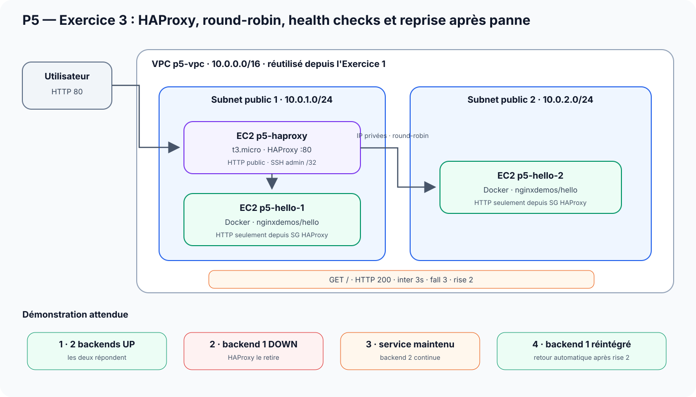

# P5 OpenClassrooms — Runbook mentor détaillé — Exercice 3

## Objectif de la séquence

**Exercice 3 : mettre en œuvre une solution Cloud garantissant disponibilité et performance avec HAProxy.**

La démonstration doit prouver, dans cet ordre :

1. que l'architecture HAProxy + 2 backends est réellement déployée ;
2. que les deux backends participent à la répartition de charge ;
3. que HAProxy effectue des health checks ;
4. qu'une panne contrôlée d'un backend est détectée ;
5. que le service public reste disponible pendant cette panne ;
6. que le backend restauré est automatiquement réintégré dans la rotation.

> **Phrase d'ouverture**
>
> « L'objectif de l'exercice 3 n'est pas seulement de démarrer HAProxy. Il faut démontrer la répartition de charge et surtout le comportement avant, pendant et après la panne d'un backend. »

---

## 1 — Ce que demande précisément l'exercice

L'architecture demandée est équivalente quel que soit le mode choisi :

```text
1 load-balancer HAProxy
2 instances de la même application web
```

L'application utilisée par l'exercice est :

```text
nginxdemos/hello
```

Il faut ensuite :

1. configurer HAProxy sur le port 80 ;
2. répartir les requêtes entre les deux serveurs ;
3. mettre en place des health checks ;
4. arrêter une instance ;
5. vérifier que HAProxy la retire ;
6. vérifier que le service continue ;
7. redémarrer l'instance ;
8. vérifier sa réintégration automatique.

---

## 2 — Architecture à présenter



### Réutilisation de l'exercice 1

L'exercice 3 **ne recrée pas son propre VPC**.

Terraform recherche le VPC `p5-vpc` et les subnets publics de l'exercice 1 grâce aux tags.

#### Conséquence d'architecture

```text
Exercice 1 doit exister avant Exercice 3.
```

Et pour le nettoyage :

```text
Exercice 3 doit être détruit avant Exercice 1.
```

**Phrase à dire :**

> « Je réutilise le socle réseau de l'exercice 1. Cela évite de créer une seconde infrastructure réseau indépendante uniquement pour le load-balancer. »

---

## 3 — Placement réel des machines

### Subnet public 1

```text
p5-haproxy
p5-hello-1
```

### Subnet public 2

```text
p5-hello-2
```

Les trois machines sont des EC2 Ubuntu 24.04 `t3.micro` dans la configuration par défaut.

---

## 4 — Security Groups

Deux Security Groups sont distincts.

### HAProxy

```text
TCP/80 ← 0.0.0.0/0
TCP/22 ← IP admin /32
```

### Backends

```text
TCP/80 ← Security Group HAProxy uniquement
TCP/22 ← IP admin /32
```

### Pourquoi c'est important ?

Le client public doit passer par HAProxy.

Le trafic HTTP public ne doit pas contourner le load-balancer pour atteindre directement les backends.

**Ce que tu dis :**

> « Les backends ne sont pas publiés directement en HTTP sur Internet. Le port 80 est autorisé uniquement depuis le Security Group HAProxy. »

---

## 5 — Ce qui tourne sur les backends

Terraform crée deux EC2.

Le `user_data` :

```text
apt update
install docker.io
enable/start Docker
docker run nginxdemos/hello:0.4-plain-text
expose 80:80
```

Chaque conteneur possède un hostname différent :

```text
p5-hello-1
p5-hello-2
```

C'est ce qui permet d'identifier quel backend a répondu.

---

## 6 — Configuration HAProxy à connaître

Le template canonique se trouve ici :

```text
terraform/exercice-3/haproxy.cfg.tpl
```

Configuration essentielle :

```text
frontend http-in
    bind *:80
    default_backend hello-servers

backend hello-servers
    balance roundrobin
    option httpchk GET /
    http-check expect status 200
    server hello-1 <IP_PRIVEE_1>:80 check inter 3s fall 3 rise 2
    server hello-2 <IP_PRIVEE_2>:80 check inter 3s fall 3 rise 2
```

---

## 7 — Comprendre les paramètres avant l'oral

### `balance roundrobin`

HAProxy distribue les nouvelles requêtes entre les backends disponibles.

La preuve attendue n'est pas nécessairement une alternance parfaite à chaque milliseconde ; il faut prouver que **les deux backends participent**.

### `option httpchk GET /`

HAProxy interroge la racine HTTP `/`.

### `http-check expect status 200`

Un backend est considéré sain lorsque la sonde obtient un HTTP 200.

### `inter 3s`

Intervalle de health check : environ 3 secondes.

### `fall 3`

Il faut 3 échecs successifs avant de déclarer le backend `DOWN`.

### Pourquoi ?

Pour éviter qu'une erreur réseau transitoire retire immédiatement une instance saine.

### `rise 2`

Après restauration, il faut 2 health checks réussis pour déclarer le backend de nouveau `UP`.

---

## 8 — Fichiers à connaître

```text
terraform/exercice-3/main.tf
terraform/exercice-3/variables.tf
terraform/exercice-3/outputs.tf
terraform/exercice-3/haproxy.cfg.tpl

scripts/commands/test-haproxy-roundrobin.sh
scripts/commands/test-haproxy-failover.sh
scripts/tools/generer-haproxy-config.sh
```

---

## 9 — Préparation hors présentation

```bash
cd ~/labs/p5_Openclassrooms
git switch main
git pull --ff-only

bash scripts/commands/p5.sh status
```

Préparer :

```bash
export HAPROXY_URL="$(
  terraform -chdir=terraform/exercice-3 \
    output -raw haproxy_url
)"

export BACKEND_1_IP="$(
  terraform -chdir=terraform/exercice-3 \
    output -raw hello_1_public_ip
)"
```

Ouvre déjà :

```text
$HAPROXY_URL
```

dans ton **navigateur Internet sous Windows 11** (Firefox, Edge ou Chrome).

---

## 10 — Démonstration Exercice 3

### Étape A — Montrer les outputs Terraform

```bash
terraform -chdir=terraform/exercice-3 output
```

#### À regarder

```text
hello_1_public_ip
hello_2_public_ip
hello_1_private_ip
hello_2_private_ip
haproxy_public_ip
haproxy_private_ip
haproxy_public_dns
haproxy_security_group_id
haproxy_url
```

### Ce que tu dis

> « Terraform me donne les adresses publiques utilisées pour l'administration et les adresses privées utilisées dans les flux internes entre HAProxy et les backends. »

---

### Étape B — Montrer la convergence Terraform

```bash
terraform -chdir=terraform/exercice-3 plan \
  -input=false \
  -detailed-exitcode
```

### Résultat attendu

```text
No changes.
Your infrastructure matches the configuration.
```

### Ce que tu dis

> « L'architecture de haute disponibilité est déjà convergée ; aucun changement Terraform n'est nécessaire avant le test. »

---

### Étape C — Montrer la configuration HAProxy utile

```bash
grep -E \
  'bind|balance|httpchk|http-check|server hello' \
  terraform/exercice-3/haproxy.cfg.tpl
```

#### Sortie attendue

```text
bind *:80
balance roundrobin
option httpchk GET /
http-check expect status 200
server hello-1 ... check inter 3s fall 3 rise 2
server hello-2 ... check inter 3s fall 3 rise 2
```

### Ce que tu dis

> « Ces quelques lignes expliquent tout le comportement que je vais montrer : écoute sur le port 80, round-robin, health check HTTP et seuils de sortie et de réintégration. »

---

## 11 — Démonstration visuelle du round-robin

Dans ton **navigateur Internet Windows**, ouvre :

```text
$HAPROXY_URL
```

Rafraîchis plusieurs fois.

Dans la page `nginxdemos/hello`, montre :

```text
Server name
Server address
```

Tu dois voir les deux identités.

### Ce que tu dis

> « Le navigateur contacte toujours la même URL HAProxy. C'est HAProxy qui choisit le backend. Le changement de `Server name` montre que plusieurs backends participent. »

---

## 12 — Preuve terminal du round-robin

```bash
bash scripts/commands/test-haproxy-roundrobin.sh \
  --url "$HAPROXY_URL" \
  --requests 12
```

### Résultat attendu

La série doit contenir les deux identités :

```text
p5-hello-1
p5-hello-2
```

Puis :

```text
OK  2 backends distincts observés
Verdict : ROUND-ROBIN OPÉRATIONNEL
```

#### Ce que ça prouve

Les deux backends répondent réellement derrière le même point d'entrée public.

---

## 13 — Annoncer la panne avant de l'exécuter

Ne lance pas directement la commande.

Dis d'abord :

> « Je vais maintenant arrêter volontairement le conteneur du backend 1. Le résultat attendu est : HAProxy détecte la panne, retire ce backend, continue à servir les requêtes avec le backend 2, puis réintègre automatiquement le backend 1 après son redémarrage. »

Cette phrase est importante : tu annonces **l'hypothèse de test avant la preuve**.

---

## 14 — Test réel de failover

```bash
bash scripts/commands/test-haproxy-failover.sh \
  --url "$HAPROXY_URL" \
  --backend-host "$BACKEND_1_IP" \
  --apply
```

### Ce que fait réellement le script

#### Phase A — Avant la panne

Il envoie plusieurs requêtes et exige :

```text
2 backends distincts
```

#### Phase B — Arrêt contrôlé

Via SSH sur le backend ciblé :

```text
sudo docker stop nginx-hello
```

#### Phase C — Attente du `fall 3`

Le script n'utilise pas juste un `sleep` arbitraire.

Il sonde HAProxy jusqu'à observer :

```text
1 backend distinct
```

dans une fenêtre maximale bornée.

#### Phase D — Continuité de service

Les requêtes HTTP continuent de réussir via le backend restant.

#### Phase E — Restauration

Le script exécute :

```text
sudo docker start nginx-hello
```

#### Phase F — Attente du `rise 2`

Il attend ensuite le retour de :

```text
2 backends distincts
```

---

## 15 — Résultat attendu du failover

Tu dois pouvoir lire une logique équivalente à :

```text
Phase : avant la panne
OK  2 backend(s) distinct(s)

Phase : pendant la panne
OK  1 backend(s) distinct(s)

Phase : après la reprise
OK  2 backend(s) distinct(s)

Verdict : BASCULE ET RÉINTÉGRATION HAPROXY VALIDÉES
```

### Comment l'expliquer

```text
2 → 1
```

HAProxy a détecté le backend indisponible.

```text
1
```

Le service public continue grâce au backend restant.

```text
1 → 2
```

HAProxy a détecté que le backend restauré répondait de nouveau correctement.

#### Phrase de conclusion de la preuve

> « La perte d'un backend n'a pas interrompu le service. HAProxy l'a retiré du pool puis l'a réintégré automatiquement après restauration. »

---

## 16 — Vérification finale dans le navigateur

Reviens dans le **navigateur Windows** sur :

```text
$HAPROXY_URL
```

Rafraîchis plusieurs fois.

Tu dois revoir :

```text
p5-hello-1
p5-hello-2
```

### Pourquoi cette dernière étape ?

Elle ferme visuellement la démonstration et montre que l'état fonctionnel initial a été restauré.

---

## 17 — Sécurité du test de panne

Le script possède une logique de restauration de sécurité.

S'il a arrêté le backend et qu'une erreur survient ensuite, un `trap` tente de redémarrer le conteneur.

### Ce que tu peux dire si on te pose la question

> « Une panne de démonstration est une mutation temporaire. J'ai donc prévu une restauration de sécurité pour réduire le risque de laisser le backend arrêté en cas d'échec intermédiaire. »

---

## 18 — Questions probables du mentor

### Pourquoi les backends ont-ils quand même une IP publique ?

Le lab a besoin d'une connexion SSH d'administration pour provoquer la panne contrôlée. Mais leur service HTTP n'est pas publié directement : le Security Group n'autorise le port 80 que depuis HAProxy.

### Pourquoi utiliser les IP privées dans HAProxy ?

Parce que HAProxy et les backends sont dans le même VPC. Le trafic inter-serveurs doit rester sur le réseau privé du VPC.

### Pourquoi `fall 3` ?

Pour éviter qu'une erreur ponctuelle retire immédiatement un serveur du pool.

### Pourquoi `rise 2` ?

Pour éviter de réintégrer trop vite un backend qui vient juste de revenir et pourrait encore être instable.

### Quelle différence entre load balancing et haute disponibilité ?

Le load balancing répartit les requêtes.  
La haute disponibilité est démontrée ici lorsque le service reste accessible malgré la perte d'un backend.

### Pourquoi deux subnets ?

Ils permettent de répartir les backends sur deux zones de disponibilité distinctes dans l'architecture du lab.

### Est-ce que HAProxy lui-même est redondant ?

Non. Dans ce lab, HAProxy reste un point unique. L'exercice démontre la résilience **des backends derrière HAProxy**, pas une architecture de load-balancer multi-nœuds de production.

Cette réponse est importante : ne prétends pas que l'architecture entière n'a aucun SPOF.

---

## 19 — Limite du projet à savoir expliquer

Le projet démontre très bien :

```text
backend failure tolerance
```

Mais il ne démontre pas :

```text
HAProxy node failure tolerance
```

Une architecture production plus poussée utiliserait par exemple :

- plusieurs load-balancers ;
- un service de load balancing managé ;
- un mécanisme multi-AZ ;
- éventuellement Auto Scaling.

Ce n'est pas nécessaire à la validation de cet exercice, mais c'est utile de savoir situer la limite.

---

## 20 — Conclusion de l'exercice 3

> « Pour résumer : le trafic public arrive sur HAProxy, les deux backends répondent via leurs IP privées, les health checks surveillent leur état, une panne contrôlée retire automatiquement le backend défaillant sans interrompre le service, puis `rise 2` permet sa réintégration après restauration. L'exercice démontre donc à la fois la répartition de charge et la continuité de service face à la perte d'un backend. »

---

## 21 — Conclusion générale du projet après Exercice 3

> « Les trois exercices forment une chaîne cohérente : Terraform et Ansible rendent le déploiement reproductible, OpenSearch transforme les logs de ce déploiement en informations observables, et HAProxy démontre le comportement de l'infrastructure lorsqu'un composant applicatif devient indisponible. »
