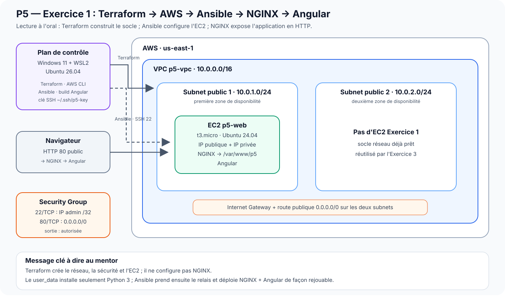

# P5 OpenClassrooms — Runbook mentor complet et détaillé

## Objectif

Ce document est la version intégrale de préparation à la présentation du P5. Il reprend **la même profondeur d'explication pour les trois exercices** : architecture, rôle de chaque composant, commandes, résultat attendu, preuve visuelle, questions probables et limites à savoir expliquer.

## Sommaire

- [Partie I — Exercice 1 : Terraform + Ansible + NGINX + Angular](#partie-i--exercice-1--terraform--ansible--nginx--angular)
- [Partie II — Exercice 2 : logs + Amazon OpenSearch](#partie-ii--exercice-2--logs--amazon-opensearch)
- [Partie III — Exercice 3 : HAProxy + round-robin + failover](#partie-iii--exercice-3--haproxy--round-robin--failover)
- [Séquence courte recommandée le jour de la présentation](#séquence-courte-recommandée-le-jour-de-la-présentation)

## Préparation générale avant la session

Dans WSL2 Ubuntu :

```bash
cd ~/labs/p5_Openclassrooms
git switch main
git pull --ff-only
bash scripts/commands/p5.sh status
```

Prépare les valeurs runtime :

```bash
export WEB_URL="$(terraform -chdir=terraform/exercice-1 output -raw web_url)"
export OPENSEARCH_ENDPOINT="$(terraform -chdir=terraform/exercice-2 output -raw opensearch_endpoint)"
export DASHBOARDS_URL="$(terraform -chdir=terraform/exercice-2 output -raw opensearch_dashboards_endpoint)"
export DASHBOARD_URL="${DASHBOARDS_URL%/}/app/dashboards#/view/p5-nginx-observability"
export HAPROXY_URL="$(terraform -chdir=terraform/exercice-3 output -raw haproxy_url)"
export BACKEND_1_IP="$(terraform -chdir=terraform/exercice-3 output -raw hello_1_public_ip)"
```

Sur **Windows 11**, ouvre à l'avance trois onglets dans Firefox, Edge ou Chrome :

```text
$WEB_URL       → application Angular de l'exercice 1
$DASHBOARD_URL → OpenSearch Dashboards de l'exercice 2
$HAPROXY_URL   → service HAProxy de l'exercice 3
```

WSL2 sert de plan de contrôle pour les commandes. Les interfaces HTTP sont montrées dans le navigateur Windows.

## Introduction orale générale

> « Le projet contient trois exercices complémentaires. Le premier construit l'infrastructure AWS avec Terraform puis configure et déploie Angular avec Ansible et NGINX. Le deuxième transforme les logs NGINX en données exploitables dans Amazon OpenSearch et les présente dans trois visualisations. Le troisième place HAProxy devant deux backends afin de démontrer la répartition de charge, la détection de panne et la réintégration automatique. »

```text
Exercice 1 : construire et déployer
Exercice 2 : observer et analyser
Exercice 3 : répartir et résister
```

Dépendances :

```text
Exercice 1
├── access.log réel ─────────────► Exercice 2
└── VPC + deux subnets ──────────► Exercice 3
```

---

## Partie I — Exercice 1 — Terraform + Ansible + NGINX + Angular

### Objectif de la séquence

**Exercice 1 : développer l'infrastructure IaC avec Terraform et automatiser le déploiement avec Ansible.**

L'objectif de la démonstration n'est pas de refaire un cours sur Terraform ou Ansible. Il faut prouver, dans cet ordre :

1. que l'infrastructure AWS est décrite et gérée par Terraform ;
2. qu'Ansible sait joindre la cible créée par Terraform ;
3. que le playbook configure réellement NGINX et déploie Angular ;
4. que la configuration est rejouable sans changement inutile ;
5. que l'application est réellement accessible en HTTP.

> **Phrase d'ouverture**
>
> « J'ai choisi le mode Cloud AWS. Terraform prend en charge l'infrastructure, puis Ansible prend le relais pour la configuration du serveur et le déploiement de l'application Angular derrière NGINX. Je vais d'abord vous montrer l'architecture, puis la démonstration de bout en bout. »

---

### 1 — Architecture à présenter



#### Lecture du schéma

**Plan de contrôle local**

- Windows 11 est l'OS hôte.
- WSL2 Ubuntu 26.04 est le plan de contrôle Linux du projet.
- Terraform, AWS CLI, Ansible et les commandes du dépôt sont lancés depuis cet environnement.
- La clé SSH du lab est utilisée par Ansible pour administrer l'EC2.

**AWS — région `us-east-1`**

Terraform crée :

- un VPC `p5-vpc` en `10.0.0.0/16` ;
- deux subnets publics :
  - `10.0.1.0/24` dans une première zone de disponibilité ;
  - `10.0.2.0/24` dans une deuxième zone ;
- une Internet Gateway ;
- une table de routage publique avec `0.0.0.0/0` vers l'Internet Gateway ;
- un Security Group `p5-web-sg` ;
- une paire de clés EC2 ;
- une EC2 `p5-web` dans le premier subnet.

L'EC2 est une `t3.micro` sous Ubuntu 24.04. Le volume racine est en `gp3` chiffré et IMDSv2 est obligatoire.

#### Pourquoi deux subnets alors qu'il n'y a qu'une EC2 dans l'exercice 1 ?

Le deuxième subnet fait partie du socle réseau du projet et sera réutilisé par l'exercice 3. Cela permet de conserver une architecture cohérente et d'y répartir les futurs backends HAProxy.

#### Security Group

```text
TCP/22  ← uniquement l'IPv4 publique d'administration /32
TCP/80  ← 0.0.0.0/0
egress  → autorisé
```

**Ce que tu dis :**

> « Le SSH n'est pas ouvert à Internet : il est limité à mon IP publique en `/32`. Le port 80 est public parce que l'application doit être accessible dans le navigateur. »

#### Frontière Terraform / Ansible

```text
Terraform
  └─ réseau + sécurité + clé + EC2
         ↓
     EC2 prête à être administrée
         ↓ SSH
Ansible
  └─ NGINX + utilisateur applicatif + artefact Angular + configuration NGINX
         ↓
Navigateur
  └─ HTTP 80 → NGINX → Angular
```

Le `user_data` Terraform installe seulement Python 3, car Python est nécessaire au fonctionnement d'Ansible sur la cible.

**Phrase importante :**

> « J'ai volontairement gardé une séparation des responsabilités : Terraform prépare l'infrastructure et la machine ; Ansible configure le système et déploie l'application. »

---

### 2 — Fichiers à connaître avant la présentation

```text
terraform/exercice-1/main.tf
terraform/exercice-1/variables.tf
terraform/exercice-1/outputs.tf
ansible/inventories/hosts_aws
ansible/inventories/hosts_aws.example
ansible/playbooks/deploy.yml
ansible/files/angular-app/
ansible/files/nginx-angular.conf
application/angular/
scripts/commands/verify-angular-deployment.sh
```

Le fichier `hosts_aws` réel est généré à partir des outputs Terraform et ne doit pas être confondu avec `hosts_aws.example`.

---

### 3 — Préparation hors présentation

À faire avant que le mentor arrive :

```bash
cd ~/labs/p5_Openclassrooms
git switch main
git pull --ff-only

bash scripts/commands/p5.sh status
```

Le lab doit être dans un état cohérent. Ne lance pas de destruction AWS avant la fin des trois exercices.

Prépare l'URL :

```bash
export WEB_URL="$(terraform -chdir=terraform/exercice-1 output -raw web_url)"
printf '%s\n' "$WEB_URL"
```

Ouvre déjà `$WEB_URL` dans un onglet de ton **navigateur Internet habituel sous Windows 11** (Firefox, Edge ou Chrome). Le navigateur ne tourne pas dans WSL2 : WSL2 lance les commandes, puis le navigateur Windows accède à l’URL publique de l’EC2.

---

### 4 — Démonstration Exercice 1

#### Étape A — Montrer que Terraform connaît l'infrastructure

```bash
terraform -chdir=terraform/exercice-1 output
```

##### À regarder

```text
vpc_id
public_subnet_ids
web_security_group_id
web_public_ip
web_private_ip
web_public_dns
web_url
```

##### Ce que ça prouve

Le state Terraform possède les valeurs réelles de l'infrastructure déployée.

##### Ce que tu dis

> « Je commence par les outputs Terraform. Ils me donnent les identifiants et adresses utiles de l'infrastructure réellement créée, notamment le VPC, les deux subnets, le Security Group et l'IP de l'EC2. »

---

#### Étape B — Montrer la convergence Terraform

```bash
terraform -chdir=terraform/exercice-1 plan \
  -input=false \
  -detailed-exitcode
```

##### Résultat attendu

```text
No changes.
Your infrastructure matches the configuration.
```

Code de sortie attendu : `0`.

##### Ce que ça prouve

L'état réel AWS et l'état déclaré dans le code Terraform sont alignés.

##### Ce que tu dis

> « Le plan ne propose aucun changement. L'infrastructure est donc convergée : ce qui existe sur AWS correspond à ce que décrit mon code Terraform. »

> **Ne fais pas un `terraform apply` pour le spectacle si le plan est vide.** Un `apply` inutile n'ajoute aucune preuve.

---

#### Étape C — Prouver la connectivité Ansible

```bash
ansible all \
  -i ansible/inventories/hosts_aws \
  -m ping
```

##### Résultat attendu

```text
SUCCESS
"ping": "pong"
```

##### Ce que ça prouve

Ansible peut :

- résoudre la cible de l'inventaire ;
- se connecter en SSH ;
- s'authentifier avec la clé ;
- exécuter Python sur l'EC2.

##### Ce que tu dis

> « L'inventaire pointe vers l'EC2 créée par Terraform et le `ping` Ansible confirme que la chaîne SSH et Python est opérationnelle. »

---

#### Étape D — Montrer rapidement le playbook

Commande de lecture ciblée :

```bash
grep -nE \
  'Installer NGINX|Déployer l.artefact Angular|configuration NGINX|nginx -t|Démarrer et activer NGINX|handlers|Recharger NGINX' \
  ansible/playbooks/deploy.yml
```

##### Points à expliquer

Le playbook :

- installe `nginx` et `curl` ;
- crée `appgroup` et `appuser` ;
- crée `/var/www/p5` ;
- copie l'artefact Angular ;
- déploie la configuration NGINX ;
- active le site et retire le site par défaut ;
- exécute `nginx -t` ;
- démarre et active NGINX ;
- recharge NGINX via un handler uniquement lorsqu'une configuration change.

##### Ce que tu dis

> « Mon playbook décrit l'état voulu du serveur. Il ne se contente pas de lancer des commandes shell : les tâches Ansible convergent la machine vers l'état attendu et le handler ne recharge NGINX que lorsque c'est nécessaire. »

---

#### Étape E — Vérifier la syntaxe

```bash
ansible-playbook \
  --syntax-check \
  -i ansible/inventories/hosts_aws \
  ansible/playbooks/deploy.yml
```

##### Résultat attendu

```text
playbook: ansible/playbooks/deploy.yml
```

Aucune erreur.

---

#### Étape F — Prouver l'idempotence

Sur un environnement déjà déployé :

```bash
ansible-playbook \
  -i ansible/inventories/hosts_aws \
  ansible/playbooks/deploy.yml
```

##### Résultat attendu dans le recap

```text
changed=0
unreachable=0
failed=0
```

##### Ce que ça prouve

Le playbook peut être rejoué et ne modifie pas inutilement une machine déjà conforme.

##### Ce que tu dis

> « Le point important ici est `changed=0`. Le serveur était déjà dans l'état voulu, donc Ansible ne refait pas inutilement le déploiement. C'est la preuve d'idempotence. »

---

#### Étape G — Prouver le résultat HTTP

```bash
bash scripts/commands/verify-angular-deployment.sh \
  --url "$WEB_URL"
```

##### Résultats attendus essentiels

```text
OK  réponse HTTP 200
OK  document Angular identifié
OK  bundle principal accessible
OK  fallback SPA NGINX opérationnel
OK  en-tête de sécurité nosniff

Verdict : APPLICATION ANGULAR DÉPLOYÉE ET SERVIE PAR NGINX
```

##### Puis navigateur

Dans ton **navigateur Internet Windows** (Firefox, Edge ou Chrome), ouvre :

```text
$WEB_URL
```

Tu copies simplement l’URL affichée par `echo "$WEB_URL"` ou `printf`, puis tu la colles dans la barre d’adresse. Montre l’application, rafraîchis une fois et navigue si nécessaire.

##### Ce que tu dis

> « La preuve finale est applicative : l'EC2 répond en HTTP 200, NGINX sert bien l'artefact Angular et le fallback SPA fonctionne. »

---

### 5 — Conclusion de l'exercice 1

> « Pour résumer : Terraform fournit une infrastructure AWS versionnée et convergée ; Ansible se connecte à la cible, installe et configure NGINX puis déploie Angular de façon idempotente ; enfin la vérification HTTP prouve que l'application est réellement accessible. Les logs NGINX générés ici deviennent ensuite une source de données pour l'exercice 2. »

---

### 6 — Questions probables du mentor

#### Pourquoi Terraform et Ansible, pourquoi pas un seul outil ?

Terraform est utilisé pour le **cycle de vie de l'infrastructure** AWS. Ansible est utilisé pour la **configuration du système** et le **déploiement applicatif**. Cette séparation rend les responsabilités plus lisibles.

#### Pourquoi installer Python 3 dans `user_data` ?

Parce qu'Ansible utilise Python sur la machine distante. Le `user_data` prépare seulement ce prérequis ; il ne déploie pas NGINX ni Angular, afin de conserver la frontière Terraform/Ansible.

#### Pourquoi `changed=0` est important ?

Parce qu'un système d'automatisation doit pouvoir être rejoué. Si l'état est déjà conforme, un second passage ne doit pas produire de modifications inutiles.

#### Pourquoi SSH en `/32` ?

Pour limiter l'accès administratif à une seule IPv4 publique au lieu d'exposer SSH à tout Internet.

#### Pourquoi deux subnets ?

L'exercice 1 construit le socle réseau complet. Le second subnet sera réutilisé dans l'exercice 3 pour répartir les backends.

#### Pourquoi ne pas détruire l'exercice 1 immédiatement ?

Dans cette implémentation, l'exercice 3 retrouve et réutilise le VPC et les subnets de l'exercice 1. L'ordre de destruction doit donc être `Exercice 3 → Exercice 2 → Exercice 1`.

---

### 7 — Attention à une incohérence de formulation dans la consigne

La consigne PDF mélange à un endroit les notions **AMI** et **type d'instance** (`t2.micro` / `t3.micro`). Dans le dépôt, l'implémentation est cohérente :

```text
AMI        : Ubuntu 24.04 LTS Canonical
instance   : t3.micro
```

Si le mentor pose la question, ne dis pas « AMI t3.micro » : `t3.micro` est un **type d'instance EC2**, pas une AMI.

---

## Partie II — Exercice 2 — Logs + Amazon OpenSearch

### Objectif de la séquence

**Exercice 2 : mettre en place le monitoring et le logging demandés, en mode Cloud AWS avec Amazon OpenSearch.**

La consigne OpenClassrooms prévoit deux possibilités :

- **mode local** : stack ELK avec Docker Compose ;
- **mode Cloud** : Amazon OpenSearch sur AWS.

Dans ce projet, le mode retenu est **Cloud AWS**.

La démonstration doit prouver, dans cet ordre :

1. que le domaine Amazon OpenSearch est réellement provisionné par Terraform ;
2. que les logs NGINX sont transformés en données structurées ;
3. que les champs nécessaires aux visualisations sont correctement typés et agrégables ;
4. que les données sont réellement présentes dans OpenSearch ;
5. que les **trois visualisations exigées** existent et sont lisibles dans OpenSearch Dashboards ;
6. que le dashboard final regroupe correctement ces trois visualisations.

> **Phrase d'ouverture**
>
> « Pour l'exercice 2, j'ai choisi le mode Cloud proposé par la consigne. J'utilise Amazon OpenSearch à la place d'un ELK local. Je vais vous montrer d'où viennent les logs, comment ils sont transformés et indexés, puis les trois visualisations demandées dans OpenSearch Dashboards. »

---

### 1 — Ce que demande précisément l'exercice

OpenClassrooms demande de :

1. démarrer l'environnement ELK/OpenSearch ;
2. charger un échantillon de logs NGINX ;
3. créer un index permettant d'exploiter ces logs ;
4. créer trois visualisations :
   - un **donut** de répartition des verbes HTTP ;
   - un **histogramme** de quantité cumulée de données envoyées par tranche de 12 heures ;
   - un **histogramme/top 5** des requêtes les plus fréquentes par tranche de 12 heures ;
5. regrouper les trois visualisations dans un dashboard.

Dans l'implémentation du dépôt, cette logique est conservée mais automatisée :

```text
log NGINX
   ↓
parsing + typage
   ↓
Bulk API
   ↓
Amazon OpenSearch
   ↓
Saved Objects versionnés
   ↓
OpenSearch Dashboards
```

---

### 2 — Architecture à présenter


#### Lecture simple du schéma

Il existe **deux sources de données**.

##### Source 1 — sample reproductible

```text
terraform/exercice-2/samples/nginx-access.log.sample
```

Il sert à :

- disposer d'une donnée connue et versionnée ;
- tester le parsing sans dépendre d'une EC2 réelle ;
- rendre la CI reproductible.

##### Source 2 — vrai log de l'exercice 1

```text
proofs/runtime/exercice-2/nginx-access-real.log
```

Ce fichier provient du NGINX réellement déployé sur `p5-web` pendant l'exercice 1.

Dans l'orchestration réelle du dépôt, `p5.sh ex2` valide puis importe d'abord le sample. Si `nginx-access-real.log` existe, il le valide et l'importe ensuite séparément avec le même pipeline. Le vrai log est donc **complémentaire** au sample, et non un remplacement de celui-ci.

**Ce que tu dis :**

> « Le sample me donne une base reproductible, tandis que le vrai `access.log` relie l'exercice 2 à l'application réellement déployée dans l'exercice 1. Les deux sources ont donc des rôles différents mais complémentaires. »

---

### 3 — Pipeline de transformation

Le dépôt ne pousse pas aveuglément des lignes de texte dans OpenSearch.

Il transforme les logs pour produire des champs structurés, notamment :

```text
@timestamp
http_method
bytes_sent
url_path
```

#### Contrat fonctionnel des champs

| Champ | Type attendu | Utilisation |
|---|---|---|
| `@timestamp` | date | axe temporel / tranches de 12 h |
| `http_method` | keyword | donut des méthodes HTTP |
| `bytes_sent` | numérique | somme des octets |
| `url_path` | keyword | top 5 des URLs |

**Phrase à dire :**

> « Le point important n'est pas seulement que les logs existent. Il faut que les champs soient correctement typés pour pouvoir faire les agrégations demandées. »

---

### 4 — Infrastructure Amazon OpenSearch à connaître

Terraform déploie un **service AWS managé**, pas une EC2 OpenSearch dans le VPC de l'exercice 1.

Configuration de référence :

```text
Région              : us-east-1
Nom du domaine      : p5-opensearch
Moteur              : OpenSearch 2.19
Instance            : 1 × t3.small.search
Stockage            : EBS gp3 · 10 Gio
HTTPS               : obligatoire
TLS                 : 1.2 minimum
Chiffrement         : au repos
Chiffrement         : nœud-à-nœud
Accès               : limité à l'IPv4 publique admin /32
```

#### Point de compréhension important

> « Amazon OpenSearch Service est un service managé AWS. Terraform crée le domaine et sa configuration, mais je n'administre pas directement une VM OpenSearch comme je le ferais avec un cluster ELK local. »

---

### 5 — Fichiers à connaître avant la présentation

```text
terraform/exercice-2/main.tf
terraform/exercice-2/variables.tf
terraform/exercice-2/outputs.tf
terraform/exercice-2/opensearch/index-template.json
terraform/exercice-2/opensearch/dashboards/p5-dashboard.json
terraform/exercice-2/samples/nginx-access.log.sample

scripts/tools/convert-nginx-logs.py
scripts/tools/build-opensearch-saved-objects.py

scripts/commands/import-opensearch-data.sh
scripts/commands/verify-opensearch-data.sh
scripts/commands/sync-opensearch-dashboards.sh

proofs/runtime/exercice-2/
```

---

### 6 — Préparation hors présentation

À faire avant l'arrivée du mentor :

```bash
cd ~/labs/p5_Openclassrooms
git switch main
git pull --ff-only

bash scripts/commands/p5.sh status
```

Préparer les variables :

```bash
export OPENSEARCH_ENDPOINT="$(
  terraform -chdir=terraform/exercice-2 \
    output -raw opensearch_endpoint
)"

export DASHBOARDS_URL="$(
  terraform -chdir=terraform/exercice-2 \
    output -raw opensearch_dashboards_endpoint
)"

export DASHBOARD_URL="${DASHBOARDS_URL%/}/app/dashboards#/view/p5-nginx-observability"
```

Ouvre déjà `$DASHBOARD_URL` dans ton **navigateur Internet sous Windows 11**. Comme pour l’exercice 1, les commandes sont lancées dans WSL2, mais l’interface OpenSearch Dashboards s’ouvre dans Firefox, Edge ou Chrome côté Windows.

**Ne détruis pas le domaine avant la présentation.**

---

### 7 — Démonstration Exercice 2

#### Étape A — Montrer les outputs Terraform

```bash
terraform -chdir=terraform/exercice-2 output
```

##### À regarder

```text
opensearch_domain_name
opensearch_endpoint
opensearch_arn
opensearch_dashboards_endpoint
```

##### Ce que ça prouve

Le domaine OpenSearch existe dans le state Terraform et les endpoints utilisés par les scripts viennent du déploiement réel.

##### Ce que tu dis

> « Les URLs ne sont pas codées en dur : elles sont récupérées depuis les outputs Terraform du domaine réellement déployé. »

---

#### Étape B — Montrer la convergence Terraform

```bash
terraform -chdir=terraform/exercice-2 plan \
  -input=false \
  -detailed-exitcode
```

##### Résultat attendu

```text
No changes.
Your infrastructure matches the configuration.
```

Code de sortie attendu : `0`.

##### Ce que tu dis

> « Le domaine OpenSearch est déjà dans l'état déclaré par Terraform. Il n'y a donc aucune mutation supplémentaire à appliquer. »

---

#### Étape C — Montrer rapidement le contrat du domaine

Commande courte :

```bash
grep -nE \
  'engine_version|instance_type|volume_size|encrypt_at_rest|node_to_node_encryption|enforce_https|tls_security_policy|SourceIp' \
  terraform/exercice-2/main.tf
```

##### Ce que tu dois pouvoir expliquer

```text
OpenSearch 2.19
1 nœud t3.small.search
EBS gp3 10 Gio
chiffrement au repos
chiffrement nœud-à-nœud
HTTPS obligatoire
TLS 1.2
accès filtré par IP /32
```

##### Ce que tu dis

> « Pour ce lab, le domaine reste volontairement petit, mais j'ai conservé les contrôles de sécurité essentiels : HTTPS, chiffrement et restriction d'accès par IP. »

---

#### Étape D — Prouver que les données sont réellement exploitables

```bash
bash scripts/commands/verify-opensearch-data.sh \
  --endpoint "$OPENSEARCH_ENDPOINT"
```

##### Ce que le script vérifie réellement

Il contrôle les mappings :

```text
@timestamp
http_method
url_path
bytes_sent
```

Puis il exécute les agrégations correspondant aux graphiques :

```text
Terms(http_method)

Date histogram 12 h
└─ Sum(bytes_sent)

Date histogram 12 h
└─ Top 5 Terms(url_path)
```

##### Résultats attendus

```text
OK  mappings @timestamp, http_method, url_path et bytes_sent
OK  documents : ...
OK  méthodes HTTP : ...
OK  tranches de 12 heures : ...
OK  chemins exploitables : ...

Agrégations utiles au dashboard
  Méthodes : ...
  Octets par 12 h : ...

Verdict : DONNÉES OPENSEARCH PRÊTES POUR LE DASHBOARD
```

##### Ce que ça prouve

Ce n'est pas seulement un domaine OpenSearch vide :

- des documents sont réellement indexés ;
- les champs ont le bon type ;
- les champs nécessaires sont agrégables ;
- les trois types de calcul nécessaires au dashboard fonctionnent.

##### Ce que tu dis

> « Ici je prouve le backend de l'observabilité. Avant même d'ouvrir le dashboard, je vérifie que les données et les agrégations sur lesquelles il repose sont valides. »

---

### 8 — Montrer le Dashboard as Code

Le dépôt contient une définition versionnée du dashboard :

```text
terraform/exercice-2/opensearch/dashboards/p5-dashboard.json
```

Commande simple :

```bash
cat terraform/exercice-2/opensearch/dashboards/p5-dashboard.json
```

Si la sortie est trop longue pendant l'oral, préfère :

```bash
grep -nE \
  'http_method|bytes_sent|url_path|12h|donut|dashboard|visual' \
  terraform/exercice-2/opensearch/dashboards/p5-dashboard.json
```

#### Ce que tu expliques

La couche de visualisation est elle aussi reproductible.

Le dépôt génère des Saved Objects OpenSearch déterministes :

```text
1. index pattern
2. donut méthodes HTTP
3. histogramme bytes_sent / 12 h
4. top 5 url_path / 12 h
5. dashboard regroupant les 3 visualisations
```

##### Ce que tu dis

> « La consigne demande de créer les visualisations. Dans mon implémentation, je suis allé plus loin : leur définition est versionnée et peut être recréée automatiquement. Mais je garde tout de même une validation visuelle humaine du rendu. »

#### Vérification non destructive du bundle Saved Objects

Avant de toucher à OpenSearch Dashboards, tu peux prouver que le manifest génère bien un bundle cohérent :

```bash
bash scripts/commands/sync-opensearch-dashboards.sh
```

##### Résultat attendu

```text
Bundle OpenSearch Dashboards
Objets      : 5
Index       : nginx-access-*
Dashboard   : P5 — Observabilité NGINX

Aucune mutation distante. Bundle généré et validé avec succès.
```

Cette commande **ne modifie pas** OpenSearch Dashboards. Elle prouve que la définition versionnée produit bien les cinq Saved Objects attendus : l’index pattern, les trois visualisations et le dashboard.

#### Préparation recommandée avant l'oral — réconcilier les Saved Objects

À faire avant la présentation si tu veux être certain que les objets distants correspondent au dépôt :

```bash
bash scripts/commands/sync-opensearch-dashboards.sh \
  --endpoint "$OPENSEARCH_ENDPOINT" \
  --dashboards-url "$DASHBOARDS_URL" \
  --apply
```

##### Résultat attendu essentiel

```text
OK  @timestamp, http_method, bytes_sent et url_path sont présents et agrégables
OK  API Dashboards disponible
OK  5 Saved Objects importés/réconciliés

Verdict : OPENSEARCH DASHBOARDS CONVERGÉ ET VÉRIFIÉ
```

`--apply` est une **mutation contrôlée et idempotente** : le script réconcilie les Saved Objects versionnés avec `overwrite=true`, puis relit les objets pour les vérifier. Pendant l'oral, il n'est pas nécessaire de refaire cette mutation si elle a déjà été validée juste avant.

---

### 9 — Démonstration visuelle obligatoire

Dans ton **navigateur Internet Windows**, ouvre :

```text
$DASHBOARD_URL
```

#### Visualisation 1 — Donut des méthodes HTTP

##### Ce que tu montres

Un graphique de type donut basé sur :

```text
Terms(http_method)
```

Exemples de catégories :

```text
GET
POST
HEAD
...
```

##### Ce que tu dis

> « Cette visualisation répond à la première exigence : elle montre la répartition des méthodes HTTP dans l'ensemble des requêtes. »

---

#### Visualisation 2 — Histogramme `bytes_sent` par 12 heures

##### Ce que tu montres

```text
Axe temporel : @timestamp
Intervalle   : 12 h
Métrique     : Sum(bytes_sent)
```

##### Ce que tu dis

> « Ici je mesure la quantité totale de données envoyées par le serveur sur chaque tranche de douze heures. »

---

#### Visualisation 3 — Top 5 des URLs par 12 heures

##### Ce que tu montres

```text
Axe temporel : @timestamp
Intervalle   : 12 h
Catégorie    : Terms(url_path)
Taille       : 5
```

##### Ce que tu dis

> « Cette troisième visualisation permet de voir quelles URLs représentent l'activité principale du serveur et comment cette activité évolue dans le temps. »

---

#### Dashboard complet

Montre ensuite les trois graphiques dans une vue unique.

##### Vérifications rapides avant la session

- la plage temporelle affiche bien les données ;
- aucun filtre parasite n'est actif ;
- les trois graphiques sont visibles ;
- le titre du dashboard est lisible ;
- les légendes ne sont pas masquées.

---

### 10 — Si le mentor demande « où est Logstash ? »

La réponse doit être précise.

> « La consigne propose soit une stack ELK locale, soit le mode Cloud OpenSearch. J'ai choisi le mode Cloud. Dans mon implémentation, le parsing des logs est assuré par le pipeline du dépôt avant envoi par Bulk API. Je ne prétends donc pas avoir déployé Logstash dans AWS : j'ai reproduit la fonction de transformation nécessaire au résultat attendu du mode Cloud. »

Ne dis pas que Logstash tourne si ce n'est pas le cas.

---

### 11 — Questions probables du mentor

#### Pourquoi OpenSearch plutôt qu'Elasticsearch/Kibana ?

Parce que la consigne propose explicitement un mode Cloud AWS avec OpenSearch. OpenSearch Dashboards est l'interface de visualisation associée.

#### Pourquoi conserver un sample si tu as un vrai log NGINX ?

Le sample assure la reproductibilité des tests et de la CI. Le vrai log prouve que la chaîne est reliée à l'application réellement déployée.

#### Pourquoi `bytes_sent` doit-il être numérique ?

Parce qu'il doit être utilisé dans une agrégation `sum`. Si le champ était du texte, la somme ne serait pas possible.

#### Pourquoi `http_method` et `url_path` sont en `keyword` ?

Parce qu'ils servent à faire des agrégations par catégories (`terms`).

#### Pourquoi vérifier les données avant d'ouvrir le dashboard ?

Parce qu'un dashboard peut exister visuellement tout en reposant sur des champs absents ou mal typés. La validation API prouve le contenu avant la présentation graphique.

#### Le dashboard est-il vraiment automatisé ?

Oui. Le dépôt versionne sa définition et génère les Saved Objects nécessaires. La vérification visuelle humaine reste néanmoins obligatoire.

---

### 12 — Conclusion de l'exercice 2

> « Pour résumer : Terraform provisionne le domaine Amazon OpenSearch, le pipeline transforme les logs NGINX en documents structurés, les mappings et agrégations sont vérifiés automatiquement, puis OpenSearch Dashboards présente les trois visualisations exigées. Je dispose donc à la fois d'une preuve technique côté données et d'une preuve visuelle côté dashboard. »

#### Transition vers l'exercice 3

> « Après avoir montré comment observer le fonctionnement du service, je passe maintenant à sa disponibilité : l'exercice 3 va démontrer le comportement du système lorsqu'un backend tombe. »

---

## Partie III — Exercice 3 — HAProxy + round-robin + failover

### Objectif de la séquence

**Exercice 3 : mettre en œuvre une solution Cloud garantissant disponibilité et performance avec HAProxy.**

La démonstration doit prouver, dans cet ordre :

1. que l'architecture HAProxy + 2 backends est réellement déployée ;
2. que les deux backends participent à la répartition de charge ;
3. que HAProxy effectue des health checks ;
4. qu'une panne contrôlée d'un backend est détectée ;
5. que le service public reste disponible pendant cette panne ;
6. que le backend restauré est automatiquement réintégré dans la rotation.

> **Phrase d'ouverture**
>
> « L'objectif de l'exercice 3 n'est pas seulement de démarrer HAProxy. Il faut démontrer la répartition de charge et surtout le comportement avant, pendant et après la panne d'un backend. »

---

### 1 — Ce que demande précisément l'exercice

L'architecture demandée est équivalente quel que soit le mode choisi :

```text
1 load-balancer HAProxy
2 instances de la même application web
```

L'application utilisée par l'exercice est :

```text
nginxdemos/hello
```

Il faut ensuite :

1. configurer HAProxy sur le port 80 ;
2. répartir les requêtes entre les deux serveurs ;
3. mettre en place des health checks ;
4. arrêter une instance ;
5. vérifier que HAProxy la retire ;
6. vérifier que le service continue ;
7. redémarrer l'instance ;
8. vérifier sa réintégration automatique.

---

### 2 — Architecture à présenter


#### Réutilisation de l'exercice 1

L'exercice 3 **ne recrée pas son propre VPC**.

Terraform recherche le VPC `p5-vpc` et les subnets publics de l'exercice 1 grâce aux tags.

##### Conséquence d'architecture

```text
Exercice 1 doit exister avant Exercice 3.
```

Et pour le nettoyage :

```text
Exercice 3 doit être détruit avant Exercice 1.
```

**Phrase à dire :**

> « Je réutilise le socle réseau de l'exercice 1. Cela évite de créer une seconde infrastructure réseau indépendante uniquement pour le load-balancer. »

---

### 3 — Placement réel des machines

#### Subnet public 1

```text
p5-haproxy
p5-hello-1
```

#### Subnet public 2

```text
p5-hello-2
```

Les trois machines sont des EC2 Ubuntu 24.04 `t3.micro` dans la configuration par défaut.

---

### 4 — Security Groups

Deux Security Groups sont distincts.

#### HAProxy

```text
TCP/80 ← 0.0.0.0/0
TCP/22 ← IP admin /32
```

#### Backends

```text
TCP/80 ← Security Group HAProxy uniquement
TCP/22 ← IP admin /32
```

#### Pourquoi c'est important ?

Le client public doit passer par HAProxy.

Le trafic HTTP public ne doit pas contourner le load-balancer pour atteindre directement les backends.

**Ce que tu dis :**

> « Les backends ne sont pas publiés directement en HTTP sur Internet. Le port 80 est autorisé uniquement depuis le Security Group HAProxy. »

---

### 5 — Ce qui tourne sur les backends

Terraform crée deux EC2.

Le `user_data` :

```text
apt update
install docker.io
enable/start Docker
docker run nginxdemos/hello:0.4-plain-text
expose 80:80
```

Chaque conteneur possède un hostname différent :

```text
p5-hello-1
p5-hello-2
```

C'est ce qui permet d'identifier quel backend a répondu.

---

### 6 — Configuration HAProxy à connaître

Le template canonique se trouve ici :

```text
terraform/exercice-3/haproxy.cfg.tpl
```

Configuration essentielle :

```text
frontend http-in
    bind *:80
    default_backend hello-servers

backend hello-servers
    balance roundrobin
    option httpchk GET /
    http-check expect status 200
    server hello-1 <IP_PRIVEE_1>:80 check inter 3s fall 3 rise 2
    server hello-2 <IP_PRIVEE_2>:80 check inter 3s fall 3 rise 2
```

---

### 7 — Comprendre les paramètres avant l'oral

#### `balance roundrobin`

HAProxy distribue les nouvelles requêtes entre les backends disponibles.

La preuve attendue n'est pas nécessairement une alternance parfaite à chaque milliseconde ; il faut prouver que **les deux backends participent**.

#### `option httpchk GET /`

HAProxy interroge la racine HTTP `/`.

#### `http-check expect status 200`

Un backend est considéré sain lorsque la sonde obtient un HTTP 200.

#### `inter 3s`

Intervalle de health check : environ 3 secondes.

#### `fall 3`

Il faut 3 échecs successifs avant de déclarer le backend `DOWN`.

#### Pourquoi ?

Pour éviter qu'une erreur réseau transitoire retire immédiatement une instance saine.

#### `rise 2`

Après restauration, il faut 2 health checks réussis pour déclarer le backend de nouveau `UP`.

---

### 8 — Fichiers à connaître

```text
terraform/exercice-3/main.tf
terraform/exercice-3/variables.tf
terraform/exercice-3/outputs.tf
terraform/exercice-3/haproxy.cfg.tpl

scripts/commands/test-haproxy-roundrobin.sh
scripts/commands/test-haproxy-failover.sh
scripts/tools/generer-haproxy-config.sh
```

---

### 9 — Préparation hors présentation

```bash
cd ~/labs/p5_Openclassrooms
git switch main
git pull --ff-only

bash scripts/commands/p5.sh status
```

Préparer :

```bash
export HAPROXY_URL="$(
  terraform -chdir=terraform/exercice-3 \
    output -raw haproxy_url
)"

export BACKEND_1_IP="$(
  terraform -chdir=terraform/exercice-3 \
    output -raw hello_1_public_ip
)"
```

Ouvre déjà :

```text
$HAPROXY_URL
```

dans ton **navigateur Internet sous Windows 11** (Firefox, Edge ou Chrome).

---

### 10 — Démonstration Exercice 3

#### Étape A — Montrer les outputs Terraform

```bash
terraform -chdir=terraform/exercice-3 output
```

##### À regarder

```text
hello_1_public_ip
hello_2_public_ip
hello_1_private_ip
hello_2_private_ip
haproxy_public_ip
haproxy_private_ip
haproxy_public_dns
haproxy_security_group_id
haproxy_url
```

#### Ce que tu dis

> « Terraform me donne les adresses publiques utilisées pour l'administration et les adresses privées utilisées dans les flux internes entre HAProxy et les backends. »

---

#### Étape B — Montrer la convergence Terraform

```bash
terraform -chdir=terraform/exercice-3 plan \
  -input=false \
  -detailed-exitcode
```

#### Résultat attendu

```text
No changes.
Your infrastructure matches the configuration.
```

#### Ce que tu dis

> « L'architecture de haute disponibilité est déjà convergée ; aucun changement Terraform n'est nécessaire avant le test. »

---

#### Étape C — Montrer la configuration HAProxy utile

```bash
grep -E \
  'bind|balance|httpchk|http-check|server hello' \
  terraform/exercice-3/haproxy.cfg.tpl
```

##### Sortie attendue

```text
bind *:80
balance roundrobin
option httpchk GET /
http-check expect status 200
server hello-1 ... check inter 3s fall 3 rise 2
server hello-2 ... check inter 3s fall 3 rise 2
```

#### Ce que tu dis

> « Ces quelques lignes expliquent tout le comportement que je vais montrer : écoute sur le port 80, round-robin, health check HTTP et seuils de sortie et de réintégration. »

---

### 11 — Démonstration visuelle du round-robin

Dans ton **navigateur Internet Windows**, ouvre :

```text
$HAPROXY_URL
```

Rafraîchis plusieurs fois.

Dans la page `nginxdemos/hello`, montre :

```text
Server name
Server address
```

Tu dois voir les deux identités.

#### Ce que tu dis

> « Le navigateur contacte toujours la même URL HAProxy. C'est HAProxy qui choisit le backend. Le changement de `Server name` montre que plusieurs backends participent. »

---

### 12 — Preuve terminal du round-robin

```bash
bash scripts/commands/test-haproxy-roundrobin.sh \
  --url "$HAPROXY_URL" \
  --requests 12
```

#### Résultat attendu

La série doit contenir les deux identités :

```text
p5-hello-1
p5-hello-2
```

Puis :

```text
OK  2 backends distincts observés
Verdict : ROUND-ROBIN OPÉRATIONNEL
```

##### Ce que ça prouve

Les deux backends répondent réellement derrière le même point d'entrée public.

---

### 13 — Annoncer la panne avant de l'exécuter

Ne lance pas directement la commande.

Dis d'abord :

> « Je vais maintenant arrêter volontairement le conteneur du backend 1. Le résultat attendu est : HAProxy détecte la panne, retire ce backend, continue à servir les requêtes avec le backend 2, puis réintègre automatiquement le backend 1 après son redémarrage. »

Cette phrase est importante : tu annonces **l'hypothèse de test avant la preuve**.

---

### 14 — Test réel de failover

```bash
bash scripts/commands/test-haproxy-failover.sh \
  --url "$HAPROXY_URL" \
  --backend-host "$BACKEND_1_IP" \
  --apply
```

#### Ce que fait réellement le script

##### Phase A — Avant la panne

Il envoie plusieurs requêtes et exige :

```text
2 backends distincts
```

##### Phase B — Arrêt contrôlé

Via SSH sur le backend ciblé :

```text
sudo docker stop nginx-hello
```

##### Phase C — Attente du `fall 3`

Le script n'utilise pas juste un `sleep` arbitraire.

Il sonde HAProxy jusqu'à observer :

```text
1 backend distinct
```

dans une fenêtre maximale bornée.

##### Phase D — Continuité de service

Les requêtes HTTP continuent de réussir via le backend restant.

##### Phase E — Restauration

Le script exécute :

```text
sudo docker start nginx-hello
```

##### Phase F — Attente du `rise 2`

Il attend ensuite le retour de :

```text
2 backends distincts
```

---

### 15 — Résultat attendu du failover

Tu dois pouvoir lire une logique équivalente à :

```text
Phase : avant la panne
OK  2 backend(s) distinct(s)

Phase : pendant la panne
OK  1 backend(s) distinct(s)

Phase : après la reprise
OK  2 backend(s) distinct(s)

Verdict : BASCULE ET RÉINTÉGRATION HAPROXY VALIDÉES
```

#### Comment l'expliquer

```text
2 → 1
```

HAProxy a détecté le backend indisponible.

```text
1
```

Le service public continue grâce au backend restant.

```text
1 → 2
```

HAProxy a détecté que le backend restauré répondait de nouveau correctement.

##### Phrase de conclusion de la preuve

> « La perte d'un backend n'a pas interrompu le service. HAProxy l'a retiré du pool puis l'a réintégré automatiquement après restauration. »

---

### 16 — Vérification finale dans le navigateur

Reviens dans le **navigateur Windows** sur :

```text
$HAPROXY_URL
```

Rafraîchis plusieurs fois.

Tu dois revoir :

```text
p5-hello-1
p5-hello-2
```

#### Pourquoi cette dernière étape ?

Elle ferme visuellement la démonstration et montre que l'état fonctionnel initial a été restauré.

---

### 17 — Sécurité du test de panne

Le script possède une logique de restauration de sécurité.

S'il a arrêté le backend et qu'une erreur survient ensuite, un `trap` tente de redémarrer le conteneur.

#### Ce que tu peux dire si on te pose la question

> « Une panne de démonstration est une mutation temporaire. J'ai donc prévu une restauration de sécurité pour réduire le risque de laisser le backend arrêté en cas d'échec intermédiaire. »

---

### 18 — Questions probables du mentor

#### Pourquoi les backends ont-ils quand même une IP publique ?

Le lab a besoin d'une connexion SSH d'administration pour provoquer la panne contrôlée. Mais leur service HTTP n'est pas publié directement : le Security Group n'autorise le port 80 que depuis HAProxy.

#### Pourquoi utiliser les IP privées dans HAProxy ?

Parce que HAProxy et les backends sont dans le même VPC. Le trafic inter-serveurs doit rester sur le réseau privé du VPC.

#### Pourquoi `fall 3` ?

Pour éviter qu'une erreur ponctuelle retire immédiatement un serveur du pool.

#### Pourquoi `rise 2` ?

Pour éviter de réintégrer trop vite un backend qui vient juste de revenir et pourrait encore être instable.

#### Quelle différence entre load balancing et haute disponibilité ?

Le load balancing répartit les requêtes.  
La haute disponibilité est démontrée ici lorsque le service reste accessible malgré la perte d'un backend.

#### Pourquoi deux subnets ?

Ils permettent de répartir les backends sur deux zones de disponibilité distinctes dans l'architecture du lab.

#### Est-ce que HAProxy lui-même est redondant ?

Non. Dans ce lab, HAProxy reste un point unique. L'exercice démontre la résilience **des backends derrière HAProxy**, pas une architecture de load-balancer multi-nœuds de production.

Cette réponse est importante : ne prétends pas que l'architecture entière n'a aucun SPOF.

---

### 19 — Limite du projet à savoir expliquer

Le projet démontre très bien :

```text
backend failure tolerance
```

Mais il ne démontre pas :

```text
HAProxy node failure tolerance
```

Une architecture production plus poussée utiliserait par exemple :

- plusieurs load-balancers ;
- un service de load balancing managé ;
- un mécanisme multi-AZ ;
- éventuellement Auto Scaling.

Ce n'est pas nécessaire à la validation de cet exercice, mais c'est utile de savoir situer la limite.

---

### 20 — Conclusion de l'exercice 3

> « Pour résumer : le trafic public arrive sur HAProxy, les deux backends répondent via leurs IP privées, les health checks surveillent leur état, une panne contrôlée retire automatiquement le backend défaillant sans interrompre le service, puis `rise 2` permet sa réintégration après restauration. L'exercice démontre donc à la fois la répartition de charge et la continuité de service face à la perte d'un backend. »

---

### 21 — Conclusion générale du projet après Exercice 3

> « Les trois exercices forment une chaîne cohérente : Terraform et Ansible rendent le déploiement reproductible, OpenSearch transforme les logs de ce déploiement en informations observables, et HAProxy démontre le comportement de l'infrastructure lorsqu'un composant applicatif devient indisponible. »

---

## Séquence courte recommandée le jour de la présentation

Le document complet sert de **référence**. Pendant l'oral, suis une séquence courte et lisible.

### Exercice 1

```text
schéma
→ terraform output
→ terraform plan = No changes
→ ansible ping = pong
→ ansible-playbook = changed=0
→ verify-angular-deployment
→ navigateur Windows : Angular
```

### Exercice 2

```text
schéma
→ terraform output
→ terraform plan = No changes
→ verify-opensearch-data
→ preuve Dashboard as Code
→ navigateur Windows : 3 visualisations + dashboard
```

### Exercice 3

```text
schéma
→ terraform output
→ terraform plan = No changes
→ haproxy.cfg
→ round-robin
→ annoncer le scénario de panne
→ failover --apply
→ 2 → 1 → 2
→ navigateur Windows après restauration
```

## Conclusion générale

> « Les trois exercices démontrent trois dimensions DevOps complémentaires : l'automatisation de l'infrastructure et du déploiement, l'observabilité à partir de logs réellement produits, puis la continuité de service face à la perte contrôlée d'un backend. »
