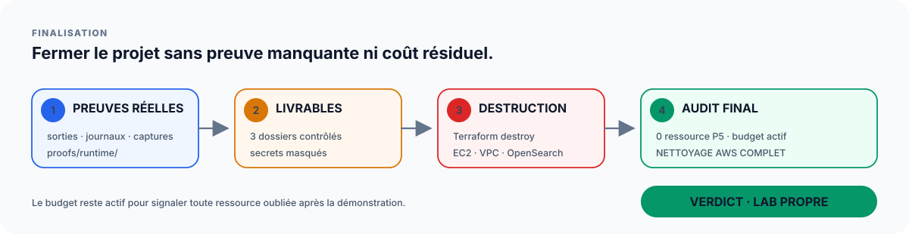

# Validation, preuves, livrables et nettoyage AWS

## Objectif

Une réalisation technique n'est pas terminée lorsque « ça marche une fois ». Il faut :

1. vérifier le résultat ;
2. conserver les bonnes preuves ;
3. transformer les preuves brutes en livrables compréhensibles ;
4. vérifier l'absence de secrets ;
5. détruire les ressources AWS ;
6. auditer le nettoyage.



Le principe de fermeture est simple : **prouver avant de détruire**, puis supprimer les ressources
d'exercice dans l'ordre `3 → 2 → 1` avant l'audit global AWS.

## 1. Trois niveaux de validation

### Niveau A — validation du dépôt

Exemples :

```bash
bash scripts/commands/validate.sh
python3 scripts/tools/audit_non_regression.py
python3 scripts/tools/audit_secrets.py
```

La CI exécute également ces contrats.

Ce niveau répond :

> « Le code et la documentation sont-ils cohérents et reproductibles ? »

### Niveau B — validation runtime AWS

Exemples :

- EC2 réellement créée ;
- Ansible ping réel ;
- application réellement accessible ;
- OpenSearch réellement actif ;
- failover HAProxy réellement rejoué.

Ce niveau répond :

> « Le lab fonctionne-t-il réellement sur le compte AWS ? »

### Niveau C — validation pédagogique

Exemples :

- capture du dashboard ;
- explication de l'idempotence ;
- interprétation du failover ;
- livrables lisibles pour un évaluateur.

Ce niveau répond :

> « Les preuves démontrent-elles clairement la compétence ? »

## 2. Collecter les diagnostics

```bash
bash scripts/commands/p5.sh diagnostics
```

Cette commande produit un état technique complet et vérifie la structure des livrables.

Les fichiers runtime sont conservés sous :

```text
logs/<UTC>/
proofs/runtime/
```

Ils sont privés par défaut.

## 3. Preuves de l'exercice 1

### Terraform

Conserver une preuve montrant :

- le plan ;
- le bon compte/région ;
- les ressources attendues ;
- l'apply réussi ;
- le post-plan sans delta.

### AWS

Conserver une preuve montrant l'EC2 active et, si utile, les ressources réseau attendues.

### Ansible

Conserver :

- `ansible ping` ;
- recap du premier passage ;
- recap du second passage.

Le second passage doit montrer :

```text
changed=0
unreachable=0
failed=0
```

### Application

Conserver une preuve que :

- NGINX sert Angular ;
- l'URL HTTP est accessible ;
- le fallback SPA fonctionne ;
- le bundle JavaScript est chargé.

### Logs

Conserver le `access.log` réel seulement comme source technique privée. Ne pas publier tout le log sans relecture.

## 4. Preuves de l'exercice 2

### Technique

Conserver :

- domaine OpenSearch actif ;
- index/données ;
- mapping ;
- agrégations ;
- absence d'erreur Bulk.

### Visuel

Captures obligatoires du parcours :

```text
1. donut méthodes HTTP
2. bytes_sent / 12 h
3. top 5 url_path / 12 h
4. dashboard complet
```

Vérifier avant capture :

- bonne plage de temps ;
- absence de filtre parasite ;
- titre lisible ;
- légende lisible ;
- valeurs visibles.

## 5. Preuves de l'exercice 3

Conserver :

- configuration HAProxy lisible ;
- validation `haproxy -c` ;
- deux backends avant panne ;
- un seul backend pendant la panne ;
- réponse HTTP maintenue pendant la panne ;
- retour des deux backends après restauration.

La preuve doit montrer le **comportement**, pas seulement une configuration statique.

## 6. Transformer une sortie brute en preuve

Mauvais exemple :

```text
capture d'un terminal sans titre ni explication
```

Bon format :

```text
Objectif : prouver l'idempotence Ansible.
Commande : deuxième exécution de deploy.yml.
Résultat : changed=0, unreachable=0, failed=0.
Interprétation : l'état demandé est déjà présent et Ansible n'effectue plus de changement inutile.
```

## 7. Anonymisation

Ne jamais publier :

- AWS access key ;
- secret access key ;
- session token ;
- clé SSH privée ;
- token GitHub ;
- `environment/aws-readiness.env` ;
- vrais `terraform.tfvars` ;
- `terraform.tfstate` ;
- inventaire Ansible réel complet ;
- header d'autorisation ;
- archive runtime brute non relue.

Peuvent être masqués lorsqu'ils ne sont pas nécessaires à la démonstration :

- IP publiques ;
- ID de compte ;
- ARN ;
- endpoints ;
- ID d'instances.

L'anonymisation ne doit pas rendre la preuve incompréhensible.

## 8. Livrables

Les trois structures sont sous :

```text
docs/livrables/
```

Le contrôle structurel est :

```bash
bash scripts/commands/prepare-livrables.sh --structure-only
```

Il vérifie la structure sans exiger toutes les preuves réelles.

Le contrôle strict est :

```bash
bash scripts/commands/prepare-livrables.sh
```

Il refuse les marqueurs de type :

```text
Gabarit à compléter
Preuve à insérer
Capture réelle à insérer
À joindre
```

## 9. Finaliser avec l'orchestrateur

```bash
bash scripts/commands/p5.sh finalize
```

Cette commande exécute les diagnostics puis le contrôle strict.

Verdict attendu :

```text
LIVRABLES PRÊTS POUR RELECTURE FINALE
```

Ce verdict signifie « plus de marqueur structurel détecté ». Une relecture humaine reste nécessaire.

## 10. Relecture comme évaluateur

Pour chaque preuve, se demander :

- est-ce que je comprends l'objectif sans connaître le terminal ?
- est-ce que la commande est visible ou expliquée ?
- est-ce que le résultat important est identifiable ?
- est-ce que la conclusion est techniquement correcte ?
- est-ce que cette preuve vient du vrai lab ?
- est-ce qu'une donnée sensible est inutilement exposée ?

## 11. Quand détruire OpenSearch ?

Une fois :

- les données vérifiées ;
- les visualisations terminées ;
- les quatre captures sauvegardées ;
- aucune nouvelle démonstration OpenSearch nécessaire.

Le nettoyage global reste cependant orchestré dans l'ordre `3 → 2 → 1`.

## 12. Pourquoi l'ordre de destruction est obligatoire

L'exercice 3 réutilise le réseau de l'exercice 1. L'ordre de fermeture représenté dans le schéma de
finalisation respecte donc les dépendances :

```text
Exercice 3 → Exercice 2 → Exercice 1 → audit AWS
```

Détruire l'exercice 1 avant l'exercice 3 casserait la dépendance réseau et compliquerait le nettoyage.

## 13. Lancer le nettoyage

```bash
bash scripts/commands/p5.sh cleanup
```

La commande appelle :

```text
scripts/commands/destroy-aws.sh
```

puis :

```text
scripts/commands/check-aws-cleanup.sh
```

## 14. Confirmation forte

La destruction exige une saisie explicite :

```text
DETRUIRE
```

Cette barrière est volontaire : une commande de destruction Cloud ne doit pas être confondue avec un simple test.

## 15. Ne pas supprimer le state avant destroy

Le state permet à Terraform de savoir quelles ressources il doit supprimer.

Mauvaise séquence :

```text
rm terraform.tfstate
terraform destroy
```

Bonne séquence :

```text
conserver le state
détruire avec Terraform
vérifier le résultat
autrement seulement analyser le state résiduel
```

## 16. Audit global AWS

Après les destroys :

```bash
bash scripts/commands/check-aws-cleanup.sh
```

Le verdict attendu est :

```text
NETTOYAGE AWS COMPLET
```

Tant que ce verdict n'est pas présent, considérer qu'une ressource d'exercice P5 peut encore exister.
Le budget de surveillance peut rester actif pour aider à signaler un coût résiduel ; il n'est pas une
ressource fonctionnelle des trois exercices.

## 17. Si une ressource reste

Ne pas commencer par la supprimer manuellement.

Procédure :

1. identifier le type de ressource ;
2. identifier l'exercice propriétaire ;
3. vérifier le state correspondant ;
4. relancer le destroy ou corriger la dépendance ;
5. relancer l'audit.

La suppression manuelle devient un dernier recours lorsqu'on a compris pourquoi Terraform ne gère plus correctement la ressource.

## 18. Après le nettoyage

Vérifier :

```bash
bash scripts/commands/p5.sh inspect
```

Puis contrôler également la console Billing/Cost Explorer selon le contexte du compte.

Un budget ou un dashboard de facturation peut avoir un délai d'actualisation. Le meilleur signal immédiat du projet est l'audit des ressources ciblées.

## 19. Checklist de fermeture

- [ ] livrable 1 complet ;
- [ ] livrable 2 complet ;
- [ ] livrable 3 complet ;
- [ ] quatre captures OpenSearch sauvegardées ;
- [ ] preuve d'idempotence sauvegardée ;
- [ ] preuve de failover sauvegardée ;
- [ ] audit secrets exécuté ;
- [ ] `p5.sh finalize` réussi ;
- [ ] exercice 3 détruit ;
- [ ] exercice 2 détruit ;
- [ ] exercice 1 détruit ;
- [ ] audit AWS exécuté ;
- [ ] `NETTOYAGE AWS COMPLET` obtenu.

## 20. Fin réelle du P5

La fin opérationnelle du projet est :

```text
preuves compréhensibles
+ livrables relus
+ aucun secret publié
+ AWS nettoyé
```

et non simplement :

```text
terraform apply a fonctionné
```
